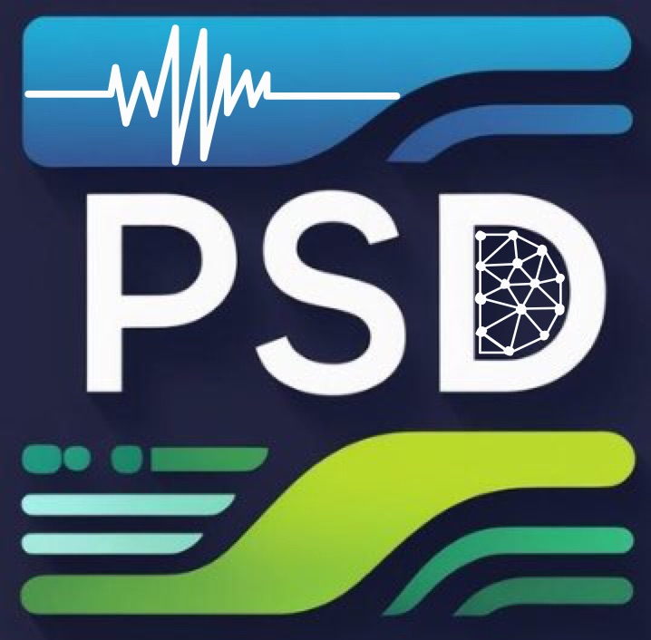
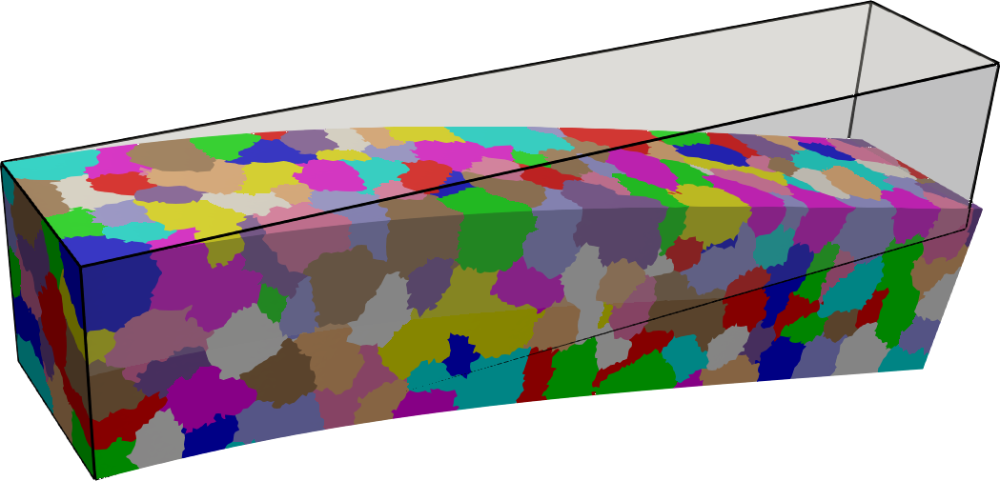

#  [PSD v2.6](https://mohd-afeef-badri.github.io/psd)

[](https://github.com/mohd-afeef-badri/psd/actions/workflows/Ub24-mpich.yml) [](https://github.com/mohd-afeef-badri/psd/actions/workflows/Ub24-openmpi.yml) [](https://github.com/mohd-afeef-badri/psd/actions/workflows/MacOs.yml) [](https://github.com/mohd-afeef-badri/psd/actions/workflows/MacOs-26.yml)

**PSD** (*P*arallel finite element *S*olver for continuum *D*ynamics) is a high-performance finite element solver for solid mechanics applications. Designed for large-scale simulations, PSD is capable of solving problems with *billions of unknowns* in both *static* and *dynamic* regimes, with support for *linear* and *nonlinear* models.

At its core, PSD uses:

- [**FreeFEM**](https://freefem.org/) for finite element discretization,
- [**PETSc**](https://www.mcs.anl.gov/petsc/) for scalable linear algebra and preconditioning.

It supports advanced material and fracture models, including [**hybrid phase-field fracture mechanics**](https://link.springer.com/article/10.1007/s00466-014-1109-y), and leverages the [**generalized-α time integration scheme**](https://hal.archives-ouvertes.fr/hal-00345290/document), enabling seamless use of Newmark-β, central difference, or Hilber-Hughes-Taylor (HHT) methods.

PSD’s parallel capabilities are based on a [**domain decomposition approach**](https://www.sciencedirect.com/science/article/pii/S0022407317309597) using vectorial finite elements. It demonstrates **quasi-optimal scalability** and has been successfully tested on up to **24,000 cores**, solving problems with over **5 billion unknowns**.

A **sequential version** of the solver is also available and does **not require PETSc**.

## Features

- 2D and 3D simulations
- Static solid mechanics
- Transient solid dynamics 
- Hybrid phase-field fracture mechanics
- Linear and nonlinear material behaviors, including elastoplasticity with strain hardening
- High-performance parallel computing
- Generalized-α time integration
- Native support for:
  - `.mesh` (MEDIT)
  - `.msh` (Gmsh)
  - `.med` (SALOME)
- Output support:
  - `.pvd`, `.vtk`, `.vtu` (ParaView)
  - ASCII trace files for physical quantities

## 🔧 Installation

Refer to the [installation guide here](https://mohd-afeef-badri.github.io/psd/#/install).

## 📚 Tutorials

Explore tutorials for different physics modules:

- [Linear Elasticity](https://mohd-afeef-badri.github.io/psd/#/linear-elasticity)
- [Fracture Mechanics](https://mohd-afeef-badri.github.io/psd/#/fracture-mechanics)
- [Elastodynamics](https://mohd-afeef-badri.github.io/psd/#/elastodynamics)
- [Soildynamics](https://mohd-afeef-badri.github.io/psd/#/soildynamics)
- [Elasto-plasticity](https://mohd-afeef-badri.github.io/psd/#/elasto-plastic)

## Quick Start: Typical Workflow of a PSD Simulation

PSD is a TUI (terminal user interface) based finite element solver. Parallel or sequential PSD simulations can run on Linux platforms.  Command line options (flags) which user enters are used  to control the PSD solver. In order to make your choice of physics, model, mesh, etc., command line options need to be typed right into the bash.

A typical PSD simulation is performed in three steps.

**Step 1: Setting up the solver**

Its time to set up the PSD solver. Open the `terminal` window at the location of the solver, i.e., `$HOME/PSD/Solver.` Then run the following command in the `terminal`.

```bash
PSD_PreProcess [Options-PSD]
```

Via the command line options you will embed the physics within the solver. This step generates a bunch of `.edp` files which are native to [FreeFEM](https://freefem.org/)  and additionally prints out instructions on what to do next. You then need to open and edit couple of these files via your favourite text editor, which could be `vim`, `gedit` ,`Notepad++`, etc.  To facilitate the edit process for your will have to go through the instructions printed on the terminal.

For example to generate a sequential 2D elasticity solver for a problem with body force and one Dirichlet border use

```bash
PSD_PreProcess -dimension 2 -bodyforceconditions 1 -dirichletconditions 1
```

**Step 2: Launching the solver**

Now you are all set to run your simulation. To do so you will need to do the run the following in the `terminal`:

if you complied a parallel PSD version

```bash
PSD_Solve -np $N Main.edp -v 0 -nw
```

if you complied a sequential PSD version

```bash
PSD_Solve_Seq Main.edp -v 0 -nw
```

- In the parallel command **$N** is an `int` value, i.e., number of processes that you want to use for performing the simulation in parallel.
- Additional flag `-wg` may be required while launching the solver, this is in case debug mode is on.

**Step 3: Result visualization**
Final step is to have a look at the results of the simulation. PSD can provides output results in the form of plots, finite element fields of interest, etc. ParaView's pvd, vtu, and pvtu files are used for postprocessing (see figure below). ASCII data files that to trace certain quantities of interest like reaction forces, kinetic energies, etc can also be outputted.



---

## 📬 Contact

To report bugs, request features, or ask questions, feel free to reach out:

**📧 [mohd-afeef.badri@cea.fr](mailto:mohd-afeef.badri@cea.fr)**
