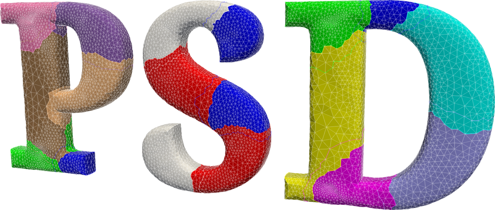

##  PSD version 2.5 ##

------



PSD, acronym for Parallel Solid/Structural/Seismic Dynamics, is a finite elements-based solid mechanics solver with capabilities of performing High Performance Computing (HPC) simulations with billions of unknowns. The kernel of PSD is wrapped around [FreeFEM](https://freefem.org/) for finite element discretization, and [PETSc](https://www.mcs.anl.gov/petsc/) for linear algebra/Preconditioning. PSD solver contains straightforward supports for *static* or *dynamic* simulations with *linear*  and *nonlinear* solid mechanics problems. Besides these [*hybrid-phase field fracture mechanics*](https://link.springer.com/article/10.1007/s00466-014-1109-y) models have also been incorporated within PSD. For dynamics the [*genralized-$\alpha$ model*](https://hal.archives-ouvertes.fr/hal-00345290/document)  for time discretization is used, this models enable straightforward use of Newmark-$\beta$, central difference, or HHT as time discretization. PSD uses sate-of-the art domain-decomposition paradigm via [*vectorial finite elements*](https://www.sciencedirect.com/science/article/pii/S0022407317309597) for parallel computing and all solvers are  proven to scale quasi-optimally. PSD has proven scalabilty uptill 24,000 cores with largest problem solved containing over 5 Billion unknowns.

Besides the parallel suite, PSD also includes a sequential solver which does not require [PETSc](https://www.mcs.anl.gov/petsc/).

PSD works for two and three dimensional problems only. Unstructured meshes (triangular for 2D and tetrahedral for 3D) are supported in [MEDIT's](https://www.ljll.math.upmc.fr/frey/software.html)  `.mesh` format or [Gmsh's](http://gmsh.info/) `.msh` format. PSD post processing is done via `.pvd` ,`.vtk` and `.vtu` files of the [ParaView](https://www.paraview.org/) platform.


## Installation ##

PSD is a cross-platform FEM solver built to work with Linux/Unix platforms. PSD has successfully been deployed on the following platforms:

- CentOS 7 / 8
- Ubuntu 16.04 / 18.04 / 20.04 / 22.04
- Raspberry Pi
- Fedora 30 / 32 / 34
- MacOS X Puma:10.1.5 	

Before installing PSD please ensure that you have the following dependencies installed on your OS.

**Dependencies**

 PSD has some essential prerequisites without which PSD will not function. These dependencies can either be preinstalled by user. In that case following list needs to be installed, and assured that these are intercompatiable.

| Package                                                      | Version                                                      | Essential |
| ------------------------------------------------------------ | ------------------------------------------------------------ | --------- |
| [automake](https://www.gnu.org/software/automake/)           | Version **2.8** or higher                                    | YES       |
| [FreeFEM](https://freefem.org/)                              | Version **4.11**                                             | YES       |
| [PETSc](https://www.mcs.anl.gov/petsc/)                      | Version **3.17.0**                                           | YES       |
| [Gmsh](http://gmsh.info/)                                    | Version **4.10.4**                                           | YES       |
| [C++](http://www.cplusplus.com/), C                          | Version **7** or Higher                                      | YES       |
| MPI                                                          | Version **2.0** or Higher (choose either [Mpich](https://www.mpich.org/) or [Open MPI](https://www.open-mpi.org/)) | YES       |
| [git](https://git-scm.com/)                                  | -                                                            | YES       |
| [salome](https://www.salome-platform.org/)                   | Version **9** or Higher                                      | OPTIONAL  |
| [MFront](http://tfel.sourceforge.net/)                       | Version **3.4.0**                                            | OPTIONAL  |
| [MGIS](https://thelfer.github.io/mgis/web/bindings-cxx.html) | Version **1.2**                                              | OPTIONAL  |
| [gnuplot](http://www.gnuplot.info/)                          | Version **4.0** or Higher                                    | OPTIONAL  |
|                                                              |                                                              |           |

Note that PETSc and FreeFEM need to be compiled with  METIS, ParMETIS, and hpddm support, in this case these form extra dependencies. The user in incharge of making sure that all the dependencies are met before installing PSD. Have a look at `Download.MD` file which explains a little bit about the dependencies and also provides the version and the links to download the dependencies from.

Generally there are two procedures of installing PSD. 

- *Installation Procedure 1: I install my own dependencies*.
- *Installation Procedure 2: PSD installs all dependencies*.

Among the two the second one is the recommended. With *Installation Procedure 1* user takes charge and installs all the dependencies.  To follow this type of installation read the section *Installation Procedure 1: I install my own dependencies*. Alternatively,  PSD can attempt to build and compile FreeFEM, PETSc, Gmsh, MFront, and  MGIS for you. In this case, user needs to ensure that automake, C/C++, git, and MPI is available in the system and that your system has an active internet connection. To know how this type of installation is done, please skip to section *Installation Procedure 2: PSD installs all dependencies*.


#### Installation Procedure 1: I install my own dependencies ####

- Grab the latest copy of PSD. The code is hosted on GitLab [repository](https://gitlab.com/PsdSolver/psd_sources).
```bash
git clone https://gitlab.com/PsdSolver/psd_sources.git PSD-Sources
```


- Use automake within the  cloned PSD folder (`psd_sources`) 
```bash
autoreconf -i
```

- Configure  PSD within the  cloned folder
```bash
./configure
```
**Note**:   `./configure` will install PSD in `/usr/local/bin`  and you would need `sudo` rights (superuser) to perform installation, for non `sudo` users or for local install consider changing directory of installation. To change this directory use `--prefix=Your/Own/Path` with `./configure`.  Remember to add `Your/Own/Path` to your `$PATH` variable, you can do so by `export PATH=$PATH:Your/Own/Path`. 

**Note**: `./configure` will try to look for installation of FreeFEM, MGIS, Mfront, and Gmsh in your `PATH` directories. If you have these packages installed in some other directory this should be specified during `./configure` by using flags `--with-FreeFEM=` ,  `--with-Gmsh=`, etc. as shown below. For example

```bash
./configure --prefix=$HOME/Install/local \
  --with-FreeFEM=$HOME/Install/local/FreeFem/bin       \
  --with-Gmsh=$HOME/Install/local/Gmsh/bin        
```

Additionally `--with-salome=/salome/install/dir` can be used for compiling PSD with  SALOME support,

 `--with-mgis=/mgis/install/dir` can be used for compiling PSD with  MGIS support,

 `--with-mfront=/mfront/install/dir` can be used for compiling PSD with  MFRONT support, and

 `--with-hdf5=/hdf5/install/dir` ,  `--with-medfile=/medfile/install/dir` , and  `--with-medcoupling=/medcoupling/install/dir`  can be used for compiling PSD with  MED support.


- Make PSD directives

```bash
make
```

- Install PSD
```bash
sudo make install
```
**Note** : You should not use `sudo` if you have used `--prefix` during the `./configure` phase.

- Install PSD tutorials
```bash
make tutorials
```

Now you should have the PSD solver installed on your machine. Note that, the solver will be installed at `usr/bin` or ` usr/local/bin` directories if you used `sudo make install` or else it will be in your ` --prefix` location.  The PSD tutorials are installed in `$HOME/PSD-tutorials`.


**Additional FreeFEM tweak for brittle fracture mechanics**

Note that this procedure is only recommended if you are interested in using PSD for brittle fracture problems. In your FreeFEM source files (installation)  go to `src/femlib/fem.cpp` ,  in this file replace the lines of code

```bash
R seuil=hm/splitmax/4.0;
```

by the following

```bash
R seuil=hm/splitmax/4.0/1000.0;
```


#### Installation Procedure 2: PSD installs all the dependencies ####

**Note**: please make sure that you are using PSD version 2.5 or above.

- Grab the latest copy of PSD. The code is hosted on GitLab [repository](https://gitlab.com/PsdSolver/psd_sources).
```bash
git clone https://gitlab.com/PsdSolver/psd_sources.git PSD-Sources
```

- We will install PSD and all its dependencies in folder `/home/PSDinstall` . Let us start by making it a temporary environmental variable.
```bash
export PREFIXPSD=/home/PSDinstall
```

- Use `automake` within the  cloned folder and configure PSD
```bash
autoreconf -i && ./configure --prefix=$PREFIXPSD --with-dependencies=yes
```
**Note**:   we will install PSD in `/home/PSDinstall`  and you would need read and write rights to perform installation in this folder. `--with-dependencies=yes` uses `wget` and internet, so make sure you are connected. To bypass the internet limitation, for instance on clusters or supercomputers, users can provide the tarball files `*.tar.gz` files of the dependencies within the `/ext` folder and use the flag `--with-zipped_dependecies`.    
**Note**:   for CentOS7 you might have to load MPI with `module load mpi/openmpi-x86_64`

- Make all dependencies
```bash
cd ext && make && cd ..
```

- The `PATH` and `LSD_LIBRARY_PATH` variables need to be updated. Add the following two line to your `~/.bashrc` 
```bash
export PATH=/home/PSDInstall/bin:$PATH 
export LD_LIBRARY_PATH=/home/PSDInstall/lib:$LD_LIBRARY_PATH
```
then do 
```bash
source ~/.bashrc
```
**Note:** this can also be done temporarily by `source $PREFIXPSD/mfront-env.sh`. If you follow this temporary approach, every time before using PSD you will need to redo this command.

- Reconfigure PSD with the installed dependencies
```bash
./configure --prefix=$PREFIXPSD \
  --with-mgis=$PREFIXPSD        \
  --with-mfront=$PREFIXPSD      \
  --with-FreeFEM=$PREFIXPSD/bin \
  --with-Gmsh=$PREFIXPSD/bin    \
  --with-salome=$PREFIXPSD/bin  \
  --with-hdf5=$PREFIXPSD/bin/BINARIES-SALOME/hdf5  		\
  --with-medfile=$PREFIXPSD/bin/BINARIES-SALOME/medfile 	\
  --with-medcoupling=$PREFIXPSD/bin/BINARIES-SALOME/MEDCOUPLING
```

**Note:** for SALOME and MED integration is here done for UB22.04. If your OS is not UB22.04 please have a look at `Makefile.am` and add correct flags `SALOME_OS` , `SALOME_OS_TAG` , and `SALOME_TAG`. Another way, get in touch with PSD team and we will help you.

- Compile and install PSD

```bash
make && make install
```

- Perform a check to see if everything works 
```bash
make check
```

- Install PSD tutorials
```bash
make tutorials
```


Now you should have the PSD solver installed on your machine. Note that, the solver will be installed at `home/PSDInstall`.  The PSD tutorials are installed in `$HOME/PSD-tutorials`.


## A quick sneak-peek of a typical PSD simulation  ##

PSD is a TUI (terminal user interface) based finite element solver. Parallel or sequential PSD simulations can run on Linux platforms.  Command line options (flags) which user enters are used  to control the PSD solver. In order to make your choice of physics, model, mesh, etc., command line options need to be typed right into the bash.

A typical PSD simulation is performed in three steps.

**Step 1: Setting up the solver**

Its time to set up the PSD solver. Open the `terminal` window at the location of the solver, i.e., `$HOME/PSD/Solver.` Then run the following command in the `terminal`.

```bash
PSD_PreProcess [Options-PSD]
```

Via the command line options you will embed the physics within the solver. This step generates a bunch of `.edp` files which are native to [FreeFEM](https://freefem.org/)  and additionally prints out instructions on what to do next. You then need to open and edit couple of these files via your favourite text editor, which could be `vim`, `gedit` ,`Notepad++`, etc.  To facilitate the edit process for your will have to go through the instructions printed on the terminal.

For example to generate a sequential 2D elasticity solver for a problem with body force and one Dirichlet border use

```bash
PSD_PreProcess -dimension 2 -bodyforceconditions 1 -dirichletconditions 1
```

**Step 2: Launching the solver**

Now you are all set to run your simulation. To do so you will need to do the run the following in the `terminal`:

if you complied a parallel PSD version

```bash
PSD_Solve -np $N Main.edp -v 0 -nw
```
if you complied a sequential PSD version
```bash
PSD_Solve_Seq Main.edp -v 0 -nw
```

- In the parallel command **$N** is an `int` value, i.e., number of processes that you want to use for performing the simulation in parallel.

- Additional flag `-wg` may be required while launching the solver, this is in case debug mode is on.

**Step 3: Result visualization**
Final step is to have a look at the results of the simulation. PSD can provides output results in the form of plots, finite element fields of interest, etc. ParaView's pvd, vtu, and pvtu files are used for postprocessing (see figure below). ASCII data files that to trace certain quantities of interest like reaction forces, kinetic energies, etc can also be outputted.


## PSD flags  explained  ##

These are a set of commandline flags/options that control your simulation. You can think of it as a way to talk to the solver. Here is a table that lists out some of the options that are available (for full list see documentation). It is advised to print these and have them around when performing a PSD simulation.

| Flag                        | Type      | Comment                                                      |
| --------------------------- | --------- | :----------------------------------------------------------- |
| **Boolean flags**           |           | These flags accept values   *1\|0\|yes\|no\|on\|off\|true\|false*   and are used to <br />activate or deactivate any functionality of PSD. |
|                             |           |                                                              |
| `-help`                     | `[bool]`  | To activate helping messages. Gives description and list of available flags. |
| `-debug`                    | `[bool]`  | To activate live plot while PSD runs.  Development flag.     |
| `-useGFP`                   | `[bool]`  | To activate use of GoFastPlugins. A suite of C++ plugins.    |
| `-useRCM`                   | `[bool]`  | Activate mesh level renumbering: Reverse Cuthill Mckee.      |
| `-pipegnu`                  | `[bool]`  | Use to activate real time pipe plotting using [gnuplot](http://www.gnuplot.info/). |
| `-timelog`                  | `[bool]`  | To activate time logging the different phases of the solver. |
| `-supercomp`                | `[bool]`  | Use when using a super computer without Xterm support        |
| `-useMfront`                | `[bool]`  | Activate Mfornt interface for PSD.                           |
| `-bodyforce`                | `[bool]`  | To activate volumetric source term (body force).             |
| `-vectorial`                | `[bool]`  | To use vectorial finite element method.                      |
| `-pointprobe`               | `[bool]`  | To postprocess point fields.                                 |
| `-sequential`               | `[bool]`  | To solve via a sequential solver.                            |
| `-energydecomp`             | `[bool]`  | To activate energy decomposition, only for phase-field.      |
| `-doublecouple`             | `[bool]`  | To activate double couple source for soildynamics.           |
| `-constrainHPF`             | `[bool]`  | To use constrain condition in hybrid phase-field model.      |
| `-top2vol-meshing`          | `[bool]`  | Activate top-ii-vol point source meshing for soil-dynamics.  |
| `-getreactionforce`         | `[bool]`  | Activate routine for extraction reactions at surface.        |
| `-plotreactionforce`        | `[bool]`  | Activate realtime pipe plotting using GnuPlot.               |
| `-withmaterialtensor`       | `[bool]`  | Activate material tensor for building stiffness matrix.      |
| `-crackdirichletcondition`  | `[bool]`  | To activate pre-cracked surface Dirichlet.                   |
|                             |           |                                                              |
| **Integer flags**           |           | These flags accept a integer value followed by the flag itself. <br />These integer values are used in PSD simulations for various definitions. |
|                             |           |                                                              |
| `-dirichletpointconditions` | `[int]`   | Number of Dirichlet points.                                  |
| `-dirichletconditions`      | `[int]`   | Number of Dirichlet boundaries.                              |
| `-bodyforceconditions`      | `[int]`   | Number of regions acted upon by bodyforce.                   |
| `-tractionconditions`       | `[int]`   | Number of Neumann/traction boundaries.                       |
| `-parmetis_worker`          | `[int]`   | Number of parallel workers used by ParMetis for partitioning. |
| `-lagrange`                 | `[int]`   | Lagrange order used for FE spaces. 1 for P1 or 2 for P2.     |
| `-dimension`                | `[int]`   | Accepts values 2 or 3. Use 3 for 3D. and 2 for 2D problem.   |
|                             |           |                                                              |
| **String flags**            |           | These flags accept a string value followed by the flag itself. <br />These string values are used in PSD simulations for various definitions. |
|                             |           |                                                              |
| `-mesh`                     | `[sting]` | Provide mesh to be solved by `PSD_Solve`.                    |
| `-timediscretization`       | `[sting]` | Time discretization type. Use "generalized_alpha" or "newmark_beta" or "hht_alpha" or "central_difference" |
| `-nonlinearmethod`          | `[sting]` | Nonlinear method type. Use "Picard" or "Newton_Raphsons".    |
| `-reactionforce`            | `[sting]` | Reaction force calculation method "stress_based" or "variational_based". |
| `-doublecouple`             | `[sting]` | Soil dynamics double couple. Use "force_based" or "displacement_based". |
| `-postprocess`              | `[sting]` | To communicate what to postprocess "u", "v", "a", "uv" , "ud", "ua", "d", "ud", or  "uav". |
| `-partitioner`              | `[sting]` | Mesh partitioner could be "[metis](http://glaros.dtc.umn.edu/gkhome/metis/metis/overview)" "[parmetis](http://glaros.dtc.umn.edu/gkhome/metis/parmetis/overview)" or "[scotch](http://www.labri.fr/perso/pelegrin/scotch/)". |
| `-problem`                  | `[sting]` | Interested problem. Use "linear_elasticity", "damage", "elastodynamics", or "soildynamics". |
| `-model`                    | `[sting]` | Interested model. Use "hybrid_phase_field" or "Mazar".       |


## Configuration flags 

These are a set of commandline flags/options that control your PSD configuration via the automake ligo.

| **Flag**              | **Description**                                              | **Examples**                                                 |
| --------------------- | ------------------------------------------------------------ | ------------------------------------------------------------ |
| `--prefix`            | Enter the directory where you wish to install PSD.<br />Note that  you  will  need to  have read and write <br />permission for this directory.<br /><br />*This flag is an optional flag* | `--prefix=/usr` <br /> `--prefix=/usr/local` <br /> `--prefix=/home/install` |
| `--with-FreeFEM`      | Enter the directory where FreeFem binary has been installed. <br />Tip, in your terminal  `which FreeFem++`  can  help you <br />find this directory.<br /><br />*This flag is an optional flag* | `--with-FreeFEM=/usr/bin` <br />`--with-FreeFEM=/home/install/bin` <br />`--with-FreeFEM=/usr/local/bin` |
| `--with-Gmsh`         | Enter the directory  where  Gmsh  binary has been installed. <br />Tip, in your terminal `which gmsh`  can help you find this<br />directory.<br /><br />*This flag is an optional flag* | `--with-Gmsh=/usr/bin` <br />`--with-Gmsh=/home/install/bin` <br />`--with-Gmsh=/usr/local/bin` |
| `--with-mgis`         | Enter the directory  where  Mgis  has been installed. <br /><br />*This flag is an optional flag* | `--with-mgis=/usr` <br />`--with-mgis=/home/install` <br />`--with-mgis=/usr/local` |
| `--with-salome`       | Enter the directory  where  SALOME  has been installed. <br /><br />*This flag is an optional flag* | `--with-salome=/home/SALOME-UB22.04` <br />`--with-salome=/home/install/SALOME-UB22.04` <br />`--with-salome=/usr/local/SALOME-UB22.04` |
| `--with-hdf5` | Enter the directory  where  hdf5  has been installed. <br /><br />*This flag is an optional flag* | `--with-hdf5=/home/SALOME-UB22.04/INSTALL/hdf5` <br />`--with-hdf5=/home/install/SALOME/BINARIES-UB22.04/hdf5` |
| `--with-medfile` | Enter the directory  where  medfile  has been installed. <br /><br />*This flag is an optional flag* | `--with-medfile=/home/SALOME-UB22.04/INSTALL/medfile` <br />`--with-medfile=/home/install/SALOME/BINARIES-UB22.04/medfile` |
| `--with-medcoupling` | Enter the directory  where  MEDCOUPLING  has been installed. <br /><br />*This flag is an optional flag* | `--with-medcoupling=/home/SALOME-UB22.04/INSTALL/MEDCOUPLING` <br />`--with-medcoupling=/home/install/SALOME/BINARIES-UB22.04/MEDCOUPLING` |
| `--with-mfront`       | Enter the directory  where  Mfront binary  has been installed. <br /><br />*This flag is an optional flag* | `--with-mfront=/usr/bin` <br />`--with-mfront=/home/install/bin` <br />`--with-mfront=/usr/local/bin` |
| `--with-dependencies` | Enter yes or no as an option to this flag, default is no. If yes<br />is entered to this command, PSD will build and compile its<br />dependencies for you. If yes PSD will compile PETSc, FreeFEM,<br />Mgis, MFront, Metis, ParMetis, Scalapack, mumps, hpddm,<br />slepc, suitsspars, tetgen.<br /><br />*This flag is an optional flag* | `--with-dependencies=yes` <br />`--with-dependencies=no` <br /> |
| `--with-zipped_dependencies` | Enter yes or no as an option to this flag, default is no. If yes<br />is entered to this command, PSD will look for `.tar.gz` files for <br />dependencies in `ext` folder and compile them<br />for you. If yes PSD will expect `.tar.gz` for PETSc, FreeFEM,<br />Mgis, MFront, Metis, ParMetis, Scalapack, mumps, hpddm,<br />slepc, suitsspars, tetgen from ext folder.<br /><br />*This flag is an optional flag* | `--with-zipped_dependencies=yes` <br />`--with-zipped_dependencies=no` <br /> |


## make options for PSD

Once `./configure` runs successfully your Makefiles will be generated thanks to automake. Different options are available with `make` command some are native to Make (still listed here, sorry to my linux co-geeks)

​    

| **Command**        | **Description**                                              | **Example**                            |
| ------------------ | ------------------------------------------------------------ | -------------------------------------- |
| `make`             | Command responsible to compile PSD for you. This is necessary. | `make`                                 |
| `-j4`              | Activates parallel make, i.e., faster compilation on 4 cores.<br /><br />*This flag is an optional flag* | `make -j4`                             |
| `install`          | Command that installs PSD for you, this command should follow the `make` command. | `make install` <br /> `make install -j4` |
| `check`            | Command that should follow `make install` helps to check the PSD installation.<br /><br />*This command is an optional but recommended* | `make check`                           |
| `clean`            | Command that cleans PSD's compilation directory.<br /><br />*This command is an optional* | `make clean`                           |
| `maintainer-clean` | Command that cleans PSD's compilation directory throughly.<br /><br />*This command is an optional* | `make maintainer-clean`                |
| `tutorials`        | Command that builds PSD tutorials in `$HOME` directory. This should <br />follow/be-used only after  `make install`.<br /><br />*This command is an optional* | `make tutorials`                       |
| `install-devl`     | Command that installs developers version of PSD for you, this command should follow <br />the `make` command.<br /><br />*This command is an optional* | `make install-devel`                   |
| `documentation`    | Command that builds documentation, in html, and pdf formats. This command should follow <br />the `make` command. Note that this needs pandoc installed in your system.<br /><br />*This command is an optional* | `make documentation`                   |


*To report bugs, issues, feature-requests contact:*

- **mohd-afeef.badri@cea.fr**
- **mohd-afeef.badri@hotmail.com**
