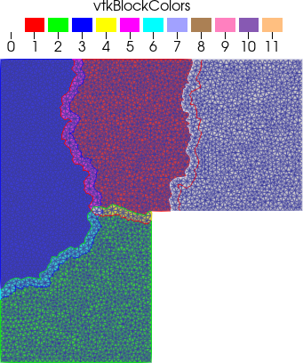
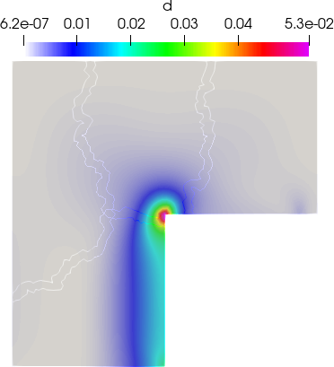
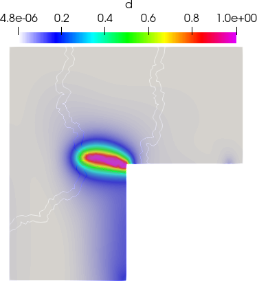
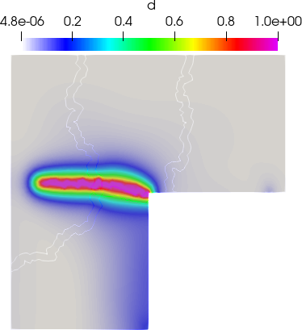
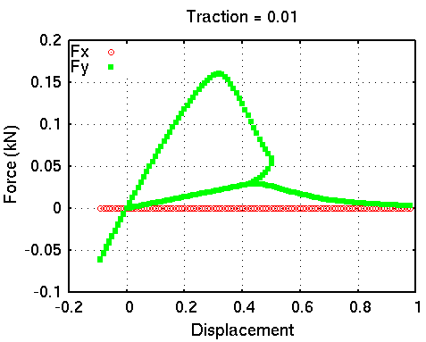

## L-shape cracking ##

This tutorial involves cracking of L shaped specimen, where loading is controlled by a point boundary condition.


### Preprocessing ###

You can either solver the problem using vectorial approach (recommended) or using staggered approach. To generate the solver use either from below.

- Generation of solver (vectorial)

```bash
PSD_PreProcess -dimension 2 -problem damage -model hybrid-phase-field \
-dirichletconditions 1 -dirichletpointconditions 1 -debug -postprocess ud \
-energydecomp -constrainHPF -vectorial -getreactionforce -plotreactionforce \
-reactionforce variational-based
```

- Generating solver (staggered)

```bash
PSD_PreProcess -dimension 2 -problem damage -model hybrid-phase-field \
-dirichletconditions 1 -dirichletpointconditions 1 -debug -postprocess ud \
-energydecomp -constrainHPF -getreactionforce -plotreactionforce \
-reactionforce variational-based
```


### Edit Cycle ###

**Edit ControlParameter.edp:**

- Update physical parameter, change
```c++
  real lambda = 121.15e3 ,                                                    
       mu     = 80.77e3  ,                                                    
       Gc     = 2.7      ; 
```

to

```c++
real	lambda	= 6.16e3 ,
		mu		= 10.95e3 ,
		Gc		= 8.9e-2 ;
```
- Update solver parameter , change
```c++
  real lfac  = 2.0  ,                                                         
       maxtr = 7e-3 ,                                                         
       tr    = 1e-5 ,                                                         
       dtr   = 1e-5 ,                                                         
       lo           ; 
```
to
```c++
real	lfac	= 2.0	,
		maxtr	= 1		,
		tr		= 1e-2	,
		dtr		= 1e-2	,
		lo				;
```
- Enter the correct Point boundary condition, change
```c++
  real[int,int] PbcCord = [                                                
//-------------------- [  x  , y  ] --------------------//                   
                       [  0. , 0. ]    // point 0                       
//------------------------------------------------------//                    
                      ];                                                      
                                                                              
   macro Pbc0Ux  -0. //                                                 
   macro Pbc0Uy  -0. //
```
to 
```c++
  real[int,int] PbcCord = [                                                   
//-------------------- [  x  , y  ] --------------------//                   
                       [  470., 250. ]    // point 0                       
//------------------------------------------------------//                    
                      ];                                                      
                                                                              
   macro Pbc0Uy  tr //
```


**Edit LinearFormBuilderAndSolver.edp:**

- To postprocess correct reaction forces in LinearFormBuilderAndSolver.edp for vectorial solver, change
```c++
  for(int i=0; i < Th.nv; i++){                                                 
     if(abs(Th(i).y-1.)<.000001){                                               
        forcetotx = forcetotx + F[][i*3]*DP[i*3];           
        forcetoty = forcetoty + F[][i*3+1]*DP[i*3+1];       
     }                                                                          
  } 
```
to
```c++
  if(mpirank==mpirankPCi[0]){
     forcetotx = forcetotx + F[][PCi[0]*3+0]*DP[PCi[0]*3+0];           
     forcetoty = forcetoty + F[][PCi[0]*3+1]*DP[PCi[0]*3+1]; 
  } 
```

- To postprocess correct reaction forces in LinearFormBuilderAndSolver.edp for staggered solver, change

```c++
  for(int i=0; i < Th.nv; i++){                                                 
     if(abs(Th(i).y-1.)<.000001){                                               
        forcetotx = forcetotx + F[][i*2]*DP[i*2];           
        forcetoty = forcetoty + F[][i*2+1]*DP[i*2+1];       
     }                                                                          
  }
```

to

```c++
  if(mpirank==mpirankPCi[0]){
     forcetotx = forcetotx + F[][PCi[0]*2+0]*DP[PCi[0]*2+0];           
     forcetoty = forcetoty + F[][PCi[0]*2+1]*DP[PCi[0]*2+1]; 
  } 
```

- Finally to include cyclic loading, change
```c++
  //-----------------updating traction----------------//                        
                                                                                
  tr += dtr; 
```
to
```c++
  //-----------------updating traction----------------//                        
  
  if(iterout<50)                                                                         
     tr += dtr;
  if(iterout>=51 && iterout<110) 
     tr -= dtr; 
  if(iterout>=111)                    
     tr += dtr; 
```




### Solving ###

```bash
PSD_Solve -np 4 Main.edp -wg -v 0 -mesh ./../Meshes/2D/L-shaped-crack.msh
```

### Postprocessing

Use ParaView to post process results. 


 Crack initiating | Crack moving | Crack developed
- | - | -
 |  | 

On you screen, the force displacement curve which plots (force.data) should look something like this

| **Force-displacement curve with cyclic loading**  |
| :-----------------------------------------------: |
|                    |
