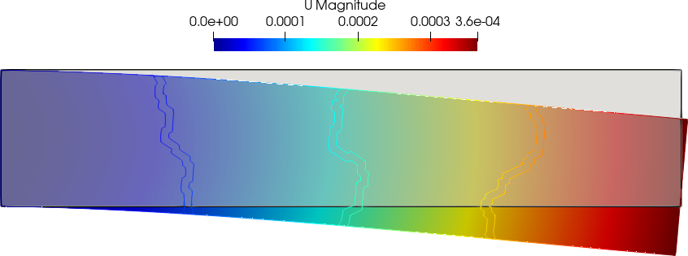

#  Linear Elasticity Tutorial  1:  #

To showcase the usage of Linear elasticity, we shall discuss here an example of a 2D bar, which bends under its own load. The bar $5\times1$ m$^2$ in area is made up of material with  $\rho=8\times 10^3$,  $E=200\times 10^9$, and $\nu=0.3$.


### Step 1: Preprocessing 

First step in a PSD simulation is PSD preprocessing , at this step you tell PSD what kind of physics, boundary conditions, approximations, mesh, etc are you expecting to solve.

In the terminal `cd` to the folder `\home\PSD-tutorials\linear-elasticity` .  Launch  `PSD_PreProcess` from the terminal, to do so run the following command.

```bash
PSD_PreProcess -problem linear-elasticity -dimension 2 -bodyforceconditions 1 \
-dirichletconditions 1 -postprocess u
```

After the `PSD_PreProcess` runs successfully you should see many `.edp` files in your current folder. 

*What do the arguments mean ?* `-problem linear-elasticity` means that we are solving linear elasticity problem, `-dimension 2` means it is a 2D simulation, `-bodyforceconditions 1` with applied body force acting on the domain; `-dirichletconditions 1` says we have one Dirichlet border; and `-postprocess u` means we would like to have ParaView post processing files.

At this stage the input properties $E,\nu$ can be mentioned in ` ControlParameters.edp`, use `E  = 200.e9`, and `nu = 0.3;`. The volumetric body force condition is mentioned in the same file via variable `Fbc0Fy -78480.0`,  i.e ($\rho*g=8.e3*(-9.81)=-78480.0$).  One can also provide the mesh to be used in ` ControlParameters.edp` , via `ThName = "../Meshes/2D/bar.msh"`  (*note that mesh can also be provided in the next step*) .In addition variable `Fbc0On 1` has to be provided in order to indicate the volume (region) for which the body force is acting, here `1` is the integer volume tag of the mesh. Dirichlet boundary conditions are also provided in `ControlParameters.edp`. To provide the clamped boundary condition the variables   ` Dbc0On 2`,  ` Dbc0Ux 0.`,  and `Dbc0Uy 0.`  are used, which means for Dirichlet border `2` (` Dbc0On 2`) where `2` is the clamped border label of the mesh  Dirichlet constrain is applied and ` Dbc0Ux 0.`, ` Dbc0Uy 0` i.e., the clamped end condition ($u_x=u_y=0$).


### Step 2: Solving 

As PSD is a parallel solver, let us use  4 cores to solve the 2D bar case. To do so enter the following command:

```bash
PSD_Solve -np 4 Main.edp  -mesh ./../Meshes/2D/bar.msh -v 0
```

Here ` -np 4`  denote the argument used to enter the number of parallel processes (MPI processes) used while solving. `-mesh ./../Meshes/2D/bar.msh` is used to provide the mesh file to the solver.  `-v 0` denotes the verbosity level on screen.  ` PSD_Solve`  is a wrapper around ` FreeFem++`  or `FreeFem++-mpi`.  Note that if your problem is large use more cores. PSD has been tested upto 13,000 parallel processes and problem sizes with billions of unknowns,  surely you will now need that many for the 2D bar problem. 


### Step 3: Postprocessing ###

PSD allows postprocessing of results in ParaView. After the step 2 mentioned above finishes. Launch ParaView and have a look at the `.pvd` file in the  `VTUs_DATE_TIME` folder.




You are all done with your 2D linear-elasticty simulation.  


## 2D bar is ok, but what about 3D ? ##

3D follows the same logic as 2D, in the preprocessing step

```bash
PSD_PreProcess -problem linear-elasticity -dimension 3 -bodyforceconditions 1 \
-dirichletconditions 1 -postprocess u
```

note that all what has changed `-dimension 3` instead of `-dimension 2`

Solving step remains exactly the same with `-mesh` flag now pointing towards the `3D` mesh.

```bash
PSD_Solve -np 4 Main.edp  -mesh ./../Meshes/3D/bar.msh -v 0
```


## What else should you try to become an advanced user ##

- Optionally try using `-fastmethod` flag with `PSD_PreProcess` for producing optimized codes, you are encouraged to have a look at `ControlParameters.edp` file produced with `-fastmethod` flag and without `-fastmethod` flag.

- Add `-sequential` flag to `PSD_PreProcess`  for sequential solver, but remember to use `PSD_Solve_Seq` instead of `PSD_Solve` and no `-np` flag.

  ```bash
  PSD_PreProcess -problem linear-elasticity -dimension 2 -sequential \
  -bodyforceconditions 1  -dirichletconditions 2 -postprocess u
  ```

  ```bash
  PSD_Solve_Seq Main.edp  -mesh ./../Meshes/2D/bar.msh -v 0
  ```

  Do the same simulation in 3D. 

- You are encouraged to time your the PSD solver and see if you have considerable gains when using more processes in parallel PSD or when comparing a a sequential solver with a parallel one. To time the solver use `-timelog` flag during `PSD_PreProcess`. 

- You are encouraged to use more complex meshes for this same problem, but do not forget to update the `ControlParameters.edp` file.
