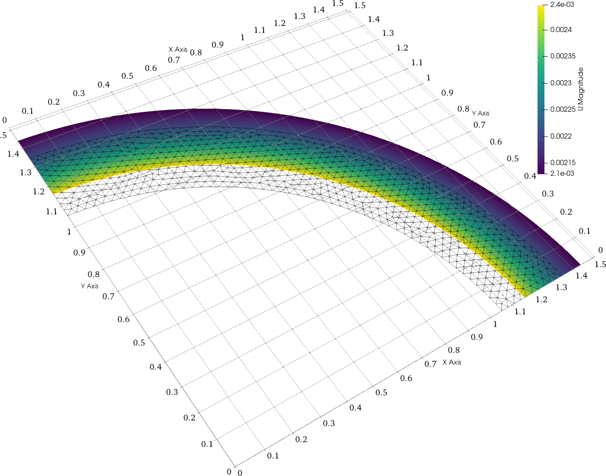
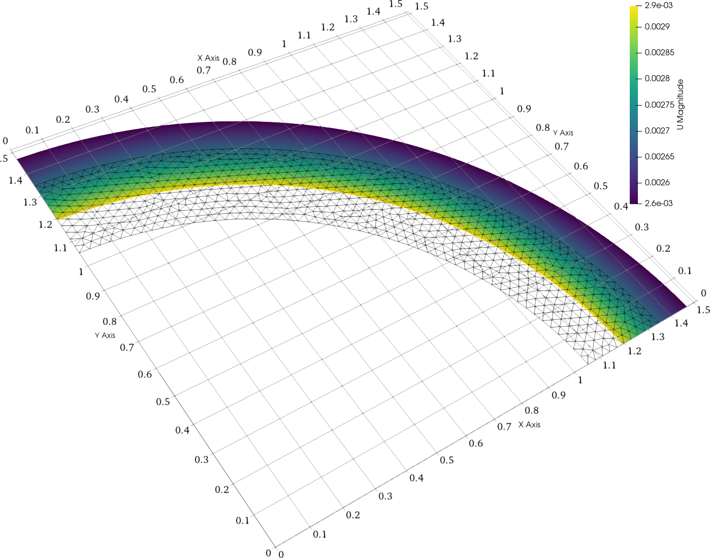
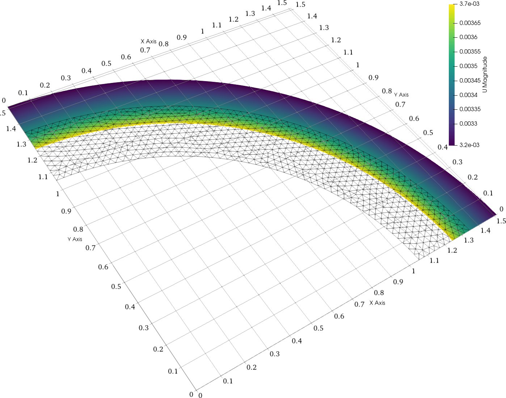
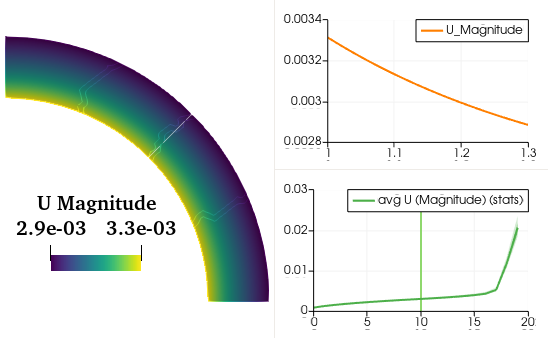
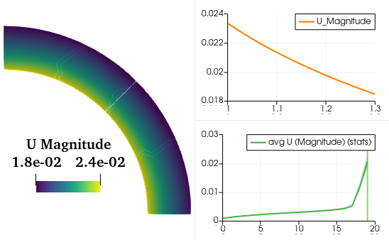
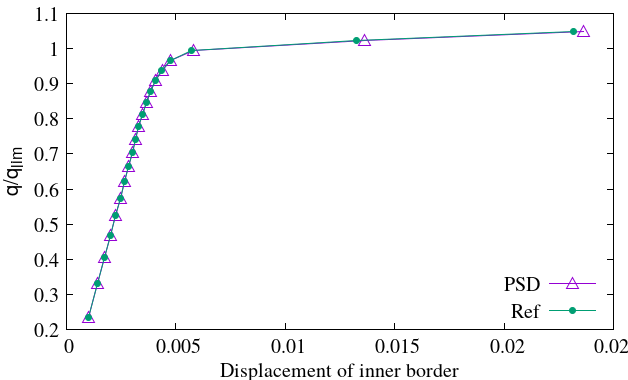

## Tutorial 1
### 2D elasto-plastic problem
#### Nonlinear elasto-plastic Von-Mises material analysis via MFront $-$Isotropic linear hardening plasticity$-$ 

> 💡 **Note**: This document details a tutorial that allows one to use the `PSD-MFront` interface for nonlinear elasto-plastic problems. `MFront` handles material‑behaviour updates and non‑linearities. It is advised to follow this tutorial after tutorials 1 and 9 on linear elasticity.

> 💡 **Note**: This tutorial serves as an introduction to nonlinear `PSD-MFront` coupling. The real strength lies in applying MFront to more complex material behaviors.

### Introduction

This tutorial addresses the incremental analysis of a nonlinear elasto-plastic Von‑Mises material in 2D ($x$‑$y$). The domain of interest is a quarter‑cylinder with external radius $R_e$ and internal radius $R_i$.

Symmetry conditions are applied at the bottom ($y=0$) and left ($x=0$) boundaries. A uniform internal pressure $q$ is applied at the internal boundary. This pressure increases from 0 to

$$
q_{\text{lim}} = \frac{2}{\sqrt3} \sigma_0 \,\ln\!\left(\frac{R_e}{R_i}\right)
$$

which is the analytical collapse load for a perfectly plastic material (no hardening).

<figure style="text-align: center;">
  
  <figcaption><em>Figure: Domain of the non-linear problem.</em></figcaption>
</figure>

The material follows an isotropic elasto-plastic Von‑Mises yield condition with strength $\sigma_0$ and hardening modulus $H$:

$$
f(\sigma) = \sqrt{\tfrac{3}{2} s:s} - \sigma_0 - H p \le 0
$$

where $p$ is the equivalent plastic strain and $s = \operatorname{dev}\sigma_{\text{elas}}$. The tangent modulus is

$$
E_t = \frac{E H}{E + H}
$$

An iterative predictor–corrector return‑mapping algorithm within a Newton‑Raphson loop is used. Thanks to linear isotropic hardening, the return mapping is analytical.

The displacement-field evolution is shown below:

<figure style="text-align: center;">
  <!-- First row -->
  
  
  
   
  <!-- Second row -->
  
  
  
  <figcaption><em>Figure: Warped displacement field evolution — from top left \(t_0, t_4, t_8, t_{12}, t_{16}, t_{19}\).</em></figcaption>
</figure>

The return mapping solves for $\sigma_{n+1}$ and $p_{n+1}$ from $\sigma_n$, $p_n$, and $\Delta\varepsilon$, handled by MFront along with the algorithmic tangent.

1. Compute trial stress:

    $$
    \sigma_{\text{elas}} = \sigma_n + \mathbf{M} \Delta\varepsilon
    $$

2. Check plasticity criterion:

    $$
    f_{\text{elas}} = \sigma_{\text{elas}}^{\rm eq} - \sigma_0 - H\,p_n
    $$

3. If $f_{\text{elas}} \le 0$, the step is elastic ($\Delta p = 0$). Otherwise:

    $$
    \Delta p = \frac{f_{\text{elas}}}{3\mu + H}
    $$

4. Correct stress:

    $$
    \sigma_{n+1} = \sigma_{\text{elas}} - \beta s,\quad \beta = \frac{3\mu}{\sigma_{\text{elas}}^{\rm eq}} \Delta p
    $$

### Procedure to simulate in PSD

### Step 1: Preprocessing

Start by using `PSD_PreProcess` to set up physics, boundary conditions, and activate MFront:

<pre><code>
PSD_PreProcess -problem elasto_plastic -model von_mises -dimension 2 \
-tractionconditions 1 -dirichletconditions 2 -postprocess u -useMfront
</code></pre>

This generates `.edp` files in your directory.

> 💡 **Note**: Argument meanings:
>
> * `-problem elasto_plastic`: elasto‑plastic simulation
> * `-model von_mises`: Von‑Mises yield condition
> * `-dimension 2`: 2D
> * `-tractionconditions 1`: pressure BC
> * `-dirichletconditions 2`: two Dirichlet BCs
> * `-postprocess u`: output for ParaView
> * `-useMfront`: enable MFront interface

Set material and geometric parameters in `ControlParameters.edp`:

<pre><code>// Material parameters
real E     = 70.e3, nu = 0.3, sig0 = 250., Et = E/100., H = E*Et/(E-Et);
real Re    = 1.3,     Ri = 1.0;
real Qlim  = 2./sqrt(3.)*log(Re/Ri)*sig0;
</code></pre>

Define MFront behavior:

<pre><code>string MaterialBehaviour  = "IsotropicLinearHardeningPlasticity";
string MaterialHypothesis = "PLANESTRAIN";
string PropertyNames      = "YoungModulus PoissonRatio HardeningSlope YieldStrength";
real[int] PropertyValues  = [ E, nu, H, sig0 ];
</code></pre>

Set algorithmic parameters:

<pre><code>// Algorithmic parameters
macro EpsNrCon  () 1.e-8
macro NrMaxItr  () 200
macro TlMaxItr  () 20
</code></pre>

Define Dirichlet BCs:

<pre><code>
// Dirichlet boundary conditions
macro Dbc0On 1
macro Dbc0Uy 0.
macro Dbc1On 3
macro Dbc1Ux 0.
</code></pre>

Define traction (Neumann) BCs:

<pre><code>
// Traction boundary conditions
real tl;
macro Tbc0On  4
macro Tbc0Tx  Qlim*tl*N.x
macro Tbc0Ty  Qlim*tl*N.y
</code></pre>

Here, `tl` is a timestep loading parameter.

### Step 2: Solving

Use multiple cores to solve:

<pre><code>
PSD_Solve -np 4 Main.edp -mesh ./../Meshes/2D/quater_cylinder.msh -v 0
</code></pre>

* `-np 4`: use 4 MPI processes
* `-mesh …`: specify mesh file
* `-v 0`: verbosity level

Larger problems can use more cores—PSD supports up to thousands of MPI processes.

### Step 3: Postprocessing

After solving, use ParaView on the `.pvd` files in the `VTUs…` directory. Visualize displacement fields like those shown in:

<figure style="text-align: center;">

  

    
    
  

  

    
    
  

  

    
    
  

  <figcaption style="max-width: 800px; margin: 0 auto; font-style: italic;">
    Figure: Validation results comparison of PSD (left column) and reference code (right column) at different timesteps (<em>t0, t10, t19</em>). Reference results used for comparison were obtained by installing and running the FEniCS Solid Mechanics library [Garth N. Wells (2021)].
  </figcaption>
</figure>

You’re now done with your 2D elasto-plastic simulation using the MFront interface!

### Validation

Comparison is made to FEniCS Solid Mechanics results \[@Fenics]. Displacement analysis matches within good accuracy.

<figure style="text-align: center;">
  
  <figcaption style="max-width: 600px; margin: 0 auto; font-style: italic;">
    Figure: Validation of the displacement movement of inner border obtained by PSD and another reference code. Reference results used for comparison were obtained by installing and running the FEniCS solid mechanics codes — 
    <a href="https://bitbucket.org/fenics-apps/fenics-solid-mechanics" target="_blank" rel="noopener noreferrer">https://bitbucket.org/fenics-apps/fenics-solid-mechanics</a>.
  </figcaption>
</figure>

<figure style="text-align: center;">
  
  

  <figcaption style="max-width: 700px; margin: 0 auto; font-style: italic;">
    Figure: Validation of the displacement field obtained by PSD and another reference code. The displacement magnitude is plotted on the central line which bisects the geometry into two. On the left, time steps — <em>t0, t4, t8, t12, t16</em> — are plotted and on the right — <em>t19</em>. Reference results used for comparison were obtained by installing and running the FEniCS Solid Mechanics library [Garth N. Wells (2021)].
  </figcaption>
</figure>

The results confirm PSD‑MFront validity for Von‑Mises plasticity.
