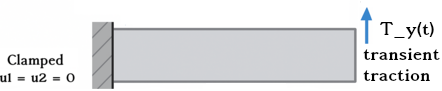

## Elastodynamics and Finite Element Discretization

Let us consider a $d$-dimensional domain $\Omega \subset \mathbb{R}^d$ in a Euclidean referential $R(O, \mathbf{e}_i)$, with $i = 1, \dots, d$, subjected to a distribution of body forces $\mathbf{b} = \mathbf{b}(x, t)$. We denote by $\partial \Omega$ the boundary of $\Omega$, and by $\mathbf{n} = \mathbf{n}(x)$ the outward unit normal vector at a point $x \in \partial \Omega$.

The dynamic equilibrium of the system is governed by the momentum balance equation, which requires finding a displacement field $\mathbf{u}(x, t): \Omega \times [0, T] \rightarrow \mathbb{R}^d$ satisfying:

$$
\begin{cases}
\text{div}\, \boldsymbol{\sigma} + \mathbf{b} = \rho\, \ddot{\mathbf{u}} & \text{in } \Omega \times [0, T] \\
\boldsymbol{\sigma} = \boldsymbol{\sigma}(\mathbf{u}) & \text{in } \Omega \times [0, T] \\
\mathbf{u} = \mathbf{u}^* & \text{on } \partial_u \Omega \times [0, T] \\
\boldsymbol{\sigma} \cdot \mathbf{n} = \mathbf{t} & \text{on } \partial_t \Omega \times [0, T] \\
\mathbf{u}(x, 0) = \mathbf{u}_0(x), \quad \dot{\mathbf{u}}(x, 0) = \dot{\mathbf{u}}_0(x) & \text{in } \Omega
\end{cases}
$$

Here:

* $\rho(x): \Omega \rightarrow \mathbb{R}$ is the mass density,
* $\ddot{\mathbf{u}}$ denotes the second time derivative (acceleration),
* $\boldsymbol{\sigma}$ is the Cauchy stress tensor derived from a given constitutive law,
* $\mathbf{u}^*$ and $\mathbf{t}$ are prescribed Dirichlet and Neumann boundary conditions, respectively,
* $\partial \Omega = \partial_u \Omega \cup \partial_t \Omega$, with $\partial_u \Omega \cap \partial_t \Omega = \emptyset$.

We define the functional spaces for admissible displacements and test functions as:

$$
\begin{aligned}
\mathcal{U} &= \left\{ \mathbf{u} \in H^1(\Omega)^d \mid \mathbf{u} = \mathbf{u}^* \text{ on } \partial_u \Omega, \ \mathbf{u}(x, 0) = \mathbf{u}_0(x), \ \dot{\mathbf{u}}(x, 0) = \dot{\mathbf{u}}_0(x) \right\} \\
\mathcal{V} &= \left\{ \mathbf{v} \in H^1(\Omega)^d \mid \mathbf{v} = \mathbf{0} \text{ on } \partial_u \Omega \right\}
\end{aligned}
$$

To derive the weak form, we multiply the balance equation by a test function $\mathbf{v} \in \mathcal{V}$ and integrate over the domain $\Omega$, using integration by parts and applying the Neumann boundary condition:

$$
\int_\Omega \rho\, \ddot{\mathbf{u}} \cdot \mathbf{v} \, dV + \int_\Omega \boldsymbol{\sigma}(\mathbf{u}) : \boldsymbol{\varepsilon}(\mathbf{v}) \, dV = \int_\Omega \mathbf{b} \cdot \mathbf{v} \, dV + \int_{\partial_t \Omega} \mathbf{t} \cdot \mathbf{v} \, dS
$$

This leads to the variational problem:
**Find** $\mathbf{u} \in \mathcal{U}$ **such that**

$$
M(\ddot{\mathbf{u}}, \mathbf{v}) + K(\mathbf{u}, \mathbf{v}) = b(\mathbf{v}; \mathbf{b}) + b_{\partial_t \Omega}(\mathbf{v}; \mathbf{t}) \quad \forall \mathbf{v} \in \mathcal{V}
$$

where:

* $M(\ddot{\mathbf{u}}, \mathbf{v}) = \int_\Omega \rho, \ddot{\mathbf{u}} \cdot \mathbf{v} , dV$ is the inertial (mass) bilinear form,
* $K(\mathbf{u}, \mathbf{v}) = \int_\Omega \boldsymbol{\sigma}(\mathbf{u}) : \boldsymbol{\varepsilon}(\mathbf{v}) , dV$ is the stiffness bilinear form,
* $b(\mathbf{v}; \mathbf{b}) = \int_\Omega \mathbf{b} \cdot \mathbf{v} , dV$ is the volume force linear form,
* $b_{\partial_t \Omega}(\mathbf{v}; \mathbf{t}) = \int_{\partial_t \Omega} \mathbf{t} \cdot \mathbf{v} , dS$ is the surface traction linear form.

#### Damping Effects

Material dissipation can be included either through the constitutive relation $\boldsymbol{\sigma} = \boldsymbol{\sigma}(\mathbf{u})$ or by introducing a global damping operator. In the latter case, the variational problem becomes:

$$
M(\ddot{\mathbf{u}}, \mathbf{v}) + C(\dot{\mathbf{u}}, \mathbf{v}) + K(\mathbf{u}, \mathbf{v}) = b(\mathbf{v}; \mathbf{b}) + b_{\partial_t \Omega}(\mathbf{v}; \mathbf{t}) \quad \forall \mathbf{v} \in \mathcal{V}
$$

where $C(\dot{\mathbf{u}}, \mathbf{v})$ is a damping bilinear form (e.g., Rayleigh or viscoelastic damping) often controled by damping parameters $\eta_m$ and $\eta_k$.

#### Generalized-α Time Integration Scheme

To integrate the semi-discrete system in time, we adopt the **generalized-α method**, which provides controllable numerical dissipation for high frequencies while maintaining second-order accuracy.

Let $t^n = n \Delta t$ be the discrete time steps. The generalized-α scheme updates $(\mathbf{u}^{n+1}, \dot{\mathbf{u}}^{n+1}, \ddot{\mathbf{u}}^{n+1})$ via:

1. **Predictor**:

   $$
   \mathbf{u}^{n+1} = \mathbf{u}^n + \Delta t \dot{\mathbf{u}}^n + \Delta t^2 \left( \frac{1}{2} - \beta \right) \ddot{\mathbf{u}}^n,
   $$

   $$
   \dot{\mathbf{u}}^{n+1} = \dot{\mathbf{u}}^n + \Delta t (1 - \gamma) \ddot{\mathbf{u}}^n.
   $$
2. **Define intermediate evaluation points**:

   $$
   \mathbf{u}_\alpha^{n+1} = (1 - \alpha_f)\mathbf{u}^{n+1} + \alpha_f \mathbf{u}^n,
   $$

   $$
   \dot{\mathbf{u}}_\alpha^{n+1} = (1 - \alpha_f)\dot{\mathbf{u}}^{n+1} + \alpha_f \dot{\mathbf{u}}^n,
   $$

   $$
   \ddot{\mathbf{u}}_\alpha^{n+1} = (1 - \alpha_m)\ddot{\mathbf{u}}^{n+1} + \alpha_m \ddot{\mathbf{u}}^n.
   $$
3. **Solve at $t^{n+1}$** using the residual:

   $$
   \mathbf{M} \ddot{\mathbf{u}}_\alpha^{n+1} + \mathbf{K}(\mathbf{u}_\alpha^{n+1}) = \mathbf{F}(t_\alpha^{n+1}),
   $$

   where $t_\alpha^{n+1} = (1 - \alpha_f)t^{n+1} + \alpha_f t^n$.
4. **Corrector**:

   $$
   \dot{\mathbf{u}}^{n+1} = \dot{\mathbf{u}}^n + \Delta t \left[(1 - \gamma)\ddot{\mathbf{u}}^n + \gamma \ddot{\mathbf{u}}^{n+1}\right],
   $$

   $$
   \mathbf{u}^{n+1} = \mathbf{u}^n + \Delta t \dot{\mathbf{u}}^n + \Delta t^2 \left[\left(\frac{1}{2} - \beta\right)\ddot{\mathbf{u}}^n + \beta \ddot{\mathbf{u}}^{n+1}\right].
   $$

#### Choice of Parameters

The parameters $(\alpha_m, \alpha_f, \beta, \gamma)$ are selected to ensure second-order accuracy and controlled high-frequency damping. A common choice is:

$$
\alpha_m = \frac{2 \rho_\infty - 1}{\rho_\infty + 1}, \quad
\alpha_f = \frac{\rho_\infty}{\rho_\infty + 1}, \quad
\gamma = \frac{1}{2} + \alpha_f - \alpha_m, \quad
\beta = \frac{1}{4}(1 + \alpha_f - \alpha_m)^2,
$$

where $\rho_\infty \in [0,1]$ is the spectral radius controlling high-frequency damping ($\rho_\infty = 1$: no dissipation; $\rho_\infty = 0$: maximum dissipation).

## Tutorial 1
### Clamped Bar with Transient Loading

> ⚠️ **Warning**:
> You are requested to having followed at least the linear-elasticity tutorials before attempting to follow this tutorial. This will make the understanding process here simpler.

> 💡 **Note**:
> These tutorials aim to kick-start usage of the elastodynamics module in PSD. They are concise by design and intended for users or developers with some familiarity with the software.

The problem of interest concerns the dynamic response of an elastic bar subjected to time-dependent loading. The bar is modeled using the small-strain linear elastodynamics equations with homogeneous material properties. The material is characterized by a density $\rho = 1.0$, and Lamé parameters $\lambda = 576.92$ and $\mu = 384.62$, corresponding to a Young's modulus $E = 1000$ and Poisson's ratio $\nu = 0.3$.

The domain is fixed (clamped) on one boundary where a Dirichlet condition imposes zero displacement in both the $x$- and $y$-directions. This constraint is applied to the left boundary identified by label 2 in the mesh. On another right boundary (label 4), a time-dependent traction is applied in the $y$-direction. This traction increases linearly over time until $t = 0.8$, then remains constant. The applied load is defined as:

$$
T_y(t) = \frac{t}{0.8} \quad \text{for } t \leq 0.8, \quad T_y(t) = 0 \quad \text{for } t > 0.8.
$$

The simulation is performed over a total duration $t_{\text{max}} = 4.0$ with a uniform time step $\Delta t = 0.08$. Time integration is carried out using the Newmark-$\beta$ method, a second-order implicit scheme with parameters $\gamma = 0.5$ and $\beta = \tfrac{1}{4}(\gamma + 0.5)^2$. This choice ensures numerical stability and accuracy for the elastodynamic response.

<figure style="text-align: center;">
  
  <figcaption><em>Figure: Geometry and boundary conditions — a 2D bar clamped at the left end transient traction.</em></figcaption>
</figure>

To account for numerical damping, generalized-α style mass and stiffness damping parameters $\eta_m = 0.01$ and $\eta_k = 0.01$ are introduced. These help suppress spurious high-frequency oscillations that may arise during time integration.

The quantities of interest include the displacement field $\mathbf{u}$, velocity field $\mathbf{v}$, and acceleration field $\mathbf{a}$, which are computed and stored at each time step for postprocessing and analysis.

#### 🛠️ Step 1: Preprocessing the Simulation

In the terminal `cd` to the folder `/home/PSD-tutorials/elastodynamics` Note that one can perform these simulation in any folder provided that PSD has been properly installed. We use `/home/PSD-tutorials/elastodynamics` for simplicity, once the user is proficient a simulation can be launch elsewhere. Launch the preprocessing phase by running the following command in your terminal:

<pre><code>PSD_PreProcess -dimension 2 -problem elastodynamics -dirichletconditions 1 -tractionconditions 1 \
-timediscretization newmark_beta -postprocess uav
</code></pre>

> 🧠 What do the arguments mean?

| Flag                                 | Description                                                                   |
| ------------------------------------ | ----------------------------------------------------------------------------- |
| `-problem elastodynamics`          | Enables elastodynamics physics                                                |
| `-dimension 2`                     | Sets the simulation dimension to 2D                                           |
| `-tractionconditions 1`            | Applies traction conditions on one border                                     |
| `-dirichletconditions 1`           | Applies Dirichlet conditions on one border                                    |
| `-timediscretization newmark_beta` | Sets time discretization via Newmark-$\beta$                                |
| `-postprocess uav`                 | Requests ($\mathbf{u}$, $\mathbf{a}$, $\mathbf{v}$) output for ParaView |

Upon successful preprocessing, several `.edp` (FreeFEM) script files will be generated in your working directory. You will now have to follow an edit cycle, where you will provide PSD with some other additional information about your simulation that you wish to perform. At this stage the input properties need to be set. All of these are setup in `ControlParameters.edp` file. 

- Start by setting mesh in `bar_dynamic.msh`.

<pre><code class="cpp">
//=============================================================================
// ------- Mesh parameters (Un-partitioned) -------
// -------------------------------------------------------------------
//  ThName : Name of the .msh file in Meshses/2D or  Meshses/3D folder
//=============================================================================
  
  string ThName = "../Meshes/2D/bar_dynamic.msh";
</code></pre>

- Next, setup the material properties:

<pre><code class="cpp">
//============================================================================
//                   ------- Material parameters -------
// -------------------------------------------------------------------
//  rho : density of Material
//  mu, lambda : Lame parameter of the Material
//  E, nu : Modulus of Elasticity and Poisson ratio of the Material
//============================================================================

  real rho    = 1.0          ,
       lambda = 576.9230769  ,
       mu     = 384.6153846  ;
</code></pre>

- Set the time discretization  and damping parameters:

<pre><code class="cpp">
//============================================================================
//           ------- Time discretization parameters -------
// -------------------------------------------------------------------
//  etam, etak : damping parameters
//  t, tmax, dt : Time parameters, time, maximum time, and time step
//  gamma, beta : Time discretization constants (Newmark-beta)
//============================================================================

  real etam = 0.01 ,
       etak = 0.01 ,
       tmax = 4.0  ,
       t    = 0.08 ,
       dt   = 0.08 ;

  real gamma = 0.5                       ,
       beta  = (1./4.)*(gamma+0.5)^2     ;
</code></pre>

- Set the Dirchlet clamped border:

<pre><code class="cpp">
//============================================================================
//        ------- Dirichlet boundary-condition parameters -------
// ---------------------------------------------------------------------------
// Dbc       : acronym for Dirichlet boundary condition
// Dbc(I)On  : is/are the  surface labels tags (integer list) on to which
//             Dirichlet boundary conditions is to be applied.
// Dbc(I)Ux  : is the x component of Dirichlet displacement on the surface
//             border (I) denoted by label(s) Dbc(I)On in the mesh.
// --------------------------------------------------------------------------
// NOTE: either macro Dbc(I)Ux or Dbc(I)Uy or Dbc(I)Uz should  be commented
//       or deleted if the user does not wish to apply Dirichlet  condition
//       on that particular  direction (let it free)
//============================================================================

  macro  Dbc0On 2   //
  macro  Dbc0Ux 0.  //
  macro  Dbc0Uy 0.  //
</code></pre>

- Finally setup the traction conditional:

<pre><code class="cpp">
//============================================================================
// ------- Neumann/traction boundary-condition parameters -------
// ---------------------------------------------------------------------------
// Tbc       : acronym for traction boundary condition
// Tbc(I)On  : is/are the  surface labels tags (integer list) on to which
//             traction boundary conditions is to be applied.
// Tbc(I)Tx  : is the x component of traction forces on the surface
//             border (I) denoted by label(s) Tb(I)On in the mesh.
// --------------------------------------------------------------------------
// NOTE: either macro Tbc(I)Tx or Tbc(I)Ty or Tbc(I)Tz should  be commented
//       or deleted  if  the  user  does not wish to apply traction on that
//       particular  direction (let it free)
//============================================================================

  macro  Tbc0On  4   //
  macro  Tbc0Ty  tt/0.8*(tt <= 0.8)+ 0.*(tt > 0.8) //
</code></pre>

With all this, we have now setup the problem and are ready for launching the solver.

#### ⚙️ Step 2: Solving the Problem

As PSD is a parallel solver, let us use 2 cores to solve the problem. To do so enter the following command:

<pre><code>PSD_Solve -np 2 Main.edp -mesh ./../Meshes/2D/bar_dynamic.msh -v 0
</code></pre>

This will launch the PSD simulation.

Here `-np 2` (number of processes) denote the argument used to enter the number of parallel processes (MPI processes) used by PSD while solving. `-mesh ./../Meshes/2D/bar_dynamic.msh` is used to provide the mesh file to the solver, `-mesh` argument is not needed if the user has indicated the right mesh in `ControlParameters.edp` file. `-v 0` denotes the verbosity level on screen. `PSD_Solve` is a wrapper around `FreeFem++-mpi`. Note that if your problem is large use more cores.

#### 📊 Step 3: Postprocessing and Visualization

Once the simulation is finished. PSD allows postprocessing of results in ParaView. Launch ParaView and have a look at the `.pvd` file in the `VTUs...` folder. Using ParaView for postprocessing the results that are provided in the `VTUs...` folder, results such as those shown in the figure below can be extracted.

<figure style="text-align: center;">
  
  
  
  
  
  <figcaption><em>Figure: Finite element displacement field on warped mesh shown at different time steps.</em></figcaption>
</figure>

> 🧪 Optional Exercise: Perform the same simulation but in 3D, a 3D mesh equivalent to that of 2D case is already present in the `Meshes` folder in the tutorial. 

## Tutorial 2
### Sequential PSD Elastodynamic Simulations

> 💡 **Note**:
> These tutorials aim to kick-start usage of the elastodynamics module in PSD. They are concise by design and intended for users or developers with some familiarity with the software.

To run the same problems described earlier in **sequential mode**, add `(...-sequential)` to the `(...PSD_PreProcess)` command. Additionally, use `(...PSD_Solve_Seq)` instead of `(...PSD_Solve)`.

The workflow for the **2D problem** becomes:

<pre><code>PSD_PreProcess -dimension 2 -problem elastodynamics -dirichletconditions 1 -tractionconditions 1 \
-timediscretization newmark_beta -postprocess uav -sequential
</code></pre>

Once preprocessing is complete, solve the problem using the given mesh file `(...bar_dynamic.msh)`:

<pre><code>PSD_Solve_Seq -np 2 Main.edp -mesh ./../Meshes/2D/bar_dynamic.msh -v 0
</code></pre>

You can similarly try out the **3D problem** by following the same workflow with `-dimension 3` and the appropriate mesh file.

## Tutorial 3
### Different Time Discretizations for Elastodynamic Simulations

> 💡 **Note**:
> These tutorials aim to kick-start usage of the elastodynamics module in PSD. They are concise by design and intended for users or developers with some familiarity with the software.

PSD offers different time discretization techniques for solving time-dependent problems. Instead of the Newmark-$\beta$ scheme, you can switch to a more advanced **Generalized-$\alpha$** scheme.

This is done by specifying the option `(...-timediscretization generalized_alpha)` in the preprocessing step. For example, for a **2D problem**, use:

<pre><code>PSD_PreProcess -dimension 2 -problem elastodynamics -dirichletconditions 1 -tractionconditions 1 \
-timediscretization generalized_alpha -postprocess uav
</code></pre>

After preprocessing, solve the problem using **three MPI processes** with the mesh file `(...bar_dynamic.msh)`:

<pre><code>PSD_Solve -np 3 Main.edp -mesh ./../Meshes/2D/bar_dynamic.msh -v 0
</code></pre>

You can similarly try out the **3D problem** by using `-dimension 3` and the appropriate 3D mesh.

## Tutorial 4
### Timelogging Elastodynamic Simulations

> 💡 **Note**:
> These tutorials aim to kick-start usage of the elastodynamics module in PSD. They are concise by design and intended for users or developers with some familiarity with the software.

PSD provides a way to log timing information from your solver via the `-timelog` flag. This enables the solver to report the time taken by different operations in each time step.

> ⚠️ **Warning**:
> Using this feature may slow down your simulation, as it involves `MPI_Barrier` operations to measure timings accurately.

#### 2D Solver with Time Logging

Run the preprocessing step with the `-timelog` flag:

<pre><code>PSD_PreProcess -dimension 2 -problem elastodynamics -dirichletconditions 1 -tractionconditions 1 \
-timediscretization newmark_beta -postprocess uav -timelog
</code></pre>

Then solve the problem using two MPI processes with the provided 2D mesh file:

<pre><code>PSD_Solve -np 2 Main.edp -mesh ./../Meshes/2D/bar_dynamic.msh -v 0
</code></pre>

#### Example Output

<figure style="text-align: center;">
  
  <figcaption><em>Figure: Time logging output produced for parallel run on 2 processes.</em></figcaption>
</figure>

A similar time log is produced for the sequential solver:

<figure style="text-align: center;">
  
  <figcaption><em>Figure: Time logging output produced for parallel run on 2 processes.</em></figcaption>
</figure>

> 💡 **Note**:
> Compare the runtimes: The parallel solver takes ~**1.5 seconds**, while the sequential run takes ~**3.3 seconds**, indicating a **2x speedup** when using 2 MPI processes.
> The timing report includes the breakdown of solver phases, but only for the **final time step**.

Use these logs to analyze performance bottlenecks and compare scalability between sequential and parallel executions.

---

## 📚 Additional Exercises

These exercises are designed to deepen your understanding of the various features and numerical strategies available in PSD. They allow you to experiment with performance optimization, modeling approaches, and elastodynamics enhancements.

#### Exercise 1 – Time Discretization Comparison

Use the `-timelog` flag to explore how different time integration schemes affect solver performance. Start by comparing **Newmark-β** and **Generalized-α** time discretizations, then try out other time integrators available in PSD.

**Tasks:**
* Solve the same elastodynamics problem using different time schemes.
* Use both `PSD_Solve` (parallel) and `PSD_Solve_Seq` (sequential) to compare performance.
* Record timing, accuracy, and solver behavior for each case.
Refer to the PSD documentation for a list of supported time integration schemes.

#### Exercise 2 – Mesh Refinement and Convergence Study

PSD supports post-partitioning mesh refinement using the `-split` flag at solver level. This flag refines each triangle (or tetrahedron) into smaller ones:

* `-split 1` → 4 elements per original element
* `-split 2` → 16 elements, and so on
* In general, `-split n` results in $4^n$ times more elements in 2D

**Suggested Usage:**

<pre><code>
PSD_Solve -np 2 Main.edp -mesh ./../Meshes/2D/bar-dynamic.msh -v 0 -split 2
</code></pre>

This refines each triangle of the `bar-dynamic.msh` mesh into 4 smaller triangles.

**Try this to:**
* Assess mesh convergence of the solution
* Analyze computational time vs. accuracy
* Explore scaling behavior with parallel computing

#### Exercise 3 – Live Visualization with OpenGL Debug Mode

The `-debug` flag (used during preprocessing) activates a live OpenGL visualization of the displacement field. This feature is helpful for quick visual feedback during development or exploratory simulations.

**Step 1: Preprocess with Debug Mode**

<pre><code>
PSD_PreProcess -dimension 2 -problem elastodynamics -dirichletconditions 1 -tractionconditions 1 \
-timediscretization newmark_beta -postprocess uav -timelog -debug
</code></pre>

**Step 2: Solve with Visualization Enabled**

<pre><code>
PSD_Solve -np 2 Main.edp -mesh ./../Meshes/2D/bar-dynamic.msh -v 0 -wg
</code></pre>

The additional `-wg` flag enables OpenGL graphics rendering during solving.

#### Exercise 4 – Accelerated Solving with GoFast Plugins (GFP)

PSD includes a high-performance computing kernel known as **GoFast Plugins (GFP)**, which uses optimized C++ structures for various compute-heavy operations. This feature is **disabled by default**, but can be activated using the `-useGFP` flag during preprocessing.

**Step 1: Preprocess with GFP Enabled**
<pre><code>
PSD_PreProcess -dimension 2 -problem elastodynamics -dirichletconditions 1 -tractionconditions 1 \
-timediscretization newmark_beta -postprocess uav -useGFP
</code></pre>

**Step 2: Solve the Problem**
<pre><code>
PSD_Solve -np 2 Main.edp -mesh ./../Meshes/2D/bar-dynamic.msh -v 0 -wg
</code></pre>

Combine with `-timelog` to measure the performance improvement.

**Try this out with other problems** from the tutorial to evaluate the speedup offered by GFP. It is often beneficial to keep this flag enabled by default for larger problems.