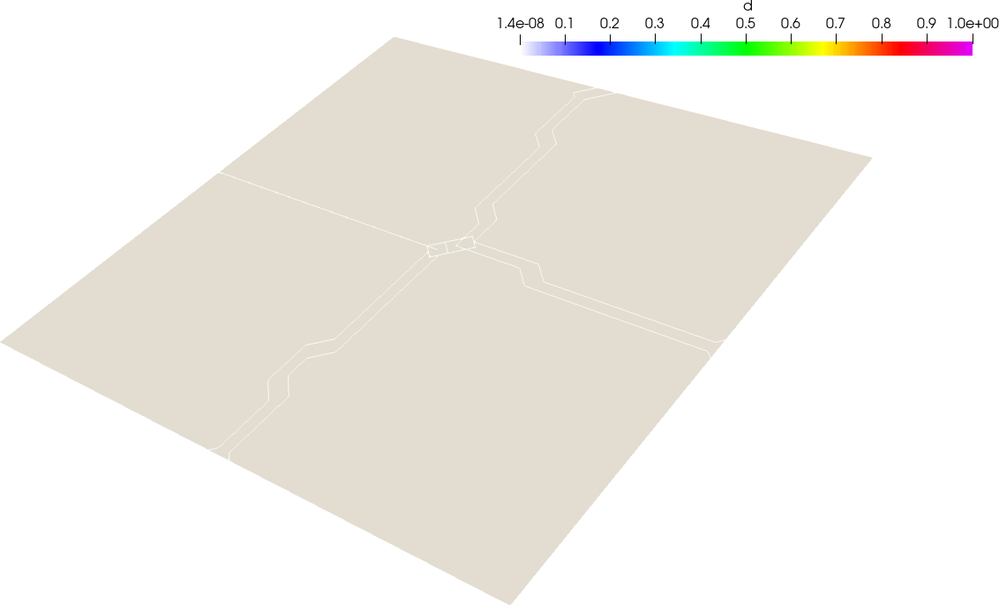

## Fracture Mechanics and Finite Element Resolution
  
PSD uses Hybrid Phase-Field models under the hood to solve fracture mechanics problems. Theory behind these models is introduced next. 

### Finite Element Formulation for Hybrid Phase-Field Fracture Mechanics

This section introduces the finite element spatial discretization of the boundary value problem (BVP) governing the hybrid phase-field model for brittle fracture. For illustration, we consider a three-dimensional (3D) setting, though the formulation generalizes naturally to other dimensions.

#### Discretized Variational Formulations

Let the computational domain be denoted as $ \Omega_h \subset \Omega \subset \mathbb{R}^3 $, discretized using finite elements. We define the unknown nodal displacement vector $ \mathbf{u}_h = [u_1, u_2, u_3]^T $ and scalar damage field $ d_h $. The finite element variational formulation for the displacement field reads:

Find $\mathbf{u}_h \in \mathcal{V}_h$ such that $\forall t \in [0, T]$:

$$
\int_{\Omega_h} \left( (1 - d_h)^2 + \kappa \right) \boldsymbol{\sigma}(\mathbf{u}_h) : \boldsymbol{\varepsilon}(\mathbf{v}_h) \, dv = \int_{\partial \Omega_h^N} \mathbf{t} \cdot \mathbf{v}_h \, ds, \quad \forall \mathbf{v}_h \in \mathcal{V}_h
\tag{1}
$$

Here, $\boldsymbol{\varepsilon}$ is the small strain tensor, $\boldsymbol{\sigma}$ the Cauchy stress tensor, and $\kappa \ll 1$ is a small regularization parameter preventing singularities as $d_h \to 1$. The test and trial functions belong to the Sobolev space:

$$
\mathcal{V}_h = \left\{ \mathbf{u}_h \in [H^1(\Omega_h)]^3 \;|\; \mathbf{u}_h = \bar{\mathbf{u}} \text{ on } \partial \Omega_h^D \right\}
\tag{2}
$$

For the damage field $d_h$, the scalar variational problem becomes:

Find $d_h \in \mathcal{W}_h$ such that $\forall t \in [0, T]$:

$$
\int_{\Omega_h} \left( \frac{G_c}{\ell_0} + 2 H^+(\mathbf{u}_h) \right) d_h \theta_h \, dv + \int_{\Omega_h} G_c \ell_0 \nabla d_h \cdot \nabla \theta_h \, dv = \int_{\Omega_h} 2 H^+(\mathbf{u}_h) \theta_h \, dv, \quad \forall \theta_h \in \mathcal{W}_h
\tag{3}
$$

where $G_c$ is the critical energy release rate, $\ell_0$ is the regularization length, and $H^+(\cdot)$ denotes the tensile part of the elastic energy. The admissible space is:

$$
\mathcal{W}_h = \left\{ d_h \in H^1(\Omega_h) \;|\; d_h \in [0, 1] \right\}
\tag{4}
$$

#### Vectorial FEM for the Hybrid Phase-Field Model

To solve equations (1) and (3), a common strategy is the **staggered scheme**, where the displacement and damage fields are updated alternately. This approach benefits from simplicity and reduced memory usage but may converge slowly due to weak coupling.

Alternatively, the **monolithic strategy** solves the coupled system simultaneously. This results in better convergence and potentially higher accuracy, albeit at increased computational and memory cost.

#### Fully Coupled Vectorial Formulation

To derive the monolithic formulation, we define a combined trial field $\mathbf{w}_h = [u_{h,1}, u_{h,2}, u_{h,3}, d_h]^T$ and corresponding test field $\mathbf{q}_h$, both belonging to:

$$
\mathcal{W}_h = \left\{ \mathbf{w}_h \in [H^1(\Omega_h)]^4 \;|\; \mathbf{w}_h|_{\partial \Omega_h^D} = [\bar{\mathbf{u}}, \cdot], \; w_{h,4} \in [0, 1] \right\}
\tag{5}
$$

The coupled variational formulation reads:

Find $\mathbf{w}_h \in \mathcal{W}_h$ such that:

$$
\begin{aligned}
\int_{\Omega_h} \left( (1 - w_{h,4})^2 + \kappa \right) \boldsymbol{\sigma}(\mathbf{w}_h) : \boldsymbol{\varepsilon}(\mathbf{q}_h) \, dv
+ \int_{\Omega_h} \left( \frac{G_c}{\ell_0} + 2 H^+(\mathbf{w}_h) \right) w_{h,4} q_{h,4} \, dv \\
+ \int_{\Omega_h} G_c \ell_0 \nabla w_{h,4} \cdot \nabla q_{h,4} \, dv
= \int_{\partial \Omega_h^N} \mathbf{t} \cdot \mathbf{q}_{h,1:3} \, ds + \int_{\Omega_h} 2 H^+(\mathbf{w}_h) q_{h,4} \, dv
\end{aligned}
\tag{6}
$$

#### Nonlinear Solving via Picard Iterations

The monolithic system is nonlinear due to the coupling terms. To solve it, we adopt a **Picard iteration** scheme, which provides a fixed-point iteration framework:

Given $\mathbf{w}_h^j$, find $\mathbf{w}_h^{j+1} \in \mathcal{W}_h$ such that:

$$
\begin{aligned}
\int_{\Omega_h} \left( (1 - w_{h,4}^j)^2 + \kappa \right) 
\left[ \lambda \nabla \mathbf{w}_h^{j+1} \cdot \nabla \mathbf{q}_h + 2 \mu \boldsymbol{\varepsilon}(\mathbf{w}_h^{j+1}) : \boldsymbol{\varepsilon}(\mathbf{q}_h) \right] dv \\
+ \int_{\Omega_h} \left( \frac{G_c}{\ell_0} + 2 H^+(\mathbf{w}_h^j) \right) w_{h,4}^{j+1} q_{h,4} \, dv
+ \int_{\Omega_h} G_c \ell_0 \nabla w_{h,4}^{j+1} \cdot \nabla q_{h,4} \, dv \\
= \int_{\partial \Omega_h^N} \mathbf{t} \cdot \mathbf{q}_{h,1:3} \, ds + \int_{\Omega_h} 2 H^+(\mathbf{w}_h^j) q_{h,4} \, dv
\end{aligned}
\tag{7}
$$

This formulation leads to symmetric linear systems at each iteration, facilitating efficient resolution using standard finite element libraries and solvers.

## Tutorial 1
### Tensile Cracking of a 2D Pre-Cracked Plate

> ⚠️ **Warning**:
> You are requested to having followed at least the linear-elasticity tutorials before attempting to follow this tutorial. This will make the understanding process here simpler.

A two-dimensional test is introduced. The problem of interest is a typical single-notch square plate cracking test under tensile loading. A unit square with a pre-existing crack is clamped at the bottom with $u_1 = u_2 = 0$ (first boundary condition), and is loaded quasi-statically on its top surface with $u_2 = u_2 + \Delta u_2$ until the crack propagates through its walls. Thus, two Dirichlet conditions are applied: one on the top and one on the bottom border.

  

*Figure: Domain of the single notch square cracking problem under tensile loading.*

The material is supposed to have the Lame coefficients, $\lambda=121.15e3$ and $\mu=80.77e3$, additionally the fracture toughness $G_c=2.7$.

To model this test, PSD provides a hybrid phase-field modelling technique under damage mechanics (fracture mechanics). We use ParaView to post-process displacement $u$ and phase-field $d$ for visualising the cracking process.

#### 🛠️ Step 1: Preprocessing the Simulation

First step in a PSD simulation is PSD preprocessing, at this step you tell PSD what kind of physics, boundary conditions, approximations, mesh, etc are you expecting to solve. PSD is a command-line (TUI: Terminal User Interface) based tool. All user interactions are done via terminal commands.

In the terminal `cd` to the folder `/home/PSD-tutorials/fracture-mechanics` Note that one can perform these simulation in any folder provided that PSD has been properly installed. We use `/home/PSD-tutorials/fracture-mechanics` for simplicity, once the user is proficient a simulation can be launch elsewhere. Launch the preprocessing phase by running the following command in your terminal:

<pre><code>PSD_PreProcess -dimension 2 -problem damage -model hybrid_phase_field \
-dirichletconditions 2 -postprocess ud
</code></pre>

> 🧠 What do the arguments mean?

| Flag      | Description       |
| ---------------------------- | --------------------------------------------------- |
| `-problem damage`            | Enables damage mechanics physics |
| `-dimension 2`               | Sets the simulation dimension to 2D                 |
| `-model hybrid_phase_field`  | Activate using hybrid phase-field modelling         |
| `-dirichletconditions 2`     | Applies Dirichlet conditions on two borders         |
| `-postprocess ud`            | Requests displacement and damage output for ParaView|

Upon successful preprocessing, several `.edp` (FreeFEM) script files will be generated in your working directory. You will now have to follow an edit cycle, where you will provide PSD with some other additional information about your simulation that you wish to perform, in this case 2D tensile loading fracture problem.

At this stage the input of the solver need to be set. All of these are setup in `ControlParameters.edp` file. 

- Let us start by setting mesh in `tensile_crack.msh`. This is step two of the PSD simulation: `PSD_Solve`.

<pre><code class="cpp">
//=============================================================================
// ------- Mesh parameters (Un-partitioned) -------
// -------------------------------------------------------------------
//  ThName : Name of the .msh file in Meshses/2D or  Meshses/3D folder
//=============================================================================
  
  string ThName = "../Meshes/2D/tensile_crack.msh";
</code></pre>

- Next, we setup the material properties, including Lame parameters and fracture toughness:

<pre><code class="cpp">
//=============================================================================
//------- Material parameters -------
// -------------------------------------------------------------------
//  mu, lambda : Lame parameter of the material
//  Gc : Material fracture toughness
//=============================================================================
  
  real lambda = 121.15e3 ,
       mu     = 80.77e3  ,
       Gc     = 2.7      ;
</code></pre>  

- Maximal tensile loading of $7e-3$ in $y$-direction is applied in quasi static manner with a loading step $\Delta u_2=1e-5$, additionally for phase field model we assume the fracture diffusion capacity  of 2, these are provided in:

<pre><code class="cpp">
//============================================================================
//                  ------- Solver parameters -------
// -------------------------------------------------------------------
//  lfac : # of cells within which fracture diffusion occurs
//  maxtr : Maximum traction force applied
//  tr : Traction force applied
//  dtr :  Change in traction force between two pseudo-time steps
//  lo :  Mesh dependent lateral fracture length
//============================================================================
  
  real lfac  = 2.0  ,
       maxtr = 7e-3 ,
       tr    = 1e-5 ,
       dtr   = 1e-5 ,
       lo           ;
</code></pre>  

- Finally the two Dirichlet conditions are applied, clamped bottom border (label = 1) with $u_1=u_2=0$, top border (label = 2) subjected to tensile pull (traction = `tr` as defined above)  in $y$-direction:

<pre><code class="cpp">
//============================================================================
//        ------- Dirichlet boundary-condition parameters -------
// ---------------------------------------------------------------------------
// Dbc       : acronym for Dirichlet boundary condition    
// Dbc(I)On  : is/are the  surface labels tags (integer list) on to which     
//             Dirichlet boundary conditions is to be applied.
// Dbc(I)Ux  : is the x component of Dirichlet displacement on the surface    
//             border (I) denoted by label(s) Dbc(I)On in the mesh.
// -------------------------------------------------------------------------- 
// NOTE: either macro Dbc(I)Ux or Dbc(I)Uy or Dbc(I)Uz should  be commented   
//       or deleted if the user does not wish to apply Dirichlet  condition   
//       on that particular  direction (let it free)       
//============================================================================
  

  macro  Dbc0On 1   //
  macro  Dbc0Ux 0.  //
  macro  Dbc0Uy 0.  //

  macro  Dbc1On 2   //       
  macro  Dbc1Uy tr  // 
</code></pre>  

This completes the solver setup and preprocessing phase. With this we are ready to move to next step.

#### ⚙️ Step 2: Solving the Problem

As PSD is a parallel solver, let us use 4 cores to solve the problem. To do so enter the following command:

<pre><code>PSD_Solve -np 4 Main.edp -mesh ./../Meshes/2D/tensile_crack.msh -v 0
</code></pre>

This will launch the PSD simulation.

Here `-np 4` (number of processes) denote the argument used to enter the number of parallel processes (MPI processes) used by PSD while solving. `-mesh ./../Meshes/2D/tensile_crack.msh` is used to provide the mesh file to the solver, `-mesh` argument is not needed if the user has indicated the right mesh in `ControlParameters.edp` file. `-v 0` denotes the verbosity level on screen. `PSD_Solve` is a wrapper around `FreeFem++-mpi`. Note that if your problem is large use more cores.

#### 📊 Step 3: Postprocessing and Visualization

Once the simulation is finished. PSD allows postprocessing of results in ParaView. Launch ParaView and have a look at the `.pvd` file in the `VTUs...` folder. Using ParaView for postprocessing the results that are provided in the `VTUs...` folder, results such as those shown in the figure below can be extracted.

  
  
  
  

  
  
  
  

 

*Figure: Finite element displacement visualised for the 2D problem using ParaView at different timesteps. Time progresses left to right and top to bottom.*

  
  
  
  

  
  
  
  

*Figure: Finite element damage visualized for the 2D problem using ParaView at different timesteps. Time progresses left to right and top to bottom.*

Figures above show the finite element displacement and damage fields, which allow us to visualize the progression of cracking in the square plate.

  

*Figure: Applied traction, non-linear iterations, and residual printed in the terminal.*

During the simulation, the terminal displays the traction updates, non-linear iterations to convergence at each time step, and the residuals of $u$ and $d$. Refer to the figure above for a sample output.

> 🧪 Optional Exercise: To construct your own test case, try editing the `ControlParameters.edp` file. Maybe try adding shear force instead of tensile one. In this case loading will be in $x$ direction, you should observe different cracking behaviors.

## Tutorial 2
### Tensile Cracking of a Pre-Cracked Cube

> ⚠️ **Warning**:
> You are requested to having followed at least the linear-elasticity tutorials before attempting to follow this tutorial. This will make the understanding process here simpler.

A three-dimensional test, analogous to its two-dimensional counterpart introduced earlier, is used here as a tutorial example. The problem of interest involves a unit cube undergoing extrusion along the $z$-axis. Cracking is initiated and propagated under tensile loading. 

The cube has a pre-existing crack and is clamped at the bottom 
$$u_1=u_2=u_3=0.$$ 
A quasi-static displacement is applied on the top surface 
$$u_2 = u_2 + \Delta u_2$$ 
until the crack propagates through the walls. There are two Dirichlet conditions—one on the bottom and one on the top surface.

Just like in the 2D case, PSD's hybrid phase-field modelling technique is employed. We use ParaView post-processing to visualize the displacement field $u$ and the phase-field $d$ during the cracking process. Indeed all what changes for this simulation is the geometry (consequently the mesh) and the dimension of the problem, these two changes will be handled by (`-dimension` and `-mesh`) arguments.

#### 🛠️ Step 1: Preprocessing the Simulation

As before, preprocessing sets up the problem definition. The main change is the dimension of the problem.

Run the following command in your terminal:

<pre><code>PSD_PreProcess -dimension 3 -problem damage -model hybrid_phase_field  \
-dirichletconditions 2 -postprocess ud
</code></pre>

> 🧠 What is different from the 2D case?

compared to the 2D problem, note that all what has changed `-dimension 3` instead of `-dimension 2`.

Again, as we followed for the 2D case, we begin here in the same manner by editing `ControlParameters.edp`.

- For the mesh we provide:

<pre><code class="cpp">
//=============================================================================
// ------- Mesh parameters (Un-partitioned) -------
// -------------------------------------------------------------------
//  ThName : Name of the .msh file in Meshses/2D or  Meshses/3D folder
//=============================================================================
  
  string ThName = "../Meshes/3D/tensile_crack.msh"; 
</code></pre>

- For the material properties, as the material remains the same we add :

<pre><code class="cpp">
//=============================================================================
//------- Material parameters -------
// -------------------------------------------------------------------
//  mu, lambda : Lame parameter of the material
//  Gc : Material fracture toughness
//  kappa0 : Damage initiation threshold of the Material    
//  kappac :  Critical strain level of the Material
//=============================================================================
  
  real lambda = 121.15e3 ,
       mu     = 80.77e3  ,
       Gc     = 2.7      ;  
</code></pre>

- For the solver parameters, as it remains the same we add :

<pre><code class="cpp">
//============================================================================
//                  ------- Solver parameters -------      
// -------------------------------------------------------------------        
//  lfac : # of cells within which fracture diffusion occurs
//  maxtr : Maximum traction force applied  
//  tr : Traction force applied
//  dtr :  Change in traction force between two pseudo-time steps
//  lo :  Mesh dependent lateral fracture length
//============================================================================
  
  real lfac  = 2.0  ,
       maxtr = 7e-3 ,
       tr    = 1e-5 ,
       dtr   = 1e-5 ,
       lo           ;  
</code></pre>

- Finally, the Dirichlet border on the bottom differs in the sense that it also includes the third $z$ component :

<pre><code class="cpp">
//============================================================================
//        ------- Dirichlet boundary-condition parameters -------
// ---------------------------------------------------------------------------
// Dbc       : acronym for Dirichlet boundary condition    
// Dbc(I)On  : is/are the  surface labels tags (integer list) on to which     
//             Dirichlet boundary conditions is to be applied.
// Dbc(I)Ux  : is the x component of Dirichlet displacement on the surface    
//             border (I) denoted by label(s) Dbc(I)On in the mesh.
// -------------------------------------------------------------------------- 
// NOTE: either macro Dbc(I)Ux or Dbc(I)Uy or Dbc(I)Uz should  be commented   
//       or deleted if the user does not wish to apply Dirichlet  condition   
//       on that particular  direction (let it free)       
//============================================================================
  

  macro  Dbc0On 1   //
  macro  Dbc0Ux 0.  //
  macro  Dbc0Uy 0.  //
  macro  Dbc0Uz 0.  //

  macro  Dbc1On 2   //       
  macro  Dbc1Uy tr  //
</code></pre>

With edit cycle complete we can now proceed to solving. 

#### ⚙️ Step 2: Solving the Problem

After preprocessing, we solve the problem using MPI with the mesh file <code>tensile_crack.msh</code>:

<pre><code>PSD_Solve -np 3 Main.edp -mesh ./../Meshes/3D/tensile_crack.msh -v 0
</code></pre>

As a reminder:
`-np 3` specifies the number of MPI processes.
`-mesh` provides the mesh to PSD.
`-v 0` sets verbosity to minimal.

#### 📊 Step 3: Postprocessing and Visualization

Finally, using ParaView for postprocessing the results that are provided in the `VTUs..` folder, results such as those shown below can be extracted.

### Displacement Field

  
  
  
  

*Figure: Finite element displacement visualized for the 3D problem in ParaView at different timesteps (quasi-static simulation). Time progresses from left to right in a row and top to bottom across rows.*

### Damage Field

  
  
  
  

 

*Figure: Finite element damage visualized for the 3D problem in ParaView at different timesteps (quasi-static simulation). Time progresses from left to right in a row and top to bottom across rows.*

> 💡 **Note**: 
> Figures above present the evolution of both displacement and damage fields, enabling a clear visualization of crack propagation in the cubic specimen.

> 🧪 Optional Exercise: Try changing the material properties to prepone or postpone the fracture process. 

## Tutorial 3
### Tensile Cracking and Calculate-Plotting Reaction-Force

> ⚠️ **Warning**:
> You are requested to having followed at least the linear-elasticity tutorials and tutorial 1 of fracture mechanics before attempting to follow this tutorial. This will make the understanding process here simpler.

In solid mechanics, quantities of interest often include plots such as **reaction force on a surface** versus the applied displacement. These outputs are frequently used in experimental validations. PSD provides routines for calculating the reaction force on a surface and also allows live (runtime) plotting of these results.

Here we reuse the tutorial 1 for demonstration. As a reminder, the problem of interest is a typical single-notch square plate cracking test under tensile loading. A unit square with a pre-existing crack is clamped at the bottom with $u_1 = u_2 = 0$ (first boundary condition), and is loaded quasi-statically on its top surface with $u_2 = u_2 + \Delta u_2$ until the crack propagates through its walls. Thus, two Dirichlet conditions are applied: one on the top and one on the bottom border.

  

*Figure: Domain of the single notch square cracking problem under tensile loading.*

The material is supposed to have the Lame coefficients, $\lambda=121.15e3$ and $\mu=80.77e3$, additionally the fracture toughness $G_c=2.7$.

#### 🛠️ Step 1: Preprocessing the Simulation

To observe the **reaction force vs. applied displacement**, two extra flags compared to that of tutorial 1 must be used during the preprocessing step with `PSD_PreProcess`:

<pre><code>
PSD_PreProcess -dimension 2 -problem damage -model hybrid_phase_field \
-dirichletconditions 2 -getreactionforce -reactionforce stress_based
</code></pre>

The two additional flags we find here are:

`-getreactionforce` which tells PSD to include the routines for reaction force computation.

`-reactionforce stress_based` method calculates the force using the stress integral in the $y$ direction:
$$F_y = \int_{\partial\Omega_{\text{top}}} \sigma_y$$

- The `ControlParameters.edp` contains the same parameters than the tutorial 1. Additionally, we need to provide the surface  on which reaction force is to be calculated, in this case it is the top surface (mesh label = 2):

<pre><code class="cpp">
//============================================================================
//                   ------- Reaction force calculation -------
// -------------------------------------------------------------------
//  RFOn : Reaction force surface list
//============================================================================

  macro  RFOn 2   //  
</code></pre>

> 💡 **Note**:
>An alternative method is `-reactionforce variational_based`, which is more accurate but slower. It uses matrix-vector multiplication:
>$$\{F_x, F_y\} = \mathbf{A} \{u_1, u_2\}$$

#### ⚙️ Step 2: Solving the Problem

Run the simulation using `PSD_Solve` with the appropriate mesh and number of processes:

<pre><code>
PSD_Solve -np 4 Main.edp -mesh ./../Meshes/2D/tensile_crack.msh -v 0
</code></pre>

While the solver runs, a file named `force.data` will be created containing both the **reaction force** and **applied traction**.

#### 📊 Step 3: Postprocessing and Visualization

As in tutorial 1 ParaView can be used to visulize the displacement and damage fields. In this tutorial you can also plot `force.data` to analyze how $F\_y$ and $F\_x$ evolve with loading $\Delta u\_2$. In this file:

* 1st column: loading $\Delta u\_2$
* 2nd column: $F\_x$
* 3rd column: $F\_y$

This leads to a plot such as shown below:

  

*Figure: Applied traction vs. force in the y direction.*

Such a plot is typical, as it shows reaction force rises almost linearly, then as the fracture starts, it quickly drops due to a fractured medium. 

> ⚠️ **Warning**:
> Ensure the output file `force.data` is correctly written before plotting; incomplete simulations might yield corrupted files.

##### Bonus tutorial : Live plots

If you have **GnuPlot** configured with PSD (i.e, gnuplot was present during PSD installation process), you can enable **live plotting** of the force-displacement curve using additional  flag `-plotreactionforce` during preprocessing.

<pre><code>
PSD_PreProcess -dimension 2 -problem damage -model hybrid_phase_field \
-dirichletconditions 2 -getreactionforce -reactionforce stress_based
</code></pre>

During the simulation run this shall lead to continuous plots as shown below: 

  
  
  

*Figure: Live plotting of traction vs. force using PSD and GnuPlot.*

> 🧪 Optional Exercise: Try changing dimension of the problem to 3D (`-dimension 3`), and perform the tutorial. You would also need to change the mesh to `./../Meshes/3D/tensile_crack.msh`

## Tutorial 4
### L-shape specimen cracking with cyclic loading

  

*Figure: Geometry of the L-shaped test used in this tutorial. Concrete L-shaped panel is shown with experimental fracture paths*

This is a benchmark tests for concrete fracture mechanics problem. The figure above presents the geometry and the experimental cracks that are observed. To observe cracking, the specimen is loaded via two Dirichlet conditions: the clamped bottom wall, and Dirichlet point loading at point P.  

#### 🛠️ Step 1: Preprocessing the Simulation

You can either solve the problem using vectorial approach (recommended) or using staggered approach. To generate the solver, use one of the following.

**Generation of solver (vectorial)**

<pre><code>
PSD_PreProcess -dimension 2 -problem damage -model hybrid_phase_field \
-dirichletconditions 1 -dirichletpointconditions 1 -debug -postprocess ud \
-energydecomp -constrainHPF -vectorial -getreactionforce -plotreactionforce \
-reactionforce variational_based
</code></pre>

**Generating solver (staggered)**

<pre><code>
PSD_PreProcess -dimension 2 -problem damage -model hybrid_phase_field \
-dirichletconditions 1 -dirichletpointconditions 1 -debug -postprocess ud \
-energydecomp -constrainHPF -getreactionforce -plotreactionforce \
-reactionforce variational_based
</code></pre>

### Edit Cycle

#### Edit `ControlParameter.edp`

- Update physical parameter, change:

<pre><code>
  real lambda = 121.15e3 ,
       mu     = 80.77e3  ,
       Gc     = 2.7      ;
</code></pre>

to

<pre><code>
  real lambda = 6.16e3 ,
       mu     = 10.95e3 ,
       Gc     = 8.9e-2  ;
</code></pre>

- Update solver parameter, change:

<pre><code>
  real lfac  = 2.0  ,
       maxtr = 7e-3 ,
       tr    = 1e-5 ,
       dtr   = 1e-5 ,
       lo           ;
</code></pre>

to

<pre><code>
  real lfac  = 2.0  ,
       maxtr = 1    ,
       tr    = 1e-2 ,
       dtr   = 1e-2 ,
       lo           ;
</code></pre>

- Enter the correct point boundary condition, change:

<pre><code>
  real[int,int] PbcCord = [
//-------------------- [  x  , y  ] --------------------//
    [  0. , 0. ]    // point 0
//------------------------------------------------------//
   ];

   macro Pbc0Ux  -0. //
   macro Pbc0Uy  -0. //
</code></pre>

to

<pre><code>
  real[int,int] PbcCord = [
//-------------------- [  x  , y  ] --------------------//
    [  470., 250. ]    // point 0
//------------------------------------------------------//
   ]
;
   macro Pbc0Uy  tr //
</code></pre>

#### Edit `LinearFormBuilderAndSolver.edp`

- To postprocess correct reaction forces for **vectorial solver**, change:

<pre><code>
  for(int i=0; i < Th.nv; i++){
     if(abs(Th(i).y-1.)<.000001){
        forcetotx = forcetotx + F[][i*3]*DP[i*3];
        forcetoty = forcetoty + F[][i*3+1]*DP[i*3+1];
     }
  }
</code></pre>

to

<pre><code>
  if(mpirank==mpirankPCi[0]){
     forcetotx = forcetotx + F[][PCi[0]*3+0]*DP[PCi[0]*3+0];
     forcetoty = forcetoty + F[][PCi[0]*3+1]*DP[PCi[0]*3+1];
  }
</code></pre>

- To postprocess correct reaction forces for **staggered solver**, change:

<pre><code>
  for(int i=0; i < Th.nv; i++){
     if(abs(Th(i).y-1.)<.000001){
        forcetotx = forcetotx + F[][i*2]*DP[i*2];
        forcetoty = forcetoty + F[][i*2+1]*DP[i*2+1];
     }
  }
</code></pre>

to

<pre><code>
  if(mpirank==mpirankPCi[0]){
     forcetotx = forcetotx + F[][PCi[0]*2+0]*DP[PCi[0]*2+0];
     forcetoty = forcetoty + F[][PCi[0]*2+1]*DP[PCi[0]*2+1];
  }
</code></pre>

- To include cyclic loading, change:

<pre><code>
  //-----------------updating traction----------------//

  tr += dtr;
</code></pre>

to

<pre><code>
  //-----------------updating traction----------------//

  if(iterout<50)
     tr += dtr;
  if(iterout>=51 && iterout<110)
     tr -= dtr;
  if(iterout>=111)
     tr += dtr;
</code></pre>

  

*Figure: Finite element mesh of the L-shaped test.*

#### ⚙️ Step 2: Solving the Problem

Irrespective of whether vectorial or staggered mode is used, solve the problem using `PSD_Solve`:

<pre><code>
PSD_Solve -np 4 Main.edp -wg -v 0 -mesh ./../Meshes/2D/L_shaped_crack.msh
</code></pre>

#### 📊 Step 3: Postprocessing and Visualization

Use ParaView to post-process results.

  
  
  

*Figure: Finite element solution showing crack initiation, movement, and development.*

On your screen, the force-displacement curve which plots `force.data` should look something like this:

  

*Figure: Force-displacement curve with cyclic loading.*
