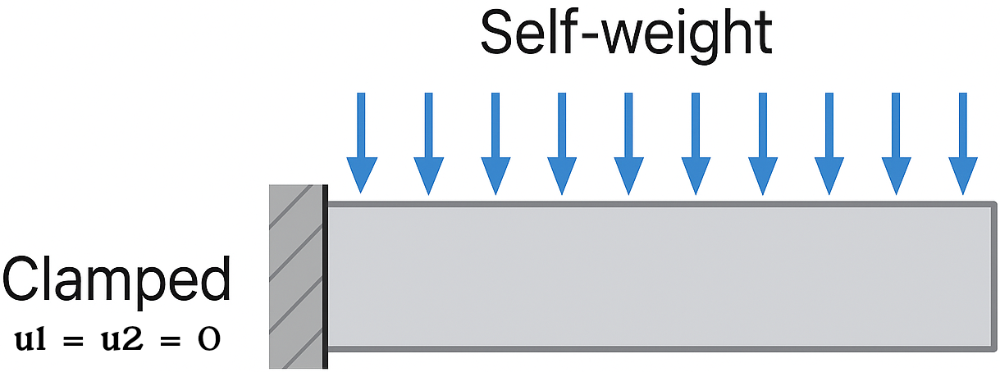
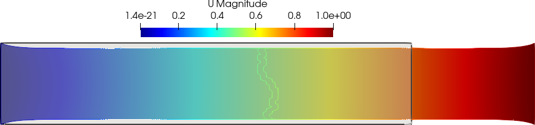
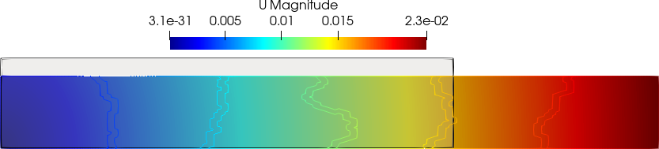
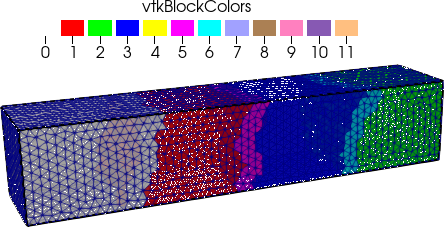
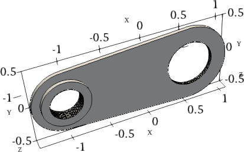
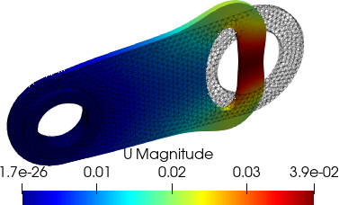

## Tutorial 1
### 2D bar problem
#### Simulation of bar problem bending under own body weight

To showcase the usage of linear elasticity, we shall discuss here an example of a 2D bar which bends under its own load (body weight). The bar $5$ m in length and $1$ m in width, and is supposed to be made up of a material with density $\rho=8\times10^3$, Youngs modulus $E=200\times10^9$, and Poisson's ratio $\nu=0.3$. Figure below shows this bar considered in this tutorial.

<figure style="text-align: center;">
  
  <figcaption><em>Figure: the clamped bar setup.</em></figcaption>
</figure>

#### Step 1: Preprocessing

First step in a PSD simulation is PSD preprocessing, at this step you tell PSD what kind of physics, boundary conditions, approximations, mesh, etc are you expecting to solve. PSD is a TUI (terminal user interface) based application, so the user needs to use the terminal (command-line) to communicate to PSD.

In the terminal `cd` to the folder `/home/PSD-tutorials/linear-elasticity` Note that one can perform these simulation in any folder provided that PSD has been properly installed. We use `/home/PSD-tutorials/linear-elasticity` for simplicity, once the user is proficient a simulation can be launch elsewhere. Launch `PSD_PreProcess` with some flags from the terminal, to do so run the following command.

<pre><code>PSD_PreProcess -problem linear_elasticity -dimension 2 \
-bodyforceconditions 1 -dirichletconditions 1 -postprocess u</code></pre>

**What do the arguments mean?**

- `-problem linear_elasticity` → solving linear elasticity
- `-dimension 2` → 2D simulation
- `-bodyforceconditions 1` → apply a body force on the domain
- `-dirichletconditions 2` → two Dirichlet borders
- `-postprocess u` → enable ParaView output

After the `PSD_PreProcess` runs successfully you should see many `.edp` files in your current folder. You will now have to follow an edit cycle, where you will provide PSD with some other additional information about your simulation that you wish to perform, in this case 2D linear elasticity bending under its own body weight.

At this stage the input properties of Youngs modulus and Poisson's ratio ($E, \nu$) can be mentioned in `ControlParameters.edp`, use `E = 200.e9`, and `nu = 0.3;`. The volumetric body force condition is mentioned in the same file via variable `Fbc0Fy -78480.0`, i.e ($\rho\times g=8.e3\times -9.81=-78480.0$). One can also provide the mesh to be used in `ControlParameters.edp`, via `ThName = "../Meshes/2D/bar.msh"`. Note that mesh can also be provided in the next step i.e, Step 2: solving. In addition variable `Fbc0On 1` has to be provided in order to indicate the volume (region) for which the body force is acting, here `1` is the integer volume tag of the mesh. Dirichlet boundary conditions are also provided in `ControlParameters.edp`. To provide the clamped boundary condition the variables `Dbc0On 2`, `Dbc0Ux 0.`, and `Dbc0Uy 0.` are used, which means for Dirichlet border `2` (`Dbc0On 2`) where `2` is the clamped border label of the mesh Dirichlet constrain is applied and `Dbc0Ux 0.`, `Dbc0Uy 0` i.e., the clamped end condition ($u_x=u_y=0$).

Please note that for this simple problem, the bar mesh (`bar.msh`) has been provided in `../Meshes/2D/` folder, this mesh is a triangular mesh produced with Gmsh. Moreover detailing meshing procedure is not the propose of PSD tutorials. A user has the choice of performing their own meshing step and providing them to PSD in `.msh` (Please use version 2) or `.mesh` format, we recommend using Salome or Gmsh meshers for creating your own geometry and meshing them.

#### Step 2: Solving

As PSD is a parallel solver, let us use 4 cores to solve the 2D bar case. To do so enter the following command:

<pre><code>PSD_Solve -np 4 Main.edp -mesh ./../Meshes/2D/bar.msh -v 0</code></pre>

This will launch the PSD simulation.

Here `-np 4` (number of processes) denote the argument used to enter the number of parallel processes (MPI processes) used by PSD while solving. `-mesh ./../Meshes/2D/bar.msh` is used to provide the mesh file to the solver, `-mesh` argument is not needed if the user has indicated the right mesh in `ControlParameters.edp` file. `-v 0` denotes the verbosity level on screen. `PSD_Solve` is a wrapper around `FreeFem++-mpi`. Note that if your problem is large use more cores. PSD has been tested upto 24,000 parallel processes (on the French Joliot-Curie supercomputer) and problem sizes with billions of unknowns, surely you will not need that many for the 2D bar problem.

#### Step 3: Postprocessing

PSD allows postprocessing of results in ParaView. After the step 2 mentioned above finishes. Launch ParaView and have a look at the `.pvd` file in the `VTUs...` folder. Using ParaView for postprocessing the results that are provided in the `VTUs...` folder, results such as those shown in the figure below can be extracted.

<figure style="text-align: center;">
   
  
  <figcaption><em>Figure: the 2D clamped bar problem: partitioned mesh and displacement field visualization in ParaView.</em></figcaption>
</figure>

You are all done with your 2D linear-elasticity simulation.

### 3D bar problem

In PSD a 3D simulation follows the same logic as a 2D one, in the preprocessing step. Imagine the same problem as above, however now the geometry is 3D with length 5 m and cross sectional area 1 m $\times$ 1 m. Indeed all what changes for this simulation is the geometry (consequently the mesh) and the dimension of the problem, these two changes will be handled by (`-dimension` and `-mesh`) arguments.

The preprocessing step now becomes:

<pre><code>PSD_PreProcess -problem linear_elasticity -dimension 3 \ 
-bodyforceconditions 1  -dirichletconditions 1 -postprocess u</code></pre>

compared to the 2D problem, note that all what has changed `-dimension 3` instead of `-dimension 2`.

Solving step remains exactly the same with except `-mesh` flag now pointing towards the 3D mesh of the bar.

<pre><code>PSD_Solve -np 4 Main.edp -mesh ./../Meshes/3D/bar.msh -v 0</code></pre>

Finally, using ParaView for postprocessing the results that are provided in the `VTUs..` folder, results such as those shown below can be extracted.

<figure style="text-align: center;">
   
  
  <figcaption><em>Figure: the 3D clamped bar problem: partitioned mesh and displacement field visualization in ParaView.</em></figcaption>
</figure>

## Tutorial 2
### Sequential solver
#### Sequential vs. Parallel Solver for 2D Linear Elasticity

Same problem of linear elasticity as in tutorial 1 -- 2D bar which bends under its own load --, is discussed here. The bar 5 m in length and 1 m in width, and is supposed to be made up of a material with density $\rho=8\times 10^3$, Young's modulus $E=200\times 10^9$, and Poisson's ratio $\nu=0.3$. To avoid text repetition, readers are encouraged to go ahead with this tutorial only after tutorial 1.

<figure style="text-align: center;">
  
</figure>

As we will not use a parallel solver but a sequential one, naturally, this tutorial leads to a slower solver than the previous tutorial 1. So this tutorial is not for speed lovers, but rather for detailing the full capacity of PSD. Also, sequential solvers are easier to develop and understand — hence this tutorial.

As the problem remains the same as tutorial 1, simply add `-sequential` flag to `PSD_PreProcess` flags from tutorial 1 for a PSD sequential solver. The flag `-sequential` signifies the use of sequential PSD solver. So the workflow for the 2D problem would be:

<pre><code>
PSD_PreProcess -problem linear_elasticity -dimension 2 -bodyforceconditions 1 \
-dirichletconditions 1 -postprocess u -sequential
</code></pre>

Similar to tutorial 1, we solve the problem using the given mesh file `bar.msh`. However, now we need to use `PSD_Solve_Seq` instead of `PSD_Solve`, as such:

<pre><code>
PSD_Solve_Seq Main.edp -mesh ./../Meshes/2D/bar.msh -v 0
</code></pre>

> 💡 **Note**: Users are encouraged to try out the 3D problem with the sequential solver. Also, comparing the results from a sequential solver to those from a parallel solver can help verify that both lead to exactly the same results.

> 💡 **Note**: For this simple problem, the bar mesh (`bar.msh`) has been provided in `../Meshes/2D/` folder. This mesh is a triangular mesh produced with Gmsh. Detailing the meshing procedure is not the purpose of PSD tutorials.

> 💡 **Note**: Users can generate their own meshes and provide them to PSD in `.msh` (please use version 2) or `.mesh` format. We recommend using Salome or Gmsh meshers for creating your own geometry and meshing them.

### Comparing CPU Time

Naturally, since we are not using parallel PSD for solving, we lose the advantage of solving fast. To testify to this claim, checking solver timings can be helpful. PSD provides means to time-log your solver via the `-timelog` flag.

> 💡 **Note**: This flag prints the amount of time taken by each step of your solver directly in the terminal.

> ⚠️ **Warning**: Using `-timelog` makes the solver slower, as it involves `MPI_Barrier` routines for correctly timing each operation.

An example workflow of 2D solver (parallel) with time logging:

<pre><code>
PSD_PreProcess -problem linear_elasticity -dimension 2 -bodyforceconditions 1 \
-dirichletconditions 1 -postprocess u -timelog
</code></pre>

We solve the problem using four MPI processes, with the given mesh file `bar.msh`:

<pre><code>
PSD_Solve -np 4 Main.edp -mesh ./../Meshes/2D/bar.msh -v 0
</code></pre>

<figure style="text-align: center;">
  
  <figcaption><em>Figure: Time logging output produced for parallel run on 4 processes.</em></figcaption>
</figure>

Now let us repeat the procedure but this time using the sequential solver:

<pre><code>
PSD_PreProcess -problem linear_elasticity -dimension 2 -bodyforceconditions 1 \
-dirichletconditions 1 -postprocess u -timelog -sequential
</code></pre>

We solve the problem now in sequential mode, with the given mesh file `bar.msh`:

<pre><code>
PSD_Solve_Seq Main.edp -mesh ./../Meshes/2D/bar.msh -v 0
</code></pre>

> 💡 **Note**: You should now see timings that are higher in comparison to the parallel solver.

Approximately, for large meshes, using 4 MPI processes should lead to a solver that's around 4 times faster.

## Tutorial 3
#### Multiple Dirichlet Conditions in Linear Elasticity (2D Clamped Bar)

To showcase the usage of linear elasticity with more than one Dirichlet condition, we discuss here a 2D bar which bends under its own load. The same problem from tutorials 1 and 2 is reused: a bar 5 m in length and 1 m in width, made of a material with density $\rho=8\times 10^3$, Young's modulus $E=200\times 10^9$, and Poisson's ratio $\nu=0.3$.

Contrary to tutorials 1 and 2, now **both ends** of the bar are clamped (i.e., two Dirichlet conditions instead of one).

#### Step 1: Preprocessing

First step in a PSD simulation is preprocessing. At this step, you tell PSD what kind of physics, boundary conditions, approximations, and mesh you expect to solve.

In the terminal, `cd` to the folder `'/home/PSD-tutorials/linear-elasticity'`. Launch `PSD_PreProcess` with the command:

<pre><code>
PSD_PreProcess -problem linear_elasticity -dimension 2 -bodyforceconditions 1 \
-dirichletconditions 2 -postprocess u
</code></pre>

After `PSD_PreProcess` runs successfully, you should see many `.edp` files in your current folder.

**What do the arguments mean?**

- `-problem linear_elasticity` → solving linear elasticity
- `-dimension 2` → 2D simulation
- `-bodyforceconditions 1` → apply a body force on the domain
- `-dirichletconditions 2` → two Dirichlet borders
- `-postprocess u` → enable ParaView output

Since both problems (from tutorials 1 and 2) are essentially the same, the command is almost identical. The only difference is the added Dirichlet condition: `-dirichletconditions 2`.

To provide Dirichlet conditions for the left clamped end ($u_x=u_y=0$), in `ControlParameters.edp` set:

- `Dbc0On 2`
- `Dbc0Ux 0.`
- `Dbc0Uy 0.`

For the right clamped end, set:

- `Dbc1On 4`
- `Dbc1Ux 0.`
- `Dbc1Uy 0.`

Each of these corresponds to borders labeled `2` and `4` in the mesh `../Meshes/2D/bar.msh`.

Material and force properties in `ControlParameters.edp`:

- `E = 200.e9`
- `nu = 0.3`
- `Fbc0Fy -78480.0` (from $\rho g = 8 \times 10^3 \times (-9.81)$)

Specify the mesh via:

- `ThName = "../Meshes/2D/bar.msh"`
- `Fbc0On 1` to identify the volume tag

> 💡 **Note**: For this simple problem, the mesh `bar.msh` is provided in `../Meshes/2D/`. This is a triangular mesh created using Gmsh.

> 💡 **Note**: You may also generate your own meshes in `.msh` (version 2) or `.mesh` format using Salome or Gmsh.

#### Step 2: Solving

Use 3 parallel processes to solve the 2D bar problem:

<pre><code>
PSD_Solve -np 3 Main.edp -mesh ./../Meshes/2D/bar.msh -v 0
</code></pre>

- `-np 3` → number of MPI processes
- `-mesh` → path to the mesh (can be omitted if set in `ControlParameters.edp`)
- `-v 0` → screen verbosity

`PSD_Solve` is a wrapper around `FreeFem++-mpi`.

> 💡 **Note**: PSD has been tested with up to 24,000 processes on Joliot-Curie (GENCI). But for this problem, a few are enough.

#### Step 3: Postprocessing

PSD outputs ParaView-compatible files. After solving, open the `.pvd` file in the `VTUs_DATE_TIME` folder using ParaView.

You can visualize outputs like in the figure below:

<figure style="text-align: center;">
  
  
  <figcaption><em>Figure: The 2D clamped bar problem: partitioned mesh and displacement field visualization in ParaView.</em></figcaption>
</figure>

You’re all done with the 2D linear elasticity simulation!

> 💡 **Note**: Try running the 3D version. Use `-dimension 3` in `PSD_PreProcess` and update the mesh and Dirichlet border labels accordingly in `ControlParameters.edp`.

#### Redoing the Test on Jupiter and Moon

Imagine you wish to know how the test compares if performed on the Moon or Jupiter. Since gravity is the only force involved, try changing the gravitational constant.

- **Moon**: $g = 1.32$
- **Jupiter**: $g = 24.79$

In `ControlParameters.edp`, change the force term:

- For Moon: `Fbc0Fy -10560.0` ($8 \times 10^3 \times -1.32$)
- For Jupiter: `Fbc0Fy -198320.0` ($8 \times 10^3 \times -24.79$)

Then redo Step 2 (solving) and Step 3 (postprocessing).

Side-by-side visualization:

<figure style="text-align: center;">
  

    
  

  

    
  

  <figcaption><em>Figure: 2D clamped bar 20000X warped displacement fields. On Moon (left) and on Jupiter (right).</em></figcaption>
</figure>

## Tutorial 4
####  2D Linear Elasticity: Clamped Bar Pulled at One End

In this tutorial, we showcase the 2D bar simulation with one end clamped while being pulled at the other end. Body force is neglected, and the pull is modeled using a Dirichlet displacement \( u_1 = 1 \). Compared to the problems in **Tutorial 1** and **Tutorial 2**, the only difference is:

- **No body force is applied**, and  
- **An additional Dirichlet condition** is applied at the free end.

We consider the same setup:  
- A bar 5 m in length and 1 m in width  
- Material properties:  
  - Density: \( \rho = 8 \times 10^3 \, \text{kg/m}^3 \)  
  - Young’s modulus: \( E = 200 \times 10^9 \, \text{Pa} \)  
  - Poisson’s ratio: \( \nu = 0.3 \)

#### Step 1: Preprocessing

First step is to tell PSD what kind of physics, boundary conditions, approximations, mesh, etc., are expected.

In the terminal, change to the tutorial folder:

<pre><code>
cd /home/PSD-tutorials/linear-elasticity
</code></pre>

Then launch the preprocessing tool:

<pre><code>
PSD_PreProcess -problem linear_elasticity -dimension 2 -dirichletconditions 2 -postprocess u
</code></pre>

#### What do the arguments mean?

* `-problem linear_elasticity`: Solving a linear elasticity problem
* `-dimension 2`: 2D simulation
* `-dirichletconditions 2`: Two Dirichlet boundaries (clamped and pulled ends)
* `-postprocess u`: Generate postprocessing output for ParaView

> 🔍 Compared to previous tutorials, `-bodyforceconditions 1` is **omitted** here since no body force is applied.

#### Define Dirichlet Conditions

In `ControlParameters.edp`, define the boundary conditions as:

* Clamped end (mesh label `2`):

<pre><code>
Dbc0On = 2;
Dbc0Ux = 0.;
Dbc0Uy = 0.;
</code></pre>

* Pulled end (mesh label `4`):

<pre><code>
Dbc1On = 4;
Dbc1Ux = 1.;
Dbc1Uy = 0.; // Optional: remove this line to allow vertical compression
</code></pre>

#### Material Properties

Also in `ControlParameters.edp`, add:

<pre><code>
E = 200.e9;
nu = 0.3;
</code></pre>

Although body force is not used here, in general it would be set like this:

<pre><code>
Fbc0Fy = -78480.0; // = rho * g = 8e3 * -9.81
Fbc0On = 1;        // Volume tag where force applies
</code></pre>

#### Mesh

Specify the mesh (if not passed during solving) in the same file:

<pre><code>
ThName = "../Meshes/2D/bar.msh";
</code></pre>

> ⚠️ The mesh file `bar.msh` (Gmsh v2 format) is in the `../Meshes/2D/` folder. You can generate your own using SALOME or Gmsh.

#### Step 2: Solving

Since PSD is a **parallel solver**, we run it with 2 MPI processes:

<pre><code>
PSD_Solve -np 2 Main.edp -mesh ./../Meshes/2D/bar.msh -v 0
</code></pre>

* `-np 2`: Use 2 MPI processes
* `-mesh ./../Meshes/2D/bar.msh`: Provide the mesh
* `-v 0`: Set verbosity level
* `PSD_Solve`: Wrapper around `FreeFem++-mpi`

> 🧠 For large problems, you can increase the number of cores. PSD has been tested with up to **24,000 parallel processes** and problems with **billions of unknowns**.

#### Step 3: Postprocessing

Once the solver finishes, you can visualize results in **ParaView**.

Open the `.pvd` file located in the output folder (e.g., `VTUs_DATE_TIME/`) using ParaView.

> 📊 From ParaView, you can visualize displacement, mesh partitions, and more (e.g., as in the figure below).

<figure style="text-align: center;">
  
  
  <figcaption><em>Figure: The 2D clamped bar problem: partitioned mesh and displacement field visualization in ParaView.</em></figcaption>
</figure>

## Tutorial 5
####  2D Linear Elasticity: Clamped Bar Pulled at One End

A similar simulation to the previous tutorial is presented here. We showcase the 2D bar problem, where one end is clamped while the other end is pulled. As in the previous simulation, the body force is neglected. However, in this case, the pull on the non-clamped end is approximated using a Neumann (traction) force:

$$
\int_{\partial\Omega^h_{\text N}}(\mathbf t \cdot \mathbf{v}^h)
$$

To simulate the pull, we assume a traction vector  
$\mathbf{t} = [t_x, t_y] = [10^9, 0]$  
acting on the non-clamped right end of the bar. This means a force of $10^9$ units in the $x$-direction is applied. We use the same problem setup from tutorials 1 and 2: a bar 5 m in length and 1 m in width, made of a material with:

- density $\rho = 8 \times 10^3$
- Young’s modulus $E = 200 \times 10^9$
- Poisson’s ratio $\nu = 0.3$

#### Step 1: Preprocessing

The first step in a `PSD` simulation is **preprocessing**. In this step, we specify the physics, boundary conditions, approximations, mesh, etc., to `PSD`.

In the terminal, `cd` into the folder:

<pre><code>cd /home/PSD-tutorials/linear-elasticity</code></pre>

Launch `PSD_PreProcess` with the following command:

<pre><code>PSD_PreProcess -problem linear_elasticity -dimension 2 -dirichletconditions 1 \
-tractionconditions 1 -postprocess u
</code></pre>

> 💡 **Note**:  
> The command-line flag <code>-dirichletconditions 1</code> tells `PSD` that there is one Dirichlet boundary — the clamped end of the bar.  
> The flag <code>-tractionconditions 1</code> notifies `PSD` that there is one traction boundary — the pulled right end.

To apply the clamped boundary condition ($u_1 = 0,\ u_2 = 0$), set the following variables in <code>ControlParameters.edp</code>:

<pre><code>macro Dbc0On 2     //
macro Dbc0Ux 0.    //
macro Dbc0Uy 0.    //</code></pre>

The traction boundary conditions are defined in the same file:

<pre><code>macro Tbc0On 4     //
macro Tbc0Tx 1.e9  //</code></pre>

This applies the traction force $\mathbf{t} = [10^9, 0]$ to boundary label 4 (the right edge).  
To add a vertical traction component (e.g. $t_y = 100$), simply include:

<pre><code>macro Tbc0Ty 100.  //</code></pre>

#### Step 2: Solving

Use 5 cores to solve the problem by running:

<pre><code>PSD_Solve -np 5 Main.edp -mesh ./../Meshes/2D/bar.msh -v 0</code></pre>

> 💡 **Note**:  
> This is the same command used in the previous bar problems, except here we use <code>-np 5</code> to solve in parallel using 5 cores.

The mesh file `bar.msh` is available in the `../Meshes/2D/` folder. It is a triangular mesh created with Gmsh.

> ⚠️ **Warning**:  
> This tutorial does **not** cover the meshing process in detail. You are free to use your own mesh, as long as it's in `.msh` (Gmsh version 2) or `.mesh` format. We recommend using Salome or Gmsh for mesh generation.

#### Step 3: Postprocessing

Launch ParaView and open the `.pvd` file located in:

<pre><code>
PSD/Solver/VTUs_DATE_TIME/
</code></pre>

#### Simulation Results

<figure style="text-align: center;">
  

    
  

  

    
  

  <figcaption><em>Figure: 2D bar results. Partitioned mesh (left) and 100X warped displacement field (right).</em></figcaption>
</figure>

> 💡 **Note**:  
> Since 5 cores were used, the mesh was partitioned into 5 subdomains.  
> Unlike in the previous tutorial, the right end of the bar contracts in the $y$-direction. This behavior is expected because there is **no Dirichlet condition** at that end, allowing it to move laterally.

## Tutorial 6
####   Linear Elasticity Tutorial 2D bar problem clamped at one end wile being pulled at the other end (Dirichlet-Neumann-Point boundary conditions case)

Similar simulations as in the previous tutorial are presented in this section. We showcase the 2D bar problem simulation with one end clamped while being pulled at the other end. Contrary to the simulation in the previous tutorial, the clamped end restricts only $x$-direction movement, i.e., $u_x=0$. As before, body force is neglected. The pull at the non-clamped end is approximated with a Neumann force term: $\int_{\partial\Omega^h_{\text N}}(\mathbf t\cdot \mathbf{v}^h)$.

To simulate the pull, we assume a traction vector $\mathbf t=[t_x,t_y]=[10^9,0]$ acting on the non-clamped (right) end of the bar, i.e., a force of $10^9$ units in the $x$-direction. We use the same problem as in previous tutorials 1 and 2: a bar 5 m in length and 1 m in width, made of a material with density $\rho=8\times 10^3$, Young’s modulus $E=200\times 10^9$, and Poisson’s ratio $\nu=0.3$.

Here is how `PSD` simulation of this case can be performed.

#### Step 1: Preprocessing

First step in a `PSD` simulation is preprocessing. At this step, you tell `PSD` what kind of physics, boundary conditions, approximations, mesh, etc., you expect to solve.

In the terminal, `cd` to the folder `/home/PSD-tutorials/linear-elasticity`. Launch `PSD_PreProcess` from the terminal with the following command:

<pre><code>PSD_PreProcess -problem linear_elasticity -dimension 2 -dirichletconditions 1 -tractionconditions 1 \
-dirichletpointconditions 1 -postprocess u
</code></pre>

> 💡 **Note**:  
> The additional flag `-dirichletpointconditions 1` notifies `PSD` that there is one Dirichlet point boundary condition.

Edit the `ControlParameters.edp` file to specify the desired point boundary conditions:
- Set `Pbc0Ux  0.` and `Pbc0Uy  0.` to enforce $u_x = 0$, $u_y = 0$.
- Set `PbcCord = [[0. , 0. ]];` to indicate the point at $(x, y) = (0, 0)$.

We also specified `-dirichletconditions 1`, meaning one Dirichlet boundary. To impose the Dirichlet condition ($u_x = 0$), set:
- `Dbc0On 2`
- `Dbc0Ux 0.`

in `ControlParameters.edp`.

`PSD` understands that label `2` refers to the mesh border on which the Dirichlet condition is applied.

#### Step 2: Solving

Use 6 cores to solve this problem by running:

<pre><code>PSD_Solve -np 6 Main.edp -mesh ./../Meshes/2D/bar.msh -v 0
</code></pre>

> 💡 **Note**:  
> This is the same command used in previous tutorials, except now we include `-np 6` to use multiple processors.

The mesh file `bar.msh` is provided in the `../Meshes/2D/` folder. This is a triangular mesh produced with Gmsh.

> ⚠️ **Warning**:  
> Detailed meshing is outside the scope of this tutorial. However, users can generate their own meshes using tools like **Salome** or **Gmsh**, and provide them to `PSD` in `.msh` (version 2 recommended) or `.mesh` format.

#### Step 3: Postprocessing

Launch ParaView and open the `.pvd` file located in the `PSD/Solver/VTUs_DATE_TIME` folder.

<figure style="text-align: center;">
  

    
  

  

    
  

  <figcaption><em>Figure: 2D bar results. Partitioned mesh (left) and 100X warped displacement field (right).</em></figcaption>
</figure>

> 💡 **Note**:  
> In the figure above, there are six subdomains in the partitioned mesh. As expected, the right and left ends of the bar contract in the $y$-direction, while the bar elongates in the $x$-direction due to the applied force.

## Tutorial 7
#### 3D Clamped Bar with Vertical Traction

In this section, we present a 3D simulation of a clamped bar using `PSD`. One end of the bar is clamped, and a vertical traction is applied at the non-clamped end. This setup is similar to previous tutorials but extended to three dimensions. The material properties remain unchanged, and a vertical traction of $t_y = -10^9$ units is applied at the free end.

We use the same bar geometry from Tutorials 1 and 2, now in 3D:  
- Length: 5 m  
- Width: 1 m  
- Height: 1 m  

The material is characterized by:  
- Density $\rho = 8 \times 10^3$  
- Young’s modulus $E = 200 \times 10^9$  
- Poisson’s ratio $\nu = 0.3$

#### Step 1: Preprocessing

The first step in a `PSD` simulation is **preprocessing**. Here, you specify the physics, boundary conditions, approximations, mesh, etc.

Launch `PSD_PreProcess` by running:

<pre><code>PSD_PreProcess  -problem linear_elasticity -dimension 3 -dirichletconditions 1 -tractionconditions 1 -postprocess u</code></pre>

> 💡 **Note**:  
> The flag <code>-dirichletconditions 1</code> tells `PSD` that there is one Dirichlet boundary — the clamped end.  
> The flag <code>-dimension 3</code> sets the simulation to 3D.  
> The flag <code>-tractionconditions 1</code> tells `PSD` to apply one traction boundary — the loaded end.

To apply the Dirichlet condition ($u_x = 0,\ u_y = 0,\ u_z = 0$), edit `ControlParameters.edp` and set:

<pre><code>Dbc0On 1
Dbc0Ux 0.
Dbc0Uy 0.
Dbc0Uz 0.</code></pre>

Here, `1` is the mesh label of the clamped surface.

To apply the traction condition at the free end with $\mathbf{t} = [t_x, t_y, t_z] = [0., -10^9, 0.]$, set:

<pre><code>Tbc0On 2
Tbc0Ty -1.e9</code></pre>

Mesh label `2` corresponds to the surface where the traction is applied.

#### Step 2: Solving

To solve the problem using 4 cores, run the following command:

<pre><code>PSD_Solve -np 4 Main.edp  -mesh ./../Meshes/3D/bar.msh -v 0</code></pre>

> 💡 **Note**:  
> This is the same command used in the earlier tutorials, now applied in a 3D setting.

> ⚠️ **Warning**:  
> The file <code>bar.msh</code> is located in the <code>../Meshes/3D/</code> directory.  
> This is a tetrahedral mesh generated with Gmsh. Mesh generation is not covered in this tutorial.  
> You may create your own meshes using Gmsh or Salome. Please ensure the format is either <code>.msh</code> (Gmsh version 2) or <code>.mesh</code>.

#### Step 3: Postprocessing

Open ParaView and load the `.pvd` file found in: `PSD/Solver/VTUs_DATE_TIME/...`

#### Simulation Results

<figure style="text-align: center;">
  

    
  

  

    
  

  <figcaption><em>Figure: 3D bar results. Partitioned mesh (left) and 0.5X warped displacement field (right).</em></figcaption>
</figure>

> 💡 **Note**:  
> Since 4 cores were used, the domain was partitioned into 4 subdomains, as visible in the left image above.

## Tutorial 8
#### 3D  mechanical piece (Dirichlet-Neumann case) with complex mesh

So far, we have focused on bar simulations, which are relatively simple. The meshes for these cases were pre-provided. Now, we consider a **3D simulation of a mechanical piece**, shown in the figure below.

The left (small) hole is fixed: $u_1=u_2=u_3=0$, while a traction force $t_x = 10^9$ is applied to the large hole.

You can obtain the CAD geometry (the Gmsh `.geo` file) from your local Gmsh installation at `gmsh/share/doc/gmsh/demos/simple_geo/piece.geo`. To generate the mesh `piece.msh`, run:

<pre><code>gmsh -3 piece.geo -format msh2
</code></pre>

Now the PSD simulation can proceed.

<figure style="text-align: center;">
  
  <figcaption><em>Figure: 3D mechanical piece.</em></figcaption>
</figure>

#### Step 1: Preprocessing

Place the mesh `piece.msh` in a folder of your choice (assume `psd-complex-simulation`). Open a terminal in this folder and run:

<pre><code>PSD_PreProcess  -problem linear_elasticity -dimension 3 \
-dirichletconditions 1 -tractionconditions 1 -postprocess u
</code></pre>

This sets one Dirichlet condition (small hole) and one traction condition (large hole). The file `piece.msh` assigns label `4` to the Dirichlet border and `3` to the traction border.

To apply boundary conditions, in `ControlParameters.edp`:

- Dirichlet:`Dbc0On 4`, `Dbc0Ux 0.`, `Dbc0Uy 0.`, `Dbc0Uz 0.`
- Traction:
  `Tbc0On 3`, `Tbc0Ty -1.e9`

This corresponds to traction vector $\mathbf{t} = [0., 10^9, 0.]$.

Use steel material properties in `ControlParameters.edp`:

- `real E = 200.e9;`
- `real nu = 0.3;`

#### Step 2: Solving

Use 2 cores:

<pre><code>PSD_Solve -np 2 Main.edp -mesh ./piece.msh
</code></pre>

#### Step 3: Postprocessing

Launch ParaView and open the `.pvd` file in `PSD/Solver/VTUs_DATE_TIME`.

<figure style="text-align: center;">
  

    
  

  

    
  

  <figcaption><em>Figure: Mechanical piece test results. Partitioned mesh (left) and warped displacement field (right).</em></figcaption>
</figure>

#### Redoing the Test with Different Conditions

<figure style="text-align: center;">
  

    
  

  <figcaption><em>Figure: Mechanical piece test results: <code>real  tx0=1.e9, ty0=0, tz0=0.,;</code></em></figcaption>
</figure>

<figure style="text-align: center;">
  

    
  

  <figcaption>
    <em>Figure: Mechanical piece test results: <code>real tx0=-1.e9, ty0=0, tz0=0.,;</code></em>
  </figcaption>
</figure>

## Tutorial 9
#### Using Mfront-PSD interface

This tutorial details one to use PSD-MFront interface for linear elasticity problem. The same problem from tutorial 1 is repeated, however now MFront is used for building certain finite element essentials. It is advised to follow this tutorial after tutorial 1. Note that, linear elasticity merely provides means of getting started with Mfornt, the real potential lies in using nonlinear materials and laws which Mfront provides. So this tutorial should be considered as baptism to the world of PSD-MFront which we believe has a lot of potential to solve some non trivial problems.

We reintroduce the problem from tutorial 1, an example of a 2D bar which bends under its own load -- typical case of linear elasticity.   A bar 5 m in length and 1 m in width, and is supposed to be made up of a material with density $\rho=8\times 10^3$, Youngs modulus $E=200\times 10^9$, and Poissons ratio $\nu=0.3$.

<figure style="text-align: center;">
  
  <figcaption><em>Figure: the clamped bar setup.</em></figcaption>
</figure>

#### Step 1: Preprocessing

First step in a PSD simulation is PSD preprocessing, at this step you tell PSD what kind of physics, boundary conditions, approximations, mesh, etc are you expecting to solve. More importantly for this tutorial we will signify to PSD that MFront has to be used.

In the terminal `cd` to the folder `/home/PSD-tutorials/linear-elasticity`. Launch `PSD\_PreProcess` from the terminal, to do so run the following command.

<pre><code>PSD_PreProcess -problem linear_elasticity -dimension 2 -bodyforceconditions 1 \
-dirichletconditions 1 -postprocess u -useMfront
</code></pre>

After the `PSD\_PreProcess` runs successfully you should see many `.edp` files in your current folder.

**What do the arguments mean?**

- `-problem linear_elasticity` → solving linear elasticity
- `-dimension 2` → 2D simulation
- `-bodyforceconditions 1` → apply a body force on the domain
- `-dirichletconditions 1` → one Dirichlet borders
- `-postprocess u` → enable ParaView output
- `-useMfront` → activates MFront interface for PSD

At this stage the input properties $E,\nu$ can be mentioned in `ControlParameters.edp`, use `E = 200.e9`, and `nu = 0.3`. In contrast to tutorial 1, notice that these values of `E` and `nu` are fed to a vector `PropertyValues = [E, nu];`  verbosed by `PropertyNames   = "YoungModulus PoissonRatio";`. We also signify that we will be solving linear elasticity via `MforntMaterialBehaviour   = "Elasticity";` and also `MaterialHypothesis = "GENERALISEDPLANESTRAIN";` which signifies the hypothesis to be used for the Linear elasticity. The `MaterialHypothesis` accepts `"GENERALISEDPLANESTRAIN"`,  `"PLANESTRAIN"`, `"PLANESTRESS"`,  and  `"TRIDIMENSIONAL"` as arguments. `PropertyValues`, `PropertyNames`, and `MaterialHypothesis`  will eventually be provided to MFront in `FemParameters.edp` file via `PsdMfrontHandler(...)` function *User is encouraged to have a look at `FemParameters.edp` file.   The volumetric body force condition is mentioned in the same file via variable `Fbc0Fy -78480.0`, i.e ($\rho*g=8.e3*(-9.81)=-78480.0$). One can also provide the mesh to be used in `ControlParameters.edp`, via `ThName = "../Meshes/2D/bar.msh"` (*note that mesh can also be provided in the next step*) .In addition variable `Fbc0On 1` has to be provided in order to indicate the volume (region) for which the body force is acting, here `1` is the integer volume tag of the mesh. Dirichlet boundary conditions are also provided in `ControlParameters.edp`. To provide the clamped boundary condition the variables `Dbc0On 2`, `Dbc0Ux 0.`, and `Dbc0Uy 0.` are used, which means for Dirichlet border `2` (`Dbc0On 2`) where `2` is the clamped border label of the mesh Dirichlet constrain is applied and `Dbc0Ux 0.`, `Dbc0Uy 0` i.e., the clamped end condition ($u_x=u_y=0$).

#### Step 2: Solving

Use 2 cores:

As PSD is a parallel solver, let us use 4 cores to solve the 2D bar case. To do so enter the following command:

<pre><code>PSD_Solve -np 4 Main.edp -mesh ./../Meshes/2D/bar.msh -v 0
</code></pre>

#### Step 3: Postprocessing

Launch ParaView and open the `.pvd` file in `PSD/Solver/VTUs_DATE_TIME`.

<figure style="text-align: center;">
  
  
  <figcaption><em>Figure: The 2D clamped bar problem: partitioned mesh and displacement field visualization in ParaView.</em></figcaption>
</figure>

You are all done with your 2D linear-elasticty simulation with Mfront interface.

#### How and what is being done in PSD-MFront interface? 

To explain how PSD-MFront interface works we will compare how a PSD solver acts when using MFront or without. In other words what is different when `-useMfront` is used at preprocessing. Note that ultimately the problem results (displacement fields, stresses, strains) will be the same.

To put it briefly, what MFront does for linear elasticity problem here is build the Material tensor (stiffness matrix) at each quadrature point. So, there are two points

- We need to communicate to Mfront the nature of the problem and the material involved.
- We need to provide Mfornt the stiffness matrix at each quadrature point so that it can fill it up.

The two raised points are handled using `PsdMfrontHandler(...)` in `FemParameters.edp` file.

Firstly, the arguments `E = 200.e9`,  `nu = 0.3`, `MforntMaterialBehaviour   = "Elasticity";`, `PropertyValues = [E, nu];`, `PropertyNames   = "YoungModulus PoissonRatio";`, `PropertyValues = [E, nu];` and   `MaterialHypothesis = "GENERALISEDPLANESTRAIN";` form `ControlParameters.edp` takes care of the first point (the nature of the problem and the material involved). The latter three arguments well define that we have a 2D problem, with given values of properties ($E, \nu$). The snippet from `ControlParameters.edp` (produced after using `-useMfront` argument for `PSD\_PreProcess`) file shows these variables which define the nature of the problem and characteristics of material involved

<pre><code>
//============================================================================
//                   ------- Material parameters -------
// -------------------------------------------------------------------
//  E, nu : Modulus of Elasticity and Poisson ratio of the material
//  PropertyNames : String of material property names (space seperated)
//                  that are provided to Mfront.
//  PropertyValues : Values of material properties provided to Mfront
//
// -------------------------------------------------------------------
//  NOTE:     Please note that PropertyNames should be the same as
//            as in the Elasticity.mfront file
// -------------------------------------------------------------------
//============================================================================

  macro E()  200.e9  //
  macro nu() 0.3     //

  string    MaterialBehaviour  = "Elasticity";
  string    MaterialHypothesis = "GENERALISEDPLANESTRAIN";
  string    PropertyNames      = "YoungModulus PoissonRatio";
  real[int] PropertyValues     = [ E, nu ];
</code></pre>

Secondly, the to get the stiffness matrix from Mfornt we use a quadrature finite element space with vector finite elements built on it (6 components) that represent the 6 components of symmetric material tensor ($\mathbb R^{3 \times 3}$). The snippet from `MeshAndFeSpace.edp` file shows the 6 component Quadrature finite element space for building material tensor.

<pre><code>
//==============================================================================
// ------- The finite element space  -------
// ----------------------------------------------------------------------------
//  Qh       : Quadratur finite element space  for material tensor
//             FEQF2 implies 3 dof for a triangular cell in the mesh
//             A vectorial FEM space is built with 6 components
//==============================================================================

 fespace Qh  ( Th ,[ FEQF2, FEQF2, FEQF2,
                           FEQF2, FEQF2,
                                  FEQF2] );
</code></pre>

Finally in file `FemParameters.edp` the `PsdMfrontHandler()` is called to build the material tensor `Mt` provided with the previously built material properties and nature of problem. Please see the snippet below

<pre><code>
//============================================================================
// ------- Material Tensor using Quadrature FE space -------
// -------------------------------------------------------------------
// Mt[int]  : is an array of finite element variable belonging to quadratu
//            re space Qh. This array is used  to define components of the
//            material tensor. 3X3 in 2D and 6X6 in 3D
//            In 2D the material tensor looks like
//
//         [ 2*mu+lambda ,  lambda      , 0 ]    [ Mt11 , Mt12 , Mt13 ]
//   Mt =  [ lambda      ,  2*mu+lambda , 0 ] =  [ Mt12 , Mt22 , Mt23 ]
//         [   0         ,     0        , mu]    [ Mt13 , Mt23 , Mt33 ]
//
// PsdMfrontHandler : is a function in mfront interface that helps
//                    building the material tensor  Mt  given with
//                    material prpts.  from  ControlParameters.edp
//============================================================================
  Qh [ Mt11 ,  Mt12 , Mt13 ,
              Mt22 , Mt23 ,
                     Mt33 ];

  PsdMfrontHandler( MaterialBehaviour                                   ,
                    mfrontBehaviourHypothesis = MaterialHypothesis      ,
                    mfrontPropertyNames       = PropertyNames           ,
                    mfrontPropertyValues      = PropertyValues          ,
                    mfrontMaterialTensor      = Mt11[]
                         );
</code></pre>

Note that in the snippet above you might be seeing `Mt11[]` being provided as `mfrontMaterialTensor`, in fact the `Mt11[]` calls the full matrial tensor not just the first component, so user should not get confused. This is more technical note, `Mt11[]` is the cast of `Mt` vector to a single array for memory optimization. One can also simply use `Mt12[]`, `Mt13[]`, `Mt22[]`, ... all these are acceptable and are simply aliases to material tensor.

The material tensor `Mt` built is used in the finite element variational formulation to build the bilinear $a(\mathbf{u},\mathbf{v})$ which is used to assemble the finite element matrix $\mathbf{A}$ for the linear system $\mathbf{Ax} = \mathbf{b}$

$$
a(\mathbf{u},\mathbf{v}) = \int_{\Omega}(
                 \varepsilon \left(\mathbf{u}):\mathbf{Mt}:\varepsilon(\mathbf{v}\right)
               )
$$

Here, $\varepsilon(\mathbf{u}):\mathbf{Mt}$ is nothing but the stress $\sigma(\mathbf{u})$ operator. User is encourage to have a look at the `VariationalFormulation.edp` file that contains the variational formulation (weak form) of the problem described.
