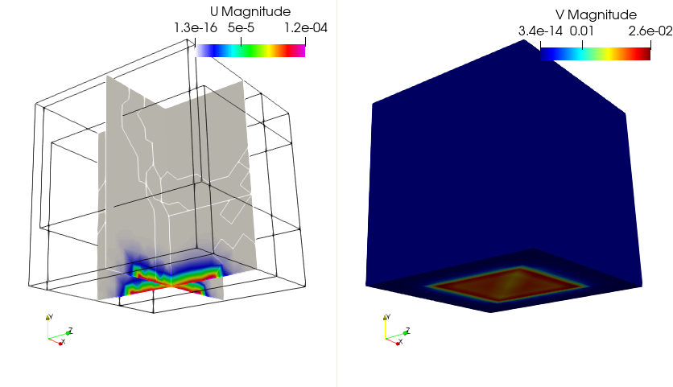
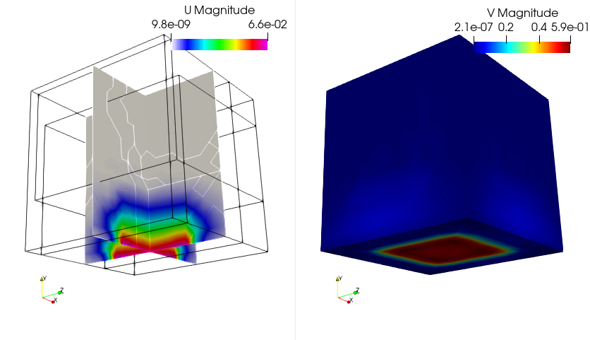
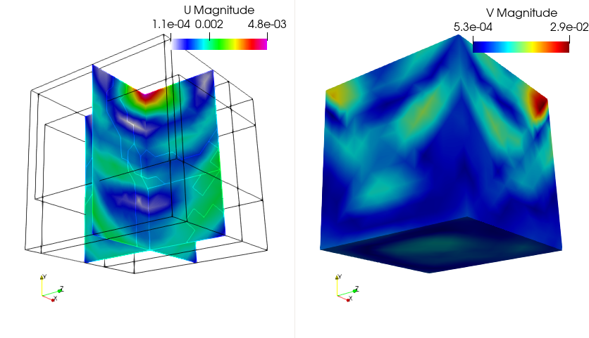
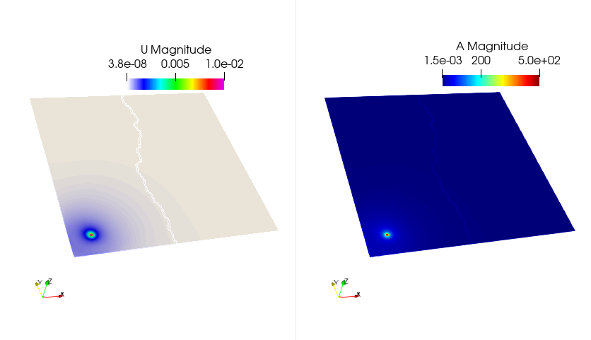

## Soildynamics and its Finite Element Formulation

Soildynamics refers to the simulation of dynamic elastic wave propagation in soli media, with specific attention to modeling seismic phenomena. It extends classical **elastodynamics** by incorporating specialized boundary conditions to both simulate a seismic source and absorb outgoing waves, thus mimicking an unbounded domain. The main additions are:

* **Double couple source terms** that emulate the seismic moment tensor in a physically meaningful way.
* **Paraxial absorbing boundary conditions** that suppress spurious reflections from the artificial computational domain boundaries.

#### Governing Equations

Let $\Omega \subset \mathbb{R}^d$ denote the bounded computational domain occupied by a linear elastic solid. The motion of the solid is governed by the conservation of linear momentum:

$$
\rho \ddot{\mathbf{u}} - \nabla \cdot \boldsymbol{\sigma} = \mathbf{f} \quad \text{in } \Omega \times [0,T]
$$

where:

* $\mathbf{u}$ is the displacement field,
* $\rho$ is the mass density,
* $\boldsymbol{\sigma} = \mathbb{C} : \boldsymbol{\varepsilon}(\mathbf{u})$ is the Cauchy stress tensor,
* $\mathbf{f}$ is the external body force,
* $\mathbb{C}$ is the fourth-order elastic tensor,
* $\boldsymbol{\varepsilon}(\mathbf{u}) = \frac{1}{2}(\nabla \mathbf{u} + \nabla \mathbf{u}^\top)$ is the strain tensor.

Boundary conditions include:

* Traction $\boldsymbol{\sigma} \cdot \mathbf{n} = \mathbf{t}$ on $\partial_t \Omega$,
* Displacement $\mathbf{u} = \mathbf{u}_0$ on $\partial_u \Omega$,
  with $\partial \Omega = \partial_u \Omega \cup \partial_t \Omega$, and $\partial_u \Omega \cap \partial_t \Omega = \emptyset$.

#### FEM discretization

We define the functional spaces for admissible displacements and test functions as:

$$
\begin{aligned}
\mathcal{U} &= \left\{ \mathbf{u} \in H^1(\Omega)^d \mid  \text{ on } \partial_u \Omega, \ \mathbf{u}(x, 0) = \mathbf{u}_0(x) \right\} \\
\mathcal{V} &= \left\{ \mathbf{v} \in H^1(\Omega)^d \mid  \text{ on } \partial_u \Omega \mathbf{v}(x, 0) = \mathbf{0} \right\}
\end{aligned}
$$

To derive the weak or the variational form, we multiply the balance equation by a test function $\mathbf{v} \in \mathcal{V}$ and integrate over the domain $\Omega$, using integration by parts and applying the Neumann boundary condition:

$$
\int_\Omega \rho\, \ddot{\mathbf{u}} \cdot \mathbf{v} \, dV + \int_\Omega \boldsymbol{\sigma}(\mathbf{u}) : \boldsymbol{\varepsilon}(\mathbf{v}) \, dV = \int_\Omega \mathbf{f} \cdot \mathbf{v} \, dV + \int_{\partial_t \Omega} \mathbf{t} \cdot \mathbf{v} \, dS
$$

### 2. Seismic Source: Double Couple Boundary Condition

In the context of earthquake simulation within the **Solidynamics** module, the seismic source is modeled as a **double-couple mechanism**. This is a standard idealization of shear faulting, where slip occurs on a fault plane without volume change. Unlike force dipoles or body force distributions, the double-couple is implemented via a **set of interior point forces (or displacements)** arranged to mimic the equivalent moment tensor.

#### Geometric Configuration

Let $\mathbf{x}_0 \in \Omega$ denote the hypocenter (i.e., the source center). Around this point, we define four auxiliary points forming two orthogonal pairs:

* $\mathbf{x}_1 = \mathbf{x}_0 + \varepsilon \mathbf{d}_1$
* $\mathbf{x}_2 = \mathbf{x}_0 - \varepsilon \mathbf{d}_1$
* $\mathbf{x}_3 = \mathbf{x}_0 + \varepsilon \mathbf{d}_2$
* $\mathbf{x}_4 = \mathbf{x}_0 - \varepsilon \mathbf{d}_2$

where $\mathbf{d}_1, \mathbf{d}_2 \in \mathbb{R}^d$ are orthonormal vectors defining the fault plane and slip direction (with $\mathbf{d}_1 \cdot \mathbf{d}_2 = 0$), and $\varepsilon \ll 1$ defines the source extent.

#### Moment Representation via Forces

A double-couple moment tensor $\mathbf{M} = M_0 (\mathbf{d}_1 \otimes \mathbf{d}_2 + \mathbf{d}_2 \otimes \mathbf{d}_1)$ is then represented by imposing **equal and opposite point forces** on the four surrounding points:

* Apply $+\mathbf{F}$ at $\mathbf{x}_1$, $-\mathbf{F}$ at $\mathbf{x}_2$
* Apply $-\mathbf{F}$ at $\mathbf{x}_3$, $+\mathbf{F}$ at $\mathbf{x}_4$

This force distribution yields a net zero force and net zero torque, consistent with a pure shear source.

Alternatively, **prescribed displacements** can be imposed on these same points in directions $\pm\mathbf{d}_2$, effectively generating the same moment. The displacements may follow a time-dependent waveform such as a Ricker wavelet or trapezoidal function to model source time history:

$$
\mathbf{u}(\mathbf{x}_i, t) = \pm \mathbf{d}_2 \cdot s(t), \quad i = 1,\dots,4
$$

where $s(t)$ defines the slip function or moment rate.

#### FEM Implementation

The contribution of the double-couple to the weak form appears as a source term contibution i.e, only in the RHS of the linear-system:

$$
\int_\Omega \mathbf{f}_\text{DC} \cdot \mathbf{v} \, \mathrm{d}\Omega \approx \sum_{i=1}^{4} \mathbf{F}_i(t) \cdot \mathbf{v}(\mathbf{x}_i)
$$

or in the displacement-imposed case, as **Dirichlet conditions** at $\mathbf{x}_1, \dots, \mathbf{x}_4$, in this case it will appear both in LHS and RHS of the linear-system.

In practice, these points are selected from the computational mesh to ensure numerical stability, and the value of $\varepsilon$ is chosen based on element size.

#### Paraxial Absorbing Boundary Conditions

To emulate an unbounded domain and absorb outgoing seismic waves at the boundary $\Sigma \subset \partial \Omega$, **zeroth-order paraxial conditions** are introduced.

**Paraxial Traction Approximation**

Let $\mathbf{m}$ denote the outward normal at $\Sigma$. The paraxial approximation replaces the traction $\mathbf{t}\_E$ due to the exterior domain $\Omega\_E$ by:

$$
\mathbf{t}_E \approx \mathbf{A}_0(\dot{\mathbf{u}}) = \rho c_p (\dot{\mathbf{u}} \cdot \mathbf{m}) \mathbf{m} + \rho c_s \left( \dot{\mathbf{u}} - (\dot{\mathbf{u}} \cdot \mathbf{m}) \mathbf{m} \right)
$$

or more compactly using projection tensors:

$$
\mathbf{A}_0(\dot{\mathbf{u}}) = \rho \left[ (c_p - c_s)(\mathbf{m} \otimes \mathbf{m}) + c_s \mathbf{I} \right] \cdot \dot{\mathbf{u}}
$$

This expression acts as a local, directionally-sensitive damping term on the velocity field at the boundary.

**Variational Formulation with Paraxial Absorbing Layer**

The FEM weak form including the paraxial absorbing term reads:

$$
\begin{aligned}
\text{Find } \mathbf{u} \in \mathcal{U} \text{ such that:} \\
M(\ddot{\mathbf{u}}, \mathbf{v}) + C(\dot{\mathbf{u}}, \mathbf{v}) + K(\mathbf{u}, \mathbf{v}) &= b(\mathbf{v}; \mathbf{f})_\Omega + b(\mathbf{v}; \mathbf{t})_{\partial_t \Omega} - b(\mathbf{v}; \mathbf{A}_0(\dot{\mathbf{u}}))_\Sigma
\end{aligned}
\quad \forall \mathbf{v} \in \mathcal{V}
$$

This boundary contribution effectively absorbs outgoing P- and S-waves.

**Accounting for Known Incident Waves**

In simulations with known incoming waves, the total displacement on $\Sigma$ is split into **incident** ($\mathbf{u}^{\text{in}}$) and **radiated** ($\mathbf{u}^{\text{r}}$) parts:

$$
\mathbf{u} = \mathbf{u}^{\text{in}} + \mathbf{u}^{\text{r}}
$$

Then the traction at $\Sigma$ becomes:

$$
\mathbf{t} = -\mathbf{A}_0(\dot{\mathbf{u}}) + \mathbf{A}_0(\dot{\mathbf{u}}^{\text{in}}) - \mathbf{t}_E(\dot{\mathbf{u}}^{\text{in}})
$$

The final variational form is:

$$
\begin{aligned}
M(\ddot{\mathbf{u}}, \mathbf{v}) + C(\dot{\mathbf{u}}, \mathbf{v}) + K(\mathbf{u}, \mathbf{v}) &= b(\mathbf{v}; \mathbf{f})_\Omega + b(\mathbf{v}; \mathbf{t})_{\partial_t \Omega} \\
&\quad - b(\mathbf{v}; \mathbf{A}_0(\dot{\mathbf{u}}))_\Sigma - b(\mathbf{v}; \mathbf{t}_E(\dot{\mathbf{u}}^{\text{in}}))_\Sigma + b(\mathbf{v}; \mathbf{A}_0(\dot{\mathbf{u}}^{\text{in}}))_\Sigma
\end{aligned}
$$

#### Time Discretization

Following Newmark-$\beta$ family of time integrators (with $\beta$, $\gamma$ parameters), the time-discretized FEM system at time step $n+1$ becomes:

$$
K^{\text{eff}}(\mathbf{u}^{n+1}, \mathbf{v}) = l(\mathbf{v}) \quad \forall \mathbf{v} \in \mathcal{V}
$$

where:

$$
K^{\text{eff}} = \frac{1 - \alpha_m}{\beta \Delta t^2} M + \frac{\gamma(1 - \alpha_f)}{\beta \Delta t} C + (1 - \alpha_f) K + \frac{\gamma(1 - \alpha_f)}{\beta \Delta t} b(\cdot; \mathbf{A}_0(\cdot))_\Sigma
$$

and the right-hand side $l(\mathbf{v})$ includes known contributions from $\mathbf{u}^n$, $\dot{\mathbf{u}}^n$, $\ddot{\mathbf{u}}^n$, and any prescribed incident fields.

## Tutorial 1

### Soildynamics in 2D with PSD

> 💡 **Note**:
>This document details some tutorials of soildynamics module of PSD. These tutorials are not verbose, but does instead give a kick start to users/developers for using PSD's soildynamics module.

The problem of interest is a single Dirichlet condition problem of soildynamics in 2D. For this problem we use Newmark-$\beta$ time discretization. Additionally postprocessing is demanded for displacement, acceleration, and velocity ($u,a,v$).

<pre><code class="bash">
PSD_PreProcess -dimension 2 -problem soildynamics -dirichletconditions 1  \
-timediscretization newmark_beta -postprocess uav
</code></pre>

Once the step above has been performed, we solve the problem using four MPI processes, with the given mesh file `soil.msh`.

<pre><code class="bash">
PSD_Solve -np 4 Main.edp -mesh ./../Meshes/2D/soil.msh -v 0
</code></pre>

  
  

  
  

  

*Figure: Finite element displacement and velocity fields visualized for the 2D problem with ParaView at different timesteps.*

Using ParaView for postprocessing the results that are provided in the `VTUs...` folder, results such as those shown in the figure above can be extracted.

## Tutorial 2

### Soildynamics in 3D with PSD

> 💡 **Note**:
>This document details some tutorials of soildynamics module of PSD. These tutorials are not verbose, but does instead give a kick start to users/developers for using PSD's soildynamics module.

The problem of interest is a single Dirichlet condition problem of soildynamics in 3D. For this problem we use Newmark-$\beta$ time discretization. Additionally postprocessing is demanded for displacement, acceleration, and velocity ($u,a,v$).

<pre><code class="bash">
PSD_PreProcess -dimension 3 -problem soildynamics -dirichletconditions 1 -timediscretization newmark_beta 
-postprocess uav
</code></pre>

Once the step above has been performed, we solve the problem using three MPI processes, with the given mesh file `soil.msh`.

<pre><code class="bash">
PSD_Solve -np 3 Main.edp -mesh ./../Meshes/3D/soil.msh -v 0
</code></pre>

  
  

  
  

  

*Figure: Finite element displacement and velocity fields visualized for the 3D problem with ParaView at different timesteps.*

Using ParaView for postprocessing the results that are provided in the `VTUs...` folder, results such as those shown in the figure above can be extracted.

## Tutorial 3

### Parallel 2D with double couple

> 💡 **Note**:
>This document details some tutorials of soildynamics module of PSD. These tutorials are not verbose, but does instead give a kick start to users/developers for using PSD's soildynamics module.

In the 2D problem above, seismic sources were supplied on the border. In the current one, the source is more realistic and comes from a double couple (point Dirichlet condition). The double couple boundary condition is a way to impose moments caused by faults that create earthquakes. Here, this problem imposes double couple using displacement-based conditions.

<pre><code class="bash">
PSD_PreProcess -dimension 2 -problem soildynamics  -timediscretization newmark_beta \
-useGFP -doublecouple displacement_based -postprocess uav
</code></pre>

Once the step above has been performed, we solve the problem using two MPI processes, with the given mesh file `soil_dc.msh`.

<pre><code class="bash">
PSD_Solve -np 2 Main.edp -v 1 -ns -nw -mesh ./../Meshes/2D/soil_dc.msh
</code></pre>

  
  

  

*Figure: Finite element displacement and acceleration fields visualized for the 2D problem with ParaView at different timesteps.*

Using ParaView for postprocessing the results that are provided in the `VTUs...` folder, results such as those shown in the figure above can be extracted.

Similarly, try out the 3D problem. However, take note that the mesh `./../Meshes/2D/soil-dc.msh` is not provided, so you will have to create your own mesh.

## Tutorial 4

### Parallel 3D with top-ii-vol meshing

A single Dirichlet boundary condition is applied at the bottom and the simulation uses GFP.

<pre><code class="bash">
PSD_PreProcess -dimension 3 -problem soildynamics -model linear -timediscretization newmark_beta \
-useGFP -top2vol-meshing -postprocess uav
</code></pre>

<pre><code class="bash">
PSD_Solve -np 4 Main.edp -v 0 -ns -nw 
</code></pre>

## Tutorial 5

### Parallel 3D with top-ii-vol meshing and double couple source

A single Dirichlet boundary condition is imposed via a double couple source, displacement based, using GFP.

<pre><code class="bash">
PSD_PreProcess -dimension 3 -problem soildynamics -timediscretization newmark_beta \
-useGFP -top2vol-meshing -doublecouple displacement_based -postprocess uav
</code></pre>

<pre><code class="bash">
PSD_Solve -np 3 Main.edp -v 0 -ns -nw
</code></pre>
