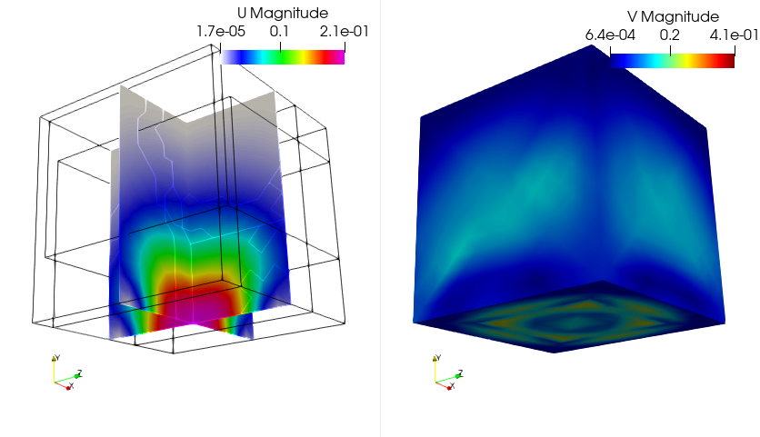
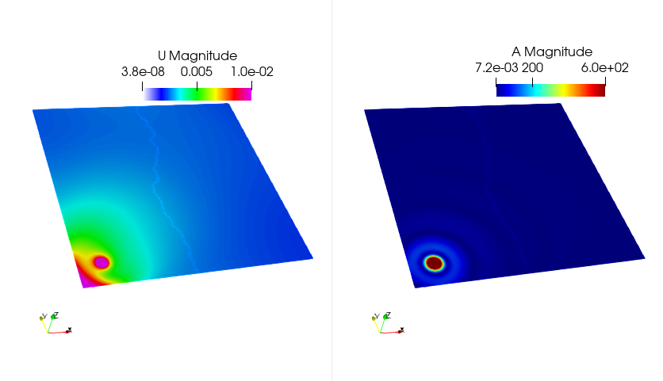
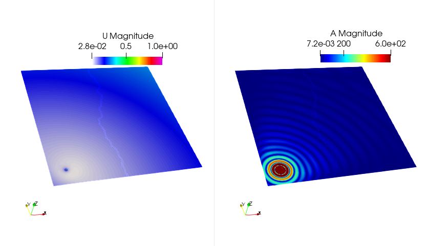

## Soildynamics and its Finite Element Formulation

Soildynamics refers to the simulation of dynamic elastic wave propagation in soli media, with specific attention to modeling seismic phenomena. It extends classical **elastodynamics** by incorporating specialized boundary conditions to both simulate a seismic source and absorb outgoing waves, thus mimicking an unbounded domain. The main additions are:

* **Double couple source terms** that emulate the seismic moment tensor in a physically meaningful way.
* **Paraxial absorbing boundary conditions** that suppress spurious reflections from the artificial computational domain boundaries.

#### Governing Equations

Let $\Omega \subset \mathbb{R}^d$ denote the bounded computational domain occupied by a linear elastic solid. The motion of the solid is governed by the conservation of linear momentum:

$$
\rho \ddot{\mathbf{u}} - \nabla \cdot \boldsymbol{\sigma} = \mathbf{f} \quad \text{in } \Omega \times [0,T]
$$

where:

* $\mathbf{u}$ is the displacement field,
* $\rho$ is the mass density,
* $\boldsymbol{\sigma} = \mathbb{C} : \boldsymbol{\varepsilon}(\mathbf{u})$ is the Cauchy stress tensor,
* $\mathbf{f}$ is the external body force,
* $\mathbb{C}$ is the fourth-order elastic tensor,
* $\boldsymbol{\varepsilon}(\mathbf{u}) = \frac{1}{2}(\nabla \mathbf{u} + \nabla \mathbf{u}^\top)$ is the strain tensor.

Boundary conditions include:

* Traction $\boldsymbol{\sigma} \cdot \mathbf{n} = \mathbf{t}$ on $\partial_t \Omega$,
* Displacement $\mathbf{u} = \mathbf{u}_0$ on $\partial_u \Omega$,
  with $\partial \Omega = \partial_u \Omega \cup \partial_t \Omega$, and $\partial_u \Omega \cap \partial_t \Omega = \emptyset$.

#### FEM discretization

We define the functional spaces for admissible displacements and test functions as:

$$
\begin{aligned}
\mathcal{U} &= \left\{ \mathbf{u} \in H^1(\Omega)^d \mid  \text{ on } \partial_u \Omega, \ \mathbf{u}(x, 0) = \mathbf{u}_0(x) \right\} \\
\mathcal{V} &= \left\{ \mathbf{v} \in H^1(\Omega)^d \mid  \text{ on } \partial_u \Omega \mathbf{v}(x, 0) = \mathbf{0} \right\}
\end{aligned}
$$

To derive the weak or the variational form, we multiply the balance equation by a test function $\mathbf{v} \in \mathcal{V}$ and integrate over the domain $\Omega$, using integration by parts and applying the Neumann boundary condition:

$$
\int_\Omega \rho\, \ddot{\mathbf{u}} \cdot \mathbf{v} \, dV + \int_\Omega \boldsymbol{\sigma}(\mathbf{u}) : \boldsymbol{\varepsilon}(\mathbf{v}) \, dV = \int_\Omega \mathbf{f} \cdot \mathbf{v} \, dV + \int_{\partial_t \Omega} \mathbf{t} \cdot \mathbf{v} \, dS
$$

### 2. Seismic Source: Double Couple Boundary Condition

In the context of earthquake simulation within the **Solidynamics** module, the seismic source is modeled as a **double-couple mechanism**. This is a standard idealization of shear faulting, where slip occurs on a fault plane without volume change. Unlike force dipoles or body force distributions, the double-couple is implemented via a **set of interior point forces (or displacements)** arranged to mimic the equivalent moment tensor.

#### Geometric Configuration

Let $\mathbf{x}_0 \in \Omega$ denote the hypocenter (i.e., the source center). Around this point, we define four auxiliary points forming two orthogonal pairs:

* $\mathbf{x}_1 = \mathbf{x}_0 + \varepsilon \mathbf{d}_1$
* $\mathbf{x}_2 = \mathbf{x}_0 - \varepsilon \mathbf{d}_1$
* $\mathbf{x}_3 = \mathbf{x}_0 + \varepsilon \mathbf{d}_2$
* $\mathbf{x}_4 = \mathbf{x}_0 - \varepsilon \mathbf{d}_2$

where $\mathbf{d}_1, \mathbf{d}_2 \in \mathbb{R}^d$ are orthonormal vectors defining the fault plane and slip direction (with $\mathbf{d}_1 \cdot \mathbf{d}_2 = 0$), and $\varepsilon \ll 1$ defines the source extent.

#### Moment Representation via Forces

A double-couple moment tensor $\mathbf{M} = M_0 (\mathbf{d}_1 \otimes \mathbf{d}_2 + \mathbf{d}_2 \otimes \mathbf{d}_1)$ is then represented by imposing **equal and opposite point forces** on the four surrounding points:

* Apply $+\mathbf{F}$ at $\mathbf{x}_1$, $-\mathbf{F}$ at $\mathbf{x}_2$
* Apply $-\mathbf{F}$ at $\mathbf{x}_3$, $+\mathbf{F}$ at $\mathbf{x}_4$

This force distribution yields a net zero force and net zero torque, consistent with a pure shear source.

Alternatively, **prescribed displacements** can be imposed on these same points in directions $\pm\mathbf{d}_2$, effectively generating the same moment. The displacements may follow a time-dependent waveform such as a Ricker wavelet or trapezoidal function to model source time history:

$$
\mathbf{u}(\mathbf{x}_i, t) = \pm \mathbf{d}_2 \cdot s(t), \quad i = 1,\dots,4
$$

where $s(t)$ defines the slip function or moment rate.

#### FEM Implementation

The contribution of the double-couple to the weak form appears as a source term contibution i.e, only in the RHS of the linear-system:

$$
\int_\Omega \mathbf{f}_\text{DC} \cdot \mathbf{v} \, \mathrm{d}\Omega \approx \sum_{i=1}^{4} \mathbf{F}_i(t) \cdot \mathbf{v}(\mathbf{x}_i)
$$

or in the displacement-imposed case, as **Dirichlet conditions** at $\mathbf{x}_1, \dots, \mathbf{x}_4$, in this case it will appear both in LHS and RHS of the linear-system.

In practice, these points are selected from the computational mesh to ensure numerical stability, and the value of $\varepsilon$ is chosen based on element size.

#### Paraxial Absorbing Boundary Conditions

To emulate an unbounded domain and absorb outgoing seismic waves at the boundary $\Sigma \subset \partial \Omega$, **zeroth-order paraxial conditions** are introduced.

**Paraxial Traction Approximation**

Let $\mathbf{m}$ denote the outward normal at $\Sigma$. The paraxial approximation replaces the traction $\mathbf{t}_E$ due to the exterior domain $\Omega_E$ by:

$$
\mathbf{t}_E \approx \mathbf{A}_0(\dot{\mathbf{u}}) = \rho c_p (\dot{\mathbf{u}} \cdot \mathbf{m}) \mathbf{m} + \rho c_s \left( \dot{\mathbf{u}} - (\dot{\mathbf{u}} \cdot \mathbf{m}) \mathbf{m} \right)
$$

or more compactly using projection tensors:

$$
\mathbf{A}_0(\dot{\mathbf{u}}) = \rho \left[ (c_p - c_s)(\mathbf{m} \otimes \mathbf{m}) + c_s \mathbf{I} \right] \cdot \dot{\mathbf{u}}
$$

This expression acts as a local, directionally-sensitive damping term on the velocity field at the boundary.

**Variational Formulation with Paraxial Absorbing Layer**

The FEM weak form including the paraxial absorbing term reads:

$$
\begin{aligned}
\text{Find } \mathbf{u} \in \mathcal{U} \text{ such that:} \\
M(\ddot{\mathbf{u}}, \mathbf{v}) + C(\dot{\mathbf{u}}, \mathbf{v}) + K(\mathbf{u}, \mathbf{v}) &= b(\mathbf{v}; \mathbf{f})_\Omega + b(\mathbf{v}; \mathbf{t})_{\partial_t \Omega} - b(\mathbf{v}; \mathbf{A}_0(\dot{\mathbf{u}}))_\Sigma
\end{aligned}
\quad \forall \mathbf{v} \in \mathcal{V}
$$

This boundary contribution effectively absorbs outgoing P- and S-waves.

**Accounting for Known Incident Waves**

In simulations with known incoming waves, the total displacement on $\Sigma$ is split into **incident** ($\mathbf{u}^{\text{in}}$) and **radiated** ($\mathbf{u}^{\text{r}}$) parts:

$$
\mathbf{u} = \mathbf{u}^{\text{in}} + \mathbf{u}^{\text{r}}
$$

Then the traction at $\Sigma$ becomes:

$$
\mathbf{t} = -\mathbf{A}_0(\dot{\mathbf{u}}) + \mathbf{A}_0(\dot{\mathbf{u}}^{\text{in}}) - \mathbf{t}_E(\dot{\mathbf{u}}^{\text{in}})
$$

The final variational form is:

$$
\begin{aligned}
M(\ddot{\mathbf{u}}, \mathbf{v}) + C(\dot{\mathbf{u}}, \mathbf{v}) + K(\mathbf{u}, \mathbf{v}) &= b(\mathbf{v}; \mathbf{f})_\Omega + b(\mathbf{v}; \mathbf{t})_{\partial_t \Omega} \\
&\quad - b(\mathbf{v}; \mathbf{A}_0(\dot{\mathbf{u}}))_\Sigma - b(\mathbf{v}; \mathbf{t}_E(\dot{\mathbf{u}}^{\text{in}}))_\Sigma + b(\mathbf{v}; \mathbf{A}_0(\dot{\mathbf{u}}^{\text{in}}))_\Sigma
\end{aligned}
$$

#### Time Discretization

Following Newmark-$\beta$ family of time integrators (with $\beta$, $\gamma$ parameters), the time-discretized FEM system at time step $n+1$ becomes:

$$
K^{\text{eff}}(\mathbf{u}^{n+1}, \mathbf{v}) = l(\mathbf{v}) \quad \forall \mathbf{v} \in \mathcal{V}
$$

where:

$$
K^{\text{eff}} = \frac{1 - \alpha_m}{\beta \Delta t^2} M + \frac{\gamma(1 - \alpha_f)}{\beta \Delta t} C + (1 - \alpha_f) K + \frac{\gamma(1 - \alpha_f)}{\beta \Delta t} b(\cdot; \mathbf{A}_0(\cdot))_\Sigma
$$

and the right-hand side $l(\mathbf{v})$ includes known contributions from $\mathbf{u}^n$, $\dot{\mathbf{u}}^n$, $\ddot{\mathbf{u}}^n$, and any prescribed incident fields.

## Tutorial 1
### Soildynamics with Paraxial Loading
_Elastic Wave Propagation in Soil Medium with Paraxial Boundaries_

> ⚠️ **Warning**:
> You are requested to having followed at least the linear-elasticity tutorials before attempting to follow this tutorial. This will make the understanding process here simpler.

> 💡 **Note**:
>This document details some tutorials of soildynamics module of PSD. These tutorials are not verbose, but does instead give a kick start to users/developers for using PSD's soildynamics module.

This tutorial illustrates the propagation of elastic waves in a 2D soil medium using the `Solidynamics` module of the PSD solver. The objective is to model the dynamic response of a homogeneous, isotropic soil domain subjected to a time-dependent boundary traction, while absorbing outgoing waves through paraxial (absorbing) boundary conditions.

The computational domain is defined by a square domain $\Omega$. It corresponds to a 2D soil, paraxial absorbing boundaries are applied to left, right and bottom edge. The soil is assumed to be a linear elastic and nearly incompressible material with ($\rho$, $E$, $\nu$) = (2500 kg/m³, $6.62 \times 10^6$ Pa, 0.45). The computed values of $\mu$, $\lambda$, $c_s$, and $c_p$ are internally derived using standard isotropic elasticity relations.

Time evolution is handled via the Newmark-$\beta$ method, a second-order accurate implicit scheme. The parameters for this problem are, total simulation time: $t_\text{max} = 4.0$ s, time step size: $\Delta t = 0.01$ s.

For this simulation, a time-dependent sinusoidal traction load is applied on a portion of the bottom boundary (label 5), between $x = 20$ m and $x = 30$ m. The loading function is defined as:

$$
v_1^{\text{in}}(x,t) = 
\begin{cases}
\sin(2\pi t) & \text{if } t \leq 1.0 \text{ and } 20 < x < 30 \\
0            & \text{otherwise}
\end{cases}
$$

This models a localized source excitation lasting for 1 second, representing surface vibrational input (e.g., from a pile driver or seismic shaker). 

The quantities of interest for this tutorial include the displacement field $\mathbf{u}$, velocity field $\mathbf{v}$, and acceleration field $\mathbf{a}$, which are computed and stored at each time step for postprocessing and analysis.

#### 🛠️ Step 1: Preprocessing the Simulation

In the terminal `cd` to the folder `/home/PSD-tutorials/soildynamics` Note that one can perform these simulation in any folder provided that PSD has been properly installed. We use `/home/PSD-tutorials/soildynamics` for simplicity, once the user is proficient a simulation can be launch elsewhere. Launch the preprocessing phase by running the following command in your terminal:

<pre><code class="bash">
PSD_PreProcess -dimension 2 -problem soildynamics -dirichletconditions 1  \
-timediscretization newmark_beta -postprocess uav
</code></pre>

> 🧠 What do the arguments mean?

| Flag                                 | Description                                                                   |
| ------------------------------------ | ----------------------------------------------------------------------------- |
| `-problem soildynamics`            | Enables soildynamics physics                                                |
| `-dimension 2`                     | Sets the simulation dimension to 2D                                           |
| `-dirichletconditions 1`           | Applies Dirichlet conditions on one border                                    |
| `-timediscretization newmark_beta` | Sets time discretization via Newmark-$\beta$                                |
| `-postprocess uav`                 | Requests ($\mathbf{u}$, $\mathbf{a}$, $\mathbf{v}$) output for ParaView |

Upon successful preprocessing, several `.edp` (FreeFEM) script files will be generated in your working directory. You will now have to follow an edit cycle, where you will provide PSD with some other additional information about your simulation that you wish to perform. At this stage the input properties need to be set. All of these are setup in `ControlParameters.edp` file. 

- Start by setting mesh in `soil.msh`.

<pre><code class="cpp">
//=============================================================================
// ------- Mesh parameters (Un-partitioned) -------
// -------------------------------------------------------------------
//  ThName : Name of the .msh file in Meshses/2D or  Meshses/3D folder
//=============================================================================

  string ThName = "../Meshes/2D/soil.msh";
</code></pre>

- Next, setup the material (soil) properties:

<pre><code class="cpp">
//============================================================================
//                   ------- Soil parameters -------
// -------------------------------------------------------------------
//  rho : density of soil
//  cp, cs : Primary and secondary wave velocities
//  mu, lambda : Lame parameter of the soil
//  E, nu : Modulus of Elasticity and Poisson ratio of the soil
//============================================================================

  real rho  = 2500.0 ;

  real    mu
         ,lambda
         ;

{
  real E  = 6.62e6  ,
       nu = 0.45    ;

  mu     = E/(2.*(1.+nu))            ;
  lambda = E*nu/((1.+nu)*(1.-2.*nu)) ;
}
  real cs   = sqrt(mu/rho)               ,
       cp   = sqrt((lambda+(2.*mu))/rho) ;
</code></pre>

- Set the time discretization parameters:

<pre><code class="cpp">
//============================================================================
//           ------- Time discretization parameters -------
// -------------------------------------------------------------------
//  t, tmax, dt : Time parameters, time, maximum time, and time step
//  gamma, beta : Time discretization constants (Newmark-beta)
//============================================================================

  real tmax = 4.0     ,
       t    = 0.01    ,
       dt   = 0.01    ;

  real gamma = 0.5                       ,
       beta  = (1./4.)*(gamma+0.5)^2     ;
</code></pre>

- Provide information in Paraxial mesh labels, i.e which surfaces will act as absorbing ones:

<pre><code class="cpp">
//============================================================================
//        -------Paraxial boundary-condition parameters-------
// -------------------------------------------------------------------
// PAlabels : is the vector of surface mesh labels that participate as
//            absorbing boundaries (via paraxial elements)
//============================================================================

  int [int]   PAlabels = [ 2 ,      // Left-border label
                           4 ,      // Right-border label
                           5 ];     // Bottom-border label
</code></pre>

- Finally, the loading conditions are provided:

<pre><code class="cpp">
//============================================================================
//        -------Paraxial boundary load-------
// -------------------------------------------------------------------
// v1in : is a time dependent sinusoidal loading function ( traction )
//        which exists for time (tt <= 1 sec)
// LoadLabels : is the vector of surface mesh labels to which external
//              force is applied to
//============================================================================

  real tt;
  func v1in = (tt <= 1.0 ? real(sin(tt*(2.*pi/1.0)))*(x>20&&x<30) : 0. );

  int [int]   LoadLabels = [ 5 ];     // Bottom-border label 
</code></pre>

With all this, we have now setup the problem and are ready for launching the solver.

#### ⚙️ Step 2: Solving the Problem

As PSD is a parallel solver, let us use 4 cores to solve the problem. To do so enter the following command:

<pre><code class="bash">
PSD_Solve -np 4 Main.edp -mesh ./../Meshes/2D/soil.msh -v 0
</code></pre>

This will launch the PSD simulation.

Here `-np 4` (number of processes) denote the argument used to enter the number of parallel processes (MPI processes) used by PSD while solving. `-mesh ./../Meshes/2D/soil.msh` is used to provide the mesh file to the solver, `-mesh` argument is not needed if the user has indicated the right mesh in `ControlParameters.edp` file. `-v 0` denotes the verbosity level on screen. `PSD_Solve` is a wrapper around `FreeFem++-mpi`. Note that if your problem is large use more cores.

#### 📊 Step 3: Postprocessing and Visualization

Once the simulation is finished. PSD allows postprocessing of results in ParaView. Launch ParaView and have a look at the `.pvd` file in the `VTUs...` folder. Using ParaView for postprocessing the results that are provided in the `VTUs...` folder, results such as those shown in the figure below can be extracted.

  
  

  
  

  

*Figure: Finite element displacement and velocity fields visualized for the 2D problem with ParaView at different timesteps.*

> 🧪 Optional Exercise: Perform the same simulation but in 3D, a 3D mesh equivalent to that of 2D case is already present in the `Meshes` folder in the tutorial. You should yeild results such as shown below.

  
  

  
  

  

*Figure: Finite element displacement and velocity fields visualized for the 3D problem with ParaView at different timesteps.*

## Tutorial 2
### Soildynamics with Double Couple Source
_Seismic Wave Propagation from a Double-Couple Source in a 2D Soil Medium_

> 💡 **Note**:
>This document details some tutorials of soildynamics module of PSD. These tutorials are not verbose, but does instead give a kick start to users/developers for using PSD's soildynamics module.

In the current tutorial, the seismic source is more realistic and comes from a double couple (point Dirichlet condition). The double couple boundary condition is a way to impose moments caused by faults that create earthquakes. Here, this problem imposes double couple using displacement-based conditions.

This tutorial models the propagation of seismic waves generated by a **double-couple source**, a simplified yet physically consistent representation of an earthquake shear dislocation, embedded in a 2D soil medium. The simulation uses the `Solidynamics` module of PSD with paraxial boundaries to absorb outgoing waves and minimize reflections.

**Material Properties**

The soil is modeled as an isotropic, linear elastic material, with properties typical of loose to medium-dense soil, with ($\rho$, $c_s$, $c_p$) = (1800 kg/m³, 2300 m/s, 4000 m/s).

**Time Integration**

The time domain response is computed over 4 seconds using the Newmark-$\beta$ method with second-order accuracy. With, simulation time: $t_\text{max} = 4.0$ s and time step: $\Delta t = 0.01$ s.

**paraxial (absorbing) boundaries**

To simulate an open domain, paraxial (absorbing) boundaries are applied on, Left edge (label 2), Right edge (label 4) and Bottom edge (label 5). These conditions help suppress reflections and emulate free radiation of waves.

**Seismic Source: Double-Couple Force System**

A double-couple (DC) source is implemented by applying equal and opposite point forces along orthogonal directions, mimicking a pure shear dislocation — a realistic approximation of a small earthquake source.

The DC source consists of four points located around the epicenter, for this problem:

| Point | Coordinates (x, y) |
| ----- | ------------------ |
| North | (5.0, 5.1)         |
| South | (5.0, 5.0)         |
| East  | (5.05, 5.05)       |
| West  | (4.95, 5.05)       |

Note, these points need to be forced in the mesh, PSD assumes that all these points are found in the mesh. 

Each point is assigned a time-dependent displacement or traction function to reproduce the moment release of a double-couple. The loading function is a smooth step function, defined as:

$$
f(t) = \frac{1}{2} \left(1 + \tanh(8(t - 0.2))\right)
$$

This function gradually activates the source at $t = 0.2$ seconds. The forces are applied as:

| Point | Loading Function   |
| ----- | ------------------ |
| North | $-0.5 \times f(t)$ |
| South | $+0.5 \times f(t)$ |
| East  | $+0.5 \times f(t)$ |
| West  | $-0.5 \times f(t)$ |

This configuration injects shear energy into the medium, generating both S-waves and P-waves, and mimics a strike-slip fault mechanism.

The quantities of interest for this tutorial include the displacement field $\mathbf{u}$, velocity field $\mathbf{v}$, and acceleration field $\mathbf{a}$, which are computed and stored at each time step for postprocessing and analysis.

#### 🛠️ Step 1: Preprocessing the Simulation

In the terminal `cd` to the folder `/home/PSD-tutorials/soildynamics` Note that one can perform these simulation in any folder provided that PSD has been properly installed. We use `/home/PSD-tutorials/soildynamics` for simplicity, once the user is proficient a simulation can be launch elsewhere. Launch the preprocessing phase by running the following command in your terminal:

<pre><code class="bash">
PSD_PreProcess -dimension 2 -problem soildynamics  -timediscretization newmark_beta \
-useGFP -doublecouple displacement_based -postprocess uav
</code></pre>

> 💡 **Note**:
>Compared to the previous tutorial, we note that `-dirichletconditions 1` are not present, and this is being replaced by a boolean flag `-doublecouple`, which enables double-couple loading. Additionally, `-useGFP`, i.e, use Go Fast Plugin is use, this is optional flag for performance considerations. 

Upon successful preprocessing, several `.edp` (FreeFEM) script files will be generated in your working directory. You will now have to follow an edit cycle, where you will provide PSD with some other additional information about your simulation that you wish to perform. At this stage the input properties need to be set. All of these are setup in `ControlParameters.edp` file. 

- Start by setting mesh in `bar_dynamic.msh`.

<pre><code class="cpp">
//=============================================================================
// ------- Mesh parameters (Un-partitioned) -------
// -------------------------------------------------------------------
//  ThName : Name of the .msh file in Meshses/2D or  Meshses/3D folder
//=============================================================================

  string ThName = "../Meshes/2D/soil_dc.msh";
</code></pre>

- Next, setup the material (soil) properties:

<pre><code class="cpp">
//============================================================================
//                   ------- Soil parameters -------
// -------------------------------------------------------------------
//  rho : density of soil
//  cp, cs : Primary and secondary wave velocities
//  mu, lambda : Lame parameter of the soil
//============================================================================

  real rho  = 1800.0 ,
       cs   = 2300.  ,
       cp   = 4000.  ;

  real    mu     =  cs*cs*rho,
          lambda =  cp*cp*rho - 2*mu;
</code></pre>

- Set the time discretization parameters:

<pre><code class="cpp">
//============================================================================
//           ------- Time discretization parameters -------
// -------------------------------------------------------------------
//  t, tmax, dt : Time parameters, time, maximum time, and time step
//  gamma, beta : Time discretization constants (Newmark-beta)
//============================================================================

  real tmax = 4.0     ,
       t    = 0.01    ,
       dt   = 0.01    ;

  real gamma = 0.5                       ,
       beta  = (1./4.)*(gamma+0.5)^2     ;
</code></pre>

- Provide information in Paraxial mesh labels, i.e which surfaces will act as absorbing ones:

<pre><code class="cpp">
//============================================================================
//        -------Paraxial boundary-condition parameters-------
// -------------------------------------------------------------------
// PAlabels : is the vector of surface mesh labels that participate as
//            absorbing boundaries (via paraxial elements)
//============================================================================

  int [int]   PAlabels = [ 2 ,      // Left-border label
                           4 ,      // Right-border label
                           5 ];     // Bottom-border label
</code></pre>

- Finally, the double-coule loading conditions are provided:

<pre><code class="cpp">
//============================================================================
//     -------Parameters for double couple point source-------
// -------------------------------------------------------------------
// DcNorthPointCord : is the vector  containing  coordinates of the
//                double couple north point. Idiom nomenclature ap-
//                lies to the south, east, and west points.
// DcNorthCondition : is the macro containing the applied condition
//                of the double couple north point.
//============================================================================

   real [int]   DcNorthPointCord = [5.,5.1];
   real [int]   DcSouthPointCord = [5.,5.];
   real [int]   DcEastPointCord  = [5.05,5.05];
   real [int]   DcWestPointCord  = [4.95,5.05];

   macro DcNorthCondition() -0.5*(1.+tanh(8*(t-0.2)))//
   macro DcSouthCondition()  0.5*(1.+tanh(8*(t-0.2)))//
   macro DcEastCondition()   0.5*(1.+tanh(8*(t-0.2)))//
   macro DcWestCondition()  -0.5*(1.+tanh(8*(t-0.2)))//
</code></pre>

With all this we can now launch and post-process the simulation.

#### ⚙️ Step 2: Solving the Problem

As PSD is a parallel solver, let us use 4 cores to solve the problem. To do so enter the following command:

<pre><code class="bash">
PSD_Solve -np 4 Main.edp -mesh ./../Meshes/2D/soil_dc.msh -v 0
</code></pre>

This will launch the PSD simulation.

Here `-np 4` (number of processes) denote the argument used to enter the number of parallel processes (MPI processes) used by PSD while solving. `-mesh ./../Meshes/2D/soil_dc.msh` is used to provide the mesh file to the solver, `-mesh` argument is not needed if the user has indicated the right mesh in `ControlParameters.edp` file. `-v 0` denotes the verbosity level on screen. `PSD_Solve` is a wrapper around `FreeFem++-mpi`. Note that if your problem is large use more cores.

#### 📊 Step 3: Postprocessing and Visualization

Once the simulation is finished. PSD allows postprocessing of results in ParaView. Launch ParaView and have a look at the `.pvd` file in the `VTUs...` folder. Using ParaView for postprocessing the results that are provided in the `VTUs...` folder, results such as those shown in the figure below can be extracted.

  
  

  

*Figure: Finite element displacement and acceleration fields visualized for the 2D problem with ParaView at different timesteps.*

> 🧪 Optional Exercise: Perform the same simulation but in 3D. Take note that the mesh `./../Meshes/3D/soil-dc.msh` is not provided, so you will have to create your own mesh. Considering the four double couple points and the source points, Gmsh or SALOME is recomended for this task.

## Tutorial 3
### 3D Soildynamics with top-ii-vol Meshing
_Topology-to-Volume Meshing with External Traction Load (3D Earthquake Meshing)_

In this tutorial, we demonstrate a full in-memory mesh generation and simulation pipeline using **PSD's `top-ii-vol` mesher**. Starting from a 3D **point cloud**, the mesh is constructed automatically in parallel, partitioned across processors. A **sinusoidal traction load** is applied on the surface to simulate wave injection, and **absorbing boundary conditions** are imposed on all relevant sides to emulate an open domain.

This tutorial is ideal for realistic, data-driven earthquake simulations where mesh generation is tied to geospatial input data (e.g., elevation or velocity models).

**Mesh** is in-situ here, instead of a traditional mesh file, the geometry is defined by a **3D point cloud** (`../Meshes/3D/Point-Cloud`). Tis point cloud corresponds to French Cadarache region, with 40 m distance between the mesurments of DEM. The point cloud is quantified by,  $N_x = 63$ and $N_y = 57$, i.e number of points in $x$ and $y$ direction. In order to generate the mesh  we assume a depth of 1920.0.

**Material properties** of  the soil is modeled as an isotropic, linear elastic material, with properties typical of loose to medium-dense soil, with ($\rho$, $c_s$, $c_p$) = (1800 kg/m³, 2300 m/s, 4000 m/s).

**Time integration** handled with Newmark-$\beta$ is assured with total simulation time: $t_{\text{max}} = 4.0$ seconds and a time step: $\Delta t = 0.01$ seconds.

**Paraxial (absorbing) elements** are applied to all walls, excluding the top surface, the following mesh surface labels are concernced `[1, 2, 4, 5, 6]`. Note `top-ii-vol` gives label `3` to the top surace.

**Traction loads** are applied to simulate a source of seismic energy, a localized sinusoidal traction force is applied on a patch of the bottom surface (label 6), within a spatial window of $x$-interval: [875481, 875681] $y$-interval: [160200, 160400]. The traction is applied only during the first second:

$$
f(t) = \begin{cases}
\sin\left(2\pi t\right) & \text{if } t \leq 1.0 \\
0 & \text{otherwise}
\end{cases}
$$

This load introduces vertical energy at the surface, mimicking a controlled dynamic forcing scenario (e.g., field experiment or induced source).

<figure style="text-align: center;">
  
  <figcaption><em>Figure: topology (elivation) and bottom boundary loading shown.</em></figcaption>
</figure>

The quantities of interest for this tutorial include the displacement field $\mathbf{u}$, velocity field $\mathbf{v}$, and acceleration field $\mathbf{a}$, which are computed and stored at each time step for postprocessing and analysis.

#### 🛠️ Step 1: Preprocessing the Simulation

In the terminal `cd` to the folder `/home/PSD-tutorials/soildynamics` Note that one can perform these simulation in any folder provided that PSD has been properly installed. We use `/home/PSD-tutorials/soildynamics` for simplicity, once the user is proficient a simulation can be launch elsewhere. Launch the preprocessing phase by running the following command in your terminal:

<pre><code class="bash">
PSD_PreProcess -dimension 3 -problem soildynamics -timediscretization newmark_beta \
-useGFP -top2vol-meshing -postprocess uav
</code></pre>

> 💡 **Note**:
>Compared to the previous tutorials, we note that `-top2vol-meshing` has been added which activates the top-ii-vol meshing support. Aditionally, `-useGFP`, i.e, use Go Fast Plugin is use, this is optional flag for performance considerations. 

Upon successful preprocessing, several `.edp` (FreeFEM) script files will be generated in your working directory. You will now have to follow an edit cycle, where you will provide PSD with some other additional information about your simulation that you wish to perform. At this stage the input properties need to be set. All of these are setup in `ControlParameters.edp` file. 

- Start by setting top-ii-vol meshing support.

<pre><code class="cpp">
//=============================================================================
// ------- Mesh parameters (Un-partitioned) -------
// -------------------------------------------------------------------
//  PcName : Name of the point cloud
//  PcNx   : Number of points in x in the point cloud
//  PcNy   : Number of points in x in the point cloud
//  PcNz   : Number of points in x in the point cloud
//  Dptz   : Depth in z for the mesh produced by top-ii-vol
//  PartX  : Number of partitions in x direction
//  PartY  : Number of partitions in y direction
//  PartZ  : Number of partitions in z direction
// -------------------------------------------------------------------
// Note that make sure PartX*PartY*PartZ = mpisize
//=============================================================================

  string PcName = "../Meshes/3D/Point-Cloud";
  macro PcNx() 63 //
  macro PcNy() 57 //
  macro PcNz() 29 //
  macro Dptz() -1920.0 //
  macro PartX() 1 //
  macro PartY() mpisize //
  macro PartZ() 1 //
</code></pre>

> 💡 **Note**:
>The 3D mesh is generated in-memory and automatically partitioned across MPI processes using, partitions along x-axis $P_x$: `PartX() 1`, partitions along y-axis $P_y$: `PartY() mpisize` (one domain per MPI process), and partitions along z-axis $P_z$: `PartZ() 1`.

>🚨 **Important**:
>The total number of partitions must match the number of MPI processes: i.e. $P_x\times P_y \times P_z = \text{mpisize}$. Users are free to choose 1D, 2D, or 3D decompostion adhearing to the given notice.

- Next, setup the soil material paramters.

<pre><code class="cpp">
//============================================================================
//                   ------- Soil parameters -------
// -------------------------------------------------------------------
//  rho : density of soil
//  cp, cs : Primary and secondary wave velocities
//  mu, lambda : Lame parameter of the soil
//============================================================================

  real rho  = 1800.0 ,
       cs   = 2300.  ,
       cp   = 4000.  ;

  real    mu     =  cs*cs*rho,
          lambda =  cp*cp*rho - 2*mu;
</code></pre>

- Set the time discretization parameters:

<pre><code class="cpp">
//============================================================================
//           ------- Time discretization parameters -------
// -------------------------------------------------------------------
//  t, tmax, dt : Time parameters, time, maximum time, and time step
//  gamma, beta : Time discretization constants (Newmark-beta)
//============================================================================

  real tmax = 4.0     ,
       t    = 0.01    ,
       dt   = 0.01    ;

  real gamma = 0.5                       ,
       beta  = (1./4.)*(gamma+0.5)^2     ;
</code></pre>

- Provide information in Paraxial mesh labels, i.e which surfaces will act as absorbing ones:

<pre><code class="cpp">
//============================================================================
//        -------Paraxial boundary-condition parameters-------
// -------------------------------------------------------------------
// PAlabels : is the vector of surface mesh labels that participate as
//            absorbing boundaries (via paraxial elements)
//============================================================================

  int [int]   PAlabels = [1,2,4,5,6];
                                     
</code></pre>

- Finally, the loading conditions are provided:

<pre><code class="cpp">
//============================================================================
//        -------Paraxial boundary load-------
// -------------------------------------------------------------------
// v1in : is a time dependent sinusoidal loading function ( traction )
//        which exists for time (tt <= 1 sec)
// LoadLabels : is the vector of surface mesh labels to which external
//              force is applied to
//============================================================================

  real tt;
  func v1in = (
                 tt <= 1.0  ?
                  real( sin(tt*(2.*pi/1.0))) *
                  (x>875481.&&x<875681.) * (y>160200.&&y<160400.)
                 :
                   0.
               );

  int [int]   LoadLabels = [6];
</code></pre>

With all this, we have now setup the problem and are ready for launching the solver.

#### ⚙️ Step 2: Solving the Problem

As PSD is a parallel solver, let us use 4 cores to solve the problem. To do so enter the following command:

<pre><code class="bash">
PSD_Solve -np 4 Main.edp -v 0 -ns -nw 
</code></pre>

This will launch the PSD simulation.

#### 📊 Step 3: Postprocessing and Visualization

Once the simulation is finished. PSD allows postprocessing of results in ParaView. Launch ParaView and have a look at the `.pvd` file in the `VTUs...` folder. Using ParaView for postprocessing the results that are provided in the `VTUs...` folder, results such as those shown in the figure below can be extracted.

<figure style="text-align: center;">
  
  
  
  
  <figcaption><em>Figure: Observed wave propogation within the soil medium.</em></figcaption>
</figure>

## Tutorial 4
### 3D with top-ii-vol meshing and double couple
_Topology-to-Volume Meshing with Double-Couple Source Injection_

This tutorial builds upon the previous one by generating the simulation mesh entirely in memory using a 3D point cloud input via PSD's `top-ii-vol` mesher. Instead of an external surface load in tutorial 3, the earthquake source is now modeled using a volumetric double-couple force system at a specified hypocenter depth.

This setup mimics a realistic fault slip by injecting seismic energy from four interior points, representing the classic double-couple moment tensor configuration used in seismology. We will not repete here the soil and time parameters here please see tutorial 3 for that. The only diffrence being double couple is represented below. 

**Double-Couple Point Source**

This tutorial simulates a **subsurface fault rupture** using a classic double-couple moment tensor configuration. The source is modeled by injecting forces at four surrounding points:

| Point | Coordinates $[x, y, z]$ in meters | Condition                     |
| ----- | --------------------------------- | ----------------------------- |
| North | \[877421.00, 162180.00, -1441.07] | $-0.5(1 + \tanh(8(t - 0.2)))$ |
| South | \[877421.00, 162180.00, -1600.71] | $+0.5(1 + \tanh(8(t - 0.2)))$ |
| East  | \[877341.00, 162180.00, -1520.89] | $+0.5(1 + \tanh(8(t - 0.2)))$ |
| West  | \[877501.00, 162180.00, -1520.89] | $-0.5(1 + \tanh(8(t - 0.2)))$ |

These forces form two opposing dipoles (N-S and E-W) and activate progressively over time using a smooth **hyperbolic tangent** ramp, centered at $t = 0.2$ seconds.

**Source Time Function (Generic Form)**

$$
f(t) = \pm \frac{1}{2}\left(1 + \tanh\left(8(t - 0.2)\right)\right)
$$

This function is continuous and differentiable—ideal for stable numerical wave propagation.

The quantities of interest for this tutorial include the displacement field $\mathbf{u}$, velocity field $\mathbf{v}$, and acceleration field $\mathbf{a}$, which are computed and stored at each time step for postprocessing and analysis.

#### 🛠️ Step 1: Preprocessing the Simulation

In the terminal `cd` to the folder `/home/PSD-tutorials/soildynamics` Note that one can perform these simulation in any folder provided that PSD has been properly installed. We use `/home/PSD-tutorials/soildynamics` for simplicity, once the user is proficient a simulation can be launch elsewhere. Launch the preprocessing phase by running the following command in your terminal:

<pre><code class="bash">
PSD_PreProcess -dimension 3 -problem soildynamics -timediscretization newmark_beta \
-useGFP -top2vol-meshing -doublecouple displacement_based -postprocess uav
</code></pre>

> 💡 **Note**:
>Compared to the previous tutorial3, we note that `-doublecouple displacement_based` has been added which activates the double couple loading for seismic source.

Upon successful preprocessing, several `.edp` (FreeFEM) script files will be generated in your working directory. You will now have to follow an edit cycle, where you will provide PSD with some other additional information about your simulation that you wish to perform. At this stage the input properties need to be set. All of these are setup in `ControlParameters.edp` file. 

- Start by setting top-ii-vol meshing support.

<pre><code class="cpp">
//=============================================================================
// ------- Mesh parameters (Un-partitioned) -------
// -------------------------------------------------------------------
//  PcName : Name of the point cloud
//  PcNx   : Number of points in x in the point cloud
//  PcNy   : Number of points in x in the point cloud
//  PcNz   : Number of points in x in the point cloud
//  Dptz   : Depth in z for the mesh produced by top-ii-vol
//  PartX  : Number of partitions in x direction
//  PartY  : Number of partitions in y direction
//  PartZ  : Number of partitions in z direction
// -------------------------------------------------------------------
// Note that make sure PartX*PartY*PartZ = mpisize
//=============================================================================

  string PcName = "../Meshes/3D/Point-Cloud";
  macro PcNx() 63 //
  macro PcNy() 57 //
  macro PcNz() 29 //
  macro Dptz() -1920.0 //
  macro PartX() 1 //
  macro PartY() mpisize //
  macro PartZ() 1 //
</code></pre>

> 💡 **Note**:
>The 3D mesh is generated in-memory and automatically partitioned across MPI processes using, partitions along x-axis $P_x$: `PartX() 1`, partitions along y-axis $P_y$: `PartY() mpisize` (one domain per MPI process), and partitions along z-axis $P_z$: `PartZ() 1`.

>🚨 **Important**:
>The total number of partitions must match the number of MPI processes: i.e. $P_x\times P_y \times P_z = \text{mpisize}$. Users are free to choose 1D, 2D, or 3D decompostion adhearing to the given notice.

- Next, setup the soil material paramters.

<pre><code class="cpp">
//============================================================================
//                   ------- Soil parameters -------
// -------------------------------------------------------------------
//  rho : density of soil
//  cp, cs : Primary and secondary wave velocities
//  mu, lambda : Lame parameter of the soil
//============================================================================

  real rho  = 1800.0 ,
       cs   = 2300.  ,
       cp   = 4000.  ;

  real    mu     =  cs*cs*rho,
          lambda =  cp*cp*rho - 2*mu;
</code></pre>

- Set the time discretization parameters:

<pre><code class="cpp">
//============================================================================
//           ------- Time discretization parameters -------
// -------------------------------------------------------------------
//  t, tmax, dt : Time parameters, time, maximum time, and time step
//  gamma, beta : Time discretization constants (Newmark-beta)
//============================================================================

  real tmax = 4.0     ,
       t    = 0.01    ,
       dt   = 0.01    ;

  real gamma = 0.5                       ,
       beta  = (1./4.)*(gamma+0.5)^2     ;
</code></pre>

- Provide information in Paraxial mesh labels, i.e which surfaces will act as absorbing ones:

<pre><code class="cpp">
//============================================================================
//        -------Paraxial boundary-condition parameters-------
// -------------------------------------------------------------------
// PAlabels : is the vector of surface mesh labels that participate as
//            absorbing boundaries (via paraxial elements)
//============================================================================

  int [int]   PAlabels = [1,2,4,5,6];
                                     
</code></pre>

- Finally, the  double couple loading conditions are provided:

<pre><code class="cpp">
//============================================================================
//     -------Parameters for double couple point source-------
// -------------------------------------------------------------------
// DcNorthPointCord : is the vector  containing  coordinates of the
//                double couple north point. Idiom nomenclature ap-
//                lies to the south, east, and west points.
// DcNorthCondition : is the macro containing the applied condition
//                of the double couple north point.
//============================================================================

   real [int]   DcNorthPointCord = [877421.00,162180.00, -1441.071429];
   real [int]   DcSouthPointCord = [877421.00,162180.00, -1600.714286];
   real [int]   DcEastPointCord  = [877341.00,162180.00, -1520.892857];
   real [int]   DcWestPointCord  = [877501.00,162180.00, -1520.892857];

   macro DcNorthCondition() -0.5*(1.+tanh(8*(t-0.2)))//
   macro DcSouthCondition()  0.5*(1.+tanh(8*(t-0.2)))//
   macro DcEastCondition()   0.5*(1.+tanh(8*(t-0.2)))//
   macro DcWestCondition()  -0.5*(1.+tanh(8*(t-0.2)))//
</code></pre>

With all this, we have now setup the problem and are ready for launching the solver.

#### ⚙️ Step 2: Solving the Problem

As PSD is a parallel solver, let us use 8 cores to solve the problem. To do so enter the following command:

<pre><code class="bash">
PSD_Solve -np 8 Main.edp -v 0 -ns -nw 
</code></pre>

This will launch the PSD simulation.

#### 📊 Step 3: Postprocessing and Visualization

Once the simulation is finished. PSD allows postprocessing of results in ParaView. Launch ParaView and have a look at the `.pvd` file in the `VTUs...` folder. Using ParaView for postprocessing the results that are provided in the `VTUs...` folder, results such as those shown in the figure below can be extracted.

<figure style="text-align: center;">
  
  
  
  
  <figcaption><em>Figure: Observed wave propogation within the soil medium.</em></figcaption>
</figure>

## 📚 Additional Exercises

These exercises are designed to deepen your understanding of the various features and numerical strategies available in PSD. They allow you to experiment with performance optimization, modeling approaches, and soildynamics enhancements.

#### Exercise 1 – Running the Solver in Sequential Mode

Explore the **sequential solver mode** in PSD by using the `-sequential` flag during the preprocessing step. Then solve the problem using `PSD_Solve_Seq` instead of the default parallel solver.

**Example Workflow:**

<pre><code class="bash">
PSD_PreProcess -dimension 2 -problem soildynamics -dirichletconditions 1 \
-timediscretization newmark_beta -postprocess uav -sequential
</code></pre>

<pre><code class="bash">
PSD_Solve_Seq Main.edp -mesh ./../Meshes/2D/soil.msh -v 0
</code></pre>

Try this approach on other problems from the tutorial and compare results against parallel runs. This is especially useful for debugging or smaller-scale tests.

#### Exercise 2 – Double Couple Source: Force-Based Variant

In soildynamics problems, **double couple sources** can be introduced using two methods:

* **Displacement-based** (already used in previous exercises via `-doublecouple displacement_based`)
* **Force-based**, where forces are applied at source locations and internally converted to equivalent moments.

**Your Task:**
Try out the **force-based** method by using:

<pre><code class="bash">
-doublecouple force_based
</code></pre>

Compare simulation outcomes (e.g., displacement fields, wave propagation) between the two approaches. This is important for validating different earthquake source modeling strategies.

#### Exercise 3 – Time Discretization Performance Study

Investigate how different time integration schemes affect performance and stability.

**Instructions:**

* Enable time logging using the `-timelog` flag.
* Compare solver performance for **Newmark-β**, **Generalized-α**, and other available time discretization schemes.
* Use both sequential and parallel solvers for comparison.

Refer to the PSD documentation for the full list of time integration options. Log the timings and interpret differences in accuracy or runtime.

#### Exercise 4 – Speeding Up Simulations with GoFast Plugins (GFP)

PSD includes a performance optimization kernel known as **GoFast Plugins (GFP)**, designed to accelerate solving by using optimized C++ structures. This feature is off by default.

**Activate GFP in Preprocessing:**

<pre><code class="bash">
PSD_PreProcess -dimension 2 -problem soildynamics -dirichletconditions 1 \
-timediscretization newmark_beta -postprocess uav -useGFP
</code></pre>

**Solve the Problem in Parallel:**

<pre><code class="bash">
PSD_Solve -np 4 Main.edp -mesh ./../Meshes/2D/soil.msh -v 0
</code></pre>

Test this feature on multiple examples from the tutorial. Combine with `-timelog` to **quantify the performance gain** from using `-useGFP`.