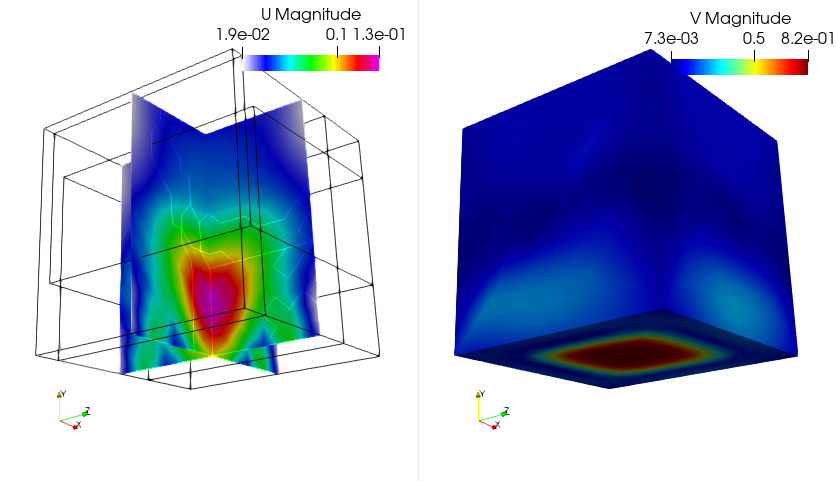

## Tutorial 1
### Soildynamics in 2D with PSD 

> 💡 **Note**: This document details some tutorials of soildynamics module of PSD. These tutorials are not verbose, but does instead give a kick start to users/developers for using PSD's soildynamics module. 

The problem of interest is a single Dirichlet condition problem of soildynamics in 2D. For this problem we use Newmark-$\beta$ time discretization. Additionally postprocessing is demanded for displacement, acceleration, and velocity ($u,a,v$).

<pre><code class="bash">
PSD_PreProcess -dimension 2 -problem soildynamics -dirichletconditions 1 -timediscretization newmark_beta \
-postprocess uav
</code></pre>

Once the step above has been performed, we solve the problem using four MPI processes, with the given mesh file `soil.msh`. 

<pre><code class="bash">
PSD_Solve -np 4 Main.edp -mesh ./../Meshes/2D/soil.msh -v 0
</code></pre>

  
  

  
  

  

*Figure: Finite element displacement and velocity fields visualized for the 2D problem with ParaView at different timesteps.*

Using ParaView for postprocessing the results that are provided in the `VTUs...` folder, results such as those shown in the figure above can be extracted.

## Tutorial 2
### Soildynamics in 3D with PSD 

> 💡 **Note**: This document details some tutorials of soildynamics module of PSD. These tutorials are not verbose, but does instead give a kick start to users/developers for using PSD's soildynamics module. 

The problem of interest is a single Dirichlet condition problem of soildynamics in 3D. For this problem we use Newmark-$\beta$ time discretization. Additionally postprocessing is demanded for displacement, acceleration, and velocity ($u,a,v$).

<pre><code class="bash">
PSD_PreProcess -dimension 3 -problem soildynamics -dirichletconditions 1 -timediscretization newmark_beta 
-postprocess uav
</code></pre>

Once the step above has been performed, we solve the problem using three MPI processes, with the given mesh file `soil.msh`.

<pre><code class="bash">
PSD_Solve -np 3 Main.edp -mesh ./../Meshes/3D/soil.msh -v 0
</code></pre>

  
  

  
  

  

*Figure: Finite element displacement and velocity fields visualized for the 3D problem with ParaView at different timesteps.*

Using ParaView for postprocessing the results that are provided in the `VTUs...` folder, results such as those shown in the figure above can be extracted.

## Tutorial 3
### Parallel 2D with double couple

> 💡 **Note**: This document details some tutorials of soildynamics module of PSD. These tutorials are not verbose, but does instead give a kick start to users/developers for using PSD's soildynamics module. 

In the 2D problem above, seismic sources were supplied on the border. In the current one, the source is more realistic and comes from a double couple (point Dirichlet condition). The double couple boundary condition is a way to impose moments caused by faults that create earthquakes. Here, this problem imposes double couple using displacement-based conditions.

<pre><code class="bash">
PSD_PreProcess -dimension 2 -problem soildynamics  -timediscretization newmark_beta \
-useGFP -doublecouple displacement_based -postprocess uav
</code></pre>

Once the step above has been performed, we solve the problem using two MPI processes, with the given mesh file `soil_dc.msh`. 

<pre><code class="bash">
PSD_Solve -np 2 Main.edp -v 1 -ns -nw -mesh ./../Meshes/2D/soil_dc.msh
</code></pre>

  
  

  

*Figure: Finite element displacement and acceleration fields visualized for the 2D problem with ParaView at different timesteps.*

Using ParaView for postprocessing the results that are provided in the `VTUs...` folder, results such as those shown in the figure above can be extracted.

Similarly, try out the 3D problem. However, take note that the mesh `./../Meshes/2D/soil-dc.msh` is not provided, so you will have to create your own mesh.

## Tutorial 4
### Parallel 3D with top-ii-vol meshing

A single Dirichlet boundary condition is applied at the bottom and the simulation uses GFP.

<pre><code class="bash">
PSD_PreProcess -dimension 3 -problem soildynamics -model linear -timediscretization newmark_beta \
-useGFP -top2vol-meshing -postprocess uav
</code></pre>

<pre><code class="bash">
PSD_Solve -np 4 Main.edp -v 0 -ns -nw 
</code></pre>

## Tutorial 5
### Parallel 3D with top-ii-vol meshing and double couple source

A single Dirichlet boundary condition is imposed via a double couple source, displacement based, using GFP.

<pre><code class="bash">
PSD_PreProcess -dimension 3 -problem soildynamics -timediscretization newmark_beta \
-useGFP -top2vol-meshing -doublecouple displacement_based -postprocess uav
</code></pre>

<pre><code class="bash">
PSD_Solve -np 3 Main.edp -v 0 -ns -nw
</code></pre>