## Validation and Verification

Validation and verification of any numerical simulation solver is a key process that should not be avoided.

### Method of Manufactured Solutions for Linear Elasticity

The Method of Manufactured Solutions (MMS) is a robust approach for code verification in numerical simulations. In the context of linear elasticity, we begin by assuming an explicit form for the displacement field, known as the *manufactured solution* $\mathbf{u}^\mathrm{m}$, and then derive a consistent source term $\mathbf{f}^\mathrm{m}$ such that this field satisfies the governing equations. By solving the modified problem numerically and comparing with the known solution, we can assess the accuracy and convergence properties of the solver.

Let us consider a hypothetical two-dimensional elastic domain $\Omega \subset \mathbb{R}^2$, subjected to a manufactured body force vector $\mathbf{f}^\mathrm{m} = [f_1^\mathrm{m}, f_2^\mathrm{m}]^\top$. The prescribed displacement field $\mathbf{u}^\mathrm{m}=\{u_1^\mathrm{m},u_2^\mathrm{m}\}$ is assumed to be:

$$
u_1^\mathrm{m} = x^3 + x^2 y, \quad
u_2^\mathrm{m} = x y^2 + x^2 y. \tag{1}
$$

The divergence of the displacement field is:

$$
\frac{\partial u_1^\mathrm{m}}{\partial x} = 3x^2 + 2xy, \quad
\frac{\partial u_1^\mathrm{m}}{\partial y} = x^2, \quad
\frac{\partial u_2^\mathrm{m}}{\partial x} = y^2 + 2xy, \quad
\frac{\partial u_2^\mathrm{m}}{\partial y} = x^2 + 2xy
$$

$$
\nabla \cdot \mathbf{u}^\mathrm{m} = \frac{\partial u_1^\mathrm{m}}{\partial x} + \frac{\partial u_2^\mathrm{m}}{\partial y} = 4(x^2 + xy) \tag{2}
$$

Using the small strain definition, the components of the symmetric strain tensor $\boldsymbol{\varepsilon}^\mathrm{m}$ are:

$$
\varepsilon_{11}^\mathrm{m} = 3x^2 + 2xy, \quad
\varepsilon_{22}^\mathrm{m} = x^2 + 2xy, \quad
\varepsilon_{12}^\mathrm{m} = \varepsilon_{21}^\mathrm{m} = \frac{1}{2}(x^2 + y^2 + 2xy) \tag{3}
$$

Substituting into the isotropic linear elasticity constitutive law:

$$
\sigma_{ij}^\mathrm{m} = \lambda \delta_{ij} (\nabla \cdot \mathbf{u}^\mathrm{m}) + 2\mu \varepsilon_{ij}^\mathrm{m}
$$

we obtain the manufactured stress tensor:

$$
\sigma_{11}^\mathrm{m} = 4\lambda(x^2 + xy) + 2\mu(3x^2 + 2xy), \quad
\sigma_{22}^\mathrm{m} = 4\lambda(x^2 + xy) + 2\mu(x^2 + 2xy)
$$

$$
\sigma_{12}^\mathrm{m} = \sigma_{21}^\mathrm{m} = \mu(x^2 + y^2 + 2xy) \tag{4}
$$

Finally, the body force vector $\mathbf{f}^\mathrm{m}$ required to enforce the above displacement field is obtained by taking the negative divergence of the stress tensor:

$$
f_1^\mathrm{m} = -\frac{\partial \sigma_{11}^\mathrm{m}}{\partial x} - \frac{\partial \sigma_{12}^\mathrm{m}}{\partial y} = -x(8\lambda + 14\mu) - y(4\lambda + 6\mu)
$$

$$
f_2^\mathrm{m} = -\frac{\partial \sigma_{21}^\mathrm{m}}{\partial x} - \frac{\partial \sigma_{22}^\mathrm{m}}{\partial y} = -x(6\lambda + 4\mu) - y(2\mu) \tag{5}
$$

With this consistent manufactured solution and source term, one can now solve the elasticity system numerically and evaluate the solution $\mathbf{u}_h$ using PSD. Comparison against the analytical displacement field $\mathbf{u}^\mathrm{m}$, using suitable norms (e.g., $L^2$, $L^\infty$), provides a direct measure of discretization error and enables empirical determination of the PSD’s convergence rate. We construct different mesh refinements for which the convergence of the solution is assessed via $L_2$ and $L_\infty$ norms:

$$
\| \mathbf{u}^\mathrm{m} - \mathbf{u}_h \|_{L_2} = \left( \int_{\Omega_h} \| \mathbf{u}^\mathrm{m} - \mathbf{u}_h \|^2 \, dx \right)^{1/2}, \quad
\| \mathbf{u}^\mathrm{m} - \mathbf{u}_h \|_{L_\infty} = \max_{\Omega_h} | \mathbf{u}^\mathrm{m} - \mathbf{u}_h |
\tag{4}
$$

Observed results indicate that the solver achieves near second-order convergence in the $L_2$ and $L_\infty$ norms, consistent with theoretical expectations for piecewise linear elements $\mathbb{P}_1$ used in PDF, thus verifying the correctness of the linear elasticity module implementation.

<figure style="text-align: center;">
  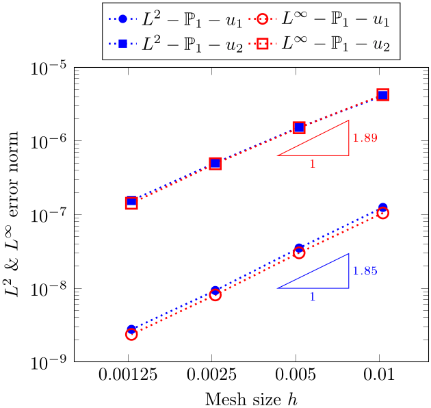
  <figcaption><em>Figure: $L_2$ and $L_\infty$ errors.</em></figcaption>
</figure>

The figure below presents the manufactured displacement field and PSD's displacement fields at two mesh refinement levels, we observe PSD's solution improving with mesh refinement.

<figure style="text-align: center;">
  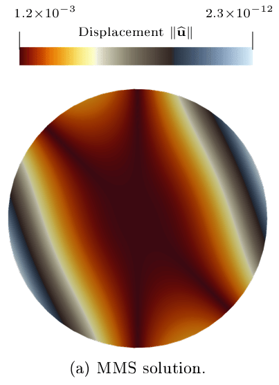
  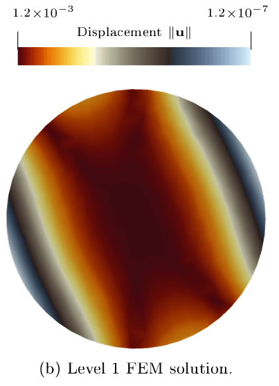
  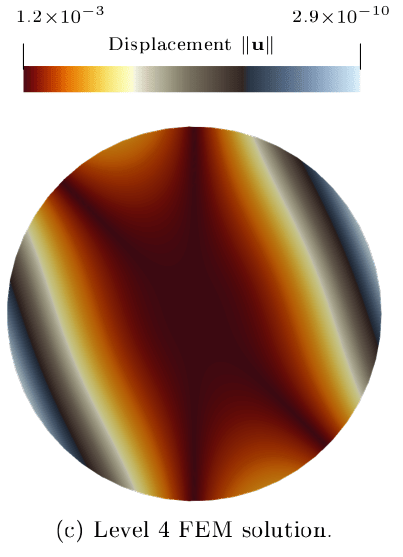
  <figcaption><em>Figure: manufactured displacement field $\mathbf{u}^\mathrm{m}$  (a) and PSD's displacement field $\mathbf{u}_h$ with a coarse mesh (b) and fine mesh (c).</em></figcaption>
</figure>

### Cross-Validation of Fracture Mechanics Module

A commonly used numerical test from literature (see e.g., \cite{Ambati2014,Liu2016,jeong2018phase,Hirshikesh2018} to cite but a few), the two-dimensional (2D) single-edge notched tensile and shear fracture test, is considered as the benchmark problem for cross validating the fracture mechanics module of PSD.

The domain of interest is an initially cracked square plate $(x,y) \in \Omega =[0~\text{cm},1~\text{cm}]^2$ (see figure below). With an initial crack and a constrained bottom edge~$\partial\Omega_{\text{D}}(x,y:y=0)$, the plate  is subject to increasing displacements on its top edge~$\partial\Omega_{\text{D}}(x,y:y=1)$ until the plate fully cracks open. The initial crack is placed at the center of the plate, i.e., $\partial\Omega_{\text{D}}(x:0 \le x \le 0.5,y:y=0.5)$. These boundary conditions are also illustrated in the figure below. The plate material is characterized by $\lambda=121.15~\text{kPa}$, $\mu=80.77~\text{kPa}$, and $G_{\text{c}}=2.7~\text{kN/mm}$.

Concerning  the  computational specifications of this test,  the displacement discontinuity  imposed by the initial crack was modeled by nearly overlapping (tolerance $\delta y=10^{-7}~\text{m}$) Dirichlet nodes  placed along the cracks edge $\partial\Omega^h_{\text{D}}(x:0 \le x \le 0.5,y:y=0.5\pm\delta y)$ within mesh $\Omega^h$.
The displacement Dirichlet condition on the top edge is applied with an increment of $\Delta\bar{u}_{2} =1\cdot10^{-5}~\text{mm}$ up to $u_2=5\cdot10^{-3}~\text{mm}$ and $\Delta\bar{u}_{2} =1\cdot10^{-6}~\text{mm}$ up to failure of the specimen. For the lower edge, the constrained displacement Dirichlet conditions $\bar{u}_{1}=\bar{u}_{2}=0$ are applied. Further, for this test and for all the simulations that appear in this study, parameter $\kappa$ is set to $1\cdot10^{-6}$ and $l_0$ is assumed equal to $2h$, where $h$ is the characteristic size of the mesh $\Omega^h$.

<figure style="text-align: center;">
  
  <figcaption><em>Figure: domain and boundary conditions for tensile fracture benchmark.</em></figcaption>
</figure>

The unstructured Delaunay (triangular) meshes generated with Gmsh are used for solving the finite element problem of fracture. To establish mesh convergence,  thus test has been solved multiple times by varying the level of mesh refinements, details of these meshes are provided in table below. The hierarchy of mesh refinements were generated by dividing each triangle in $\Omega^h$ into four equal triangles. As such in the table, we observe that with every refinement, the mesh size~$h$ halves and the number of triangles quadruple. The initial crack fields for the three mesh refinements (visualized using damage-field $d$) are presented in figure below. We notice well that with correct mesh refinement the reaction forces retrieved from PSD simulations and those presented in Mihie et al. match, there by cross validating the module. 

<figure style="text-align: center;">
  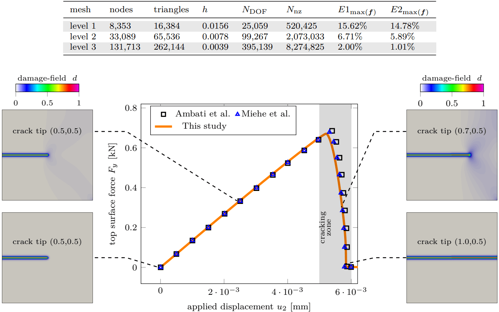
  <figcaption><em>Figure: cross validation test for tensile fracture test for PSD.</em></figcaption>
</figure>

Similar benchmark exists for shear loading on the top face, the only deference now is that top face is loaded in $x$-direction causing shear loading. This enables both compression and tensile zones within the material, hence determining the right fracture path in this case is even more challenging. Figure below presents the cross-validation of  PSD solver compared to reference solvers. 

<figure style="text-align: center;">
  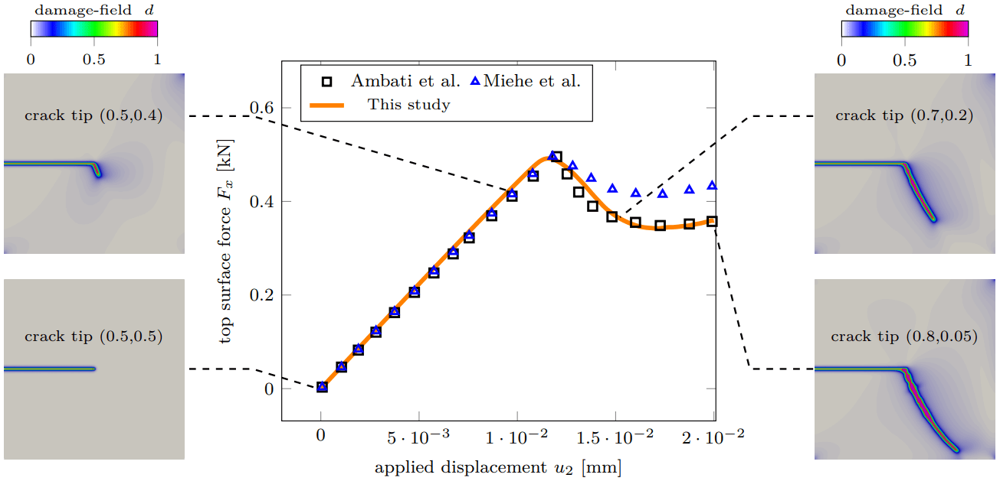
  <figcaption><em>Figure: cross validation test for shear fracture test for PSD.</em></figcaption>
</figure>

### Experiential-Validation of Fracture Mechanics Module

<figure style="text-align: center;">
  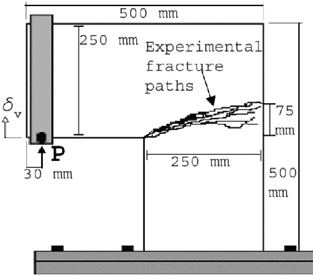
  
  
  <figcaption><em>Figure: left: geometry and experimental results of the fracture path; middle: partitioned mesh used by PSD; right: PSD damage solution at final time step.</em></figcaption>
</figure>

### Cross-Validation of Elastodynamics Module

<figure style="text-align: center;">
  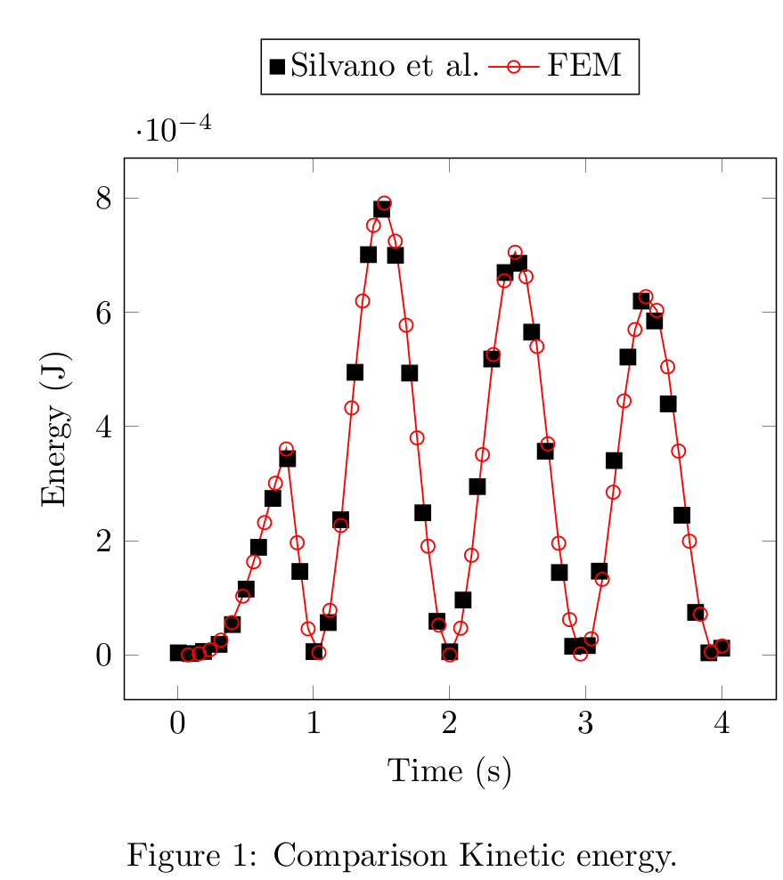
  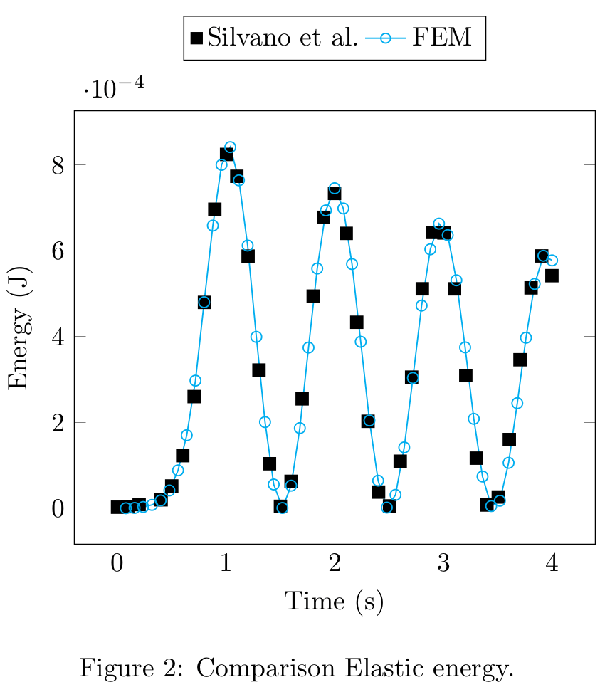
  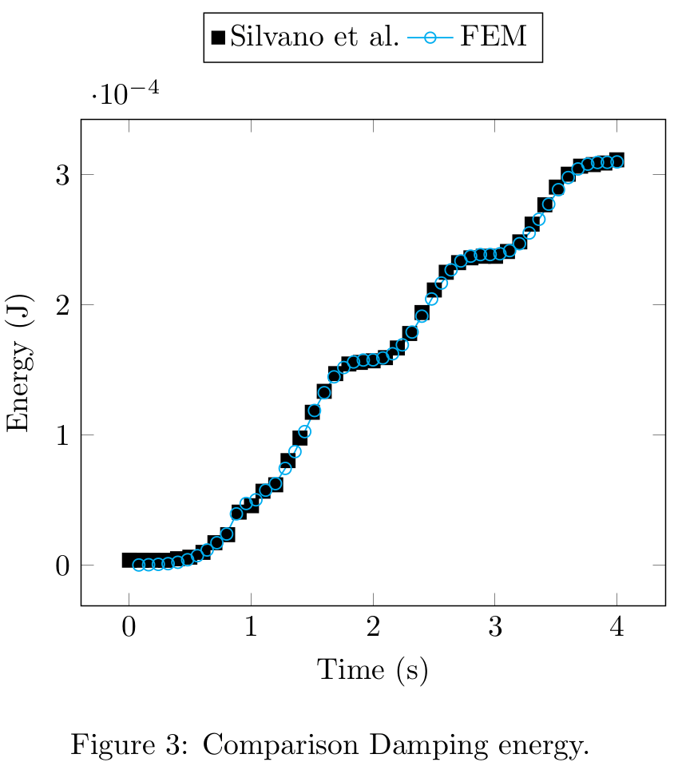
  <figcaption><em>Figure: cross validation elastodynamics module of PSD. Transient kinetic, elastic, and damping energies are compared to reference  solutions.</em></figcaption>
</figure>

### Cross-Validation of Soildynamics Module

<figure style="text-align: center;">
  
  <figcaption><em>Figure: 2D cross validation test for soildyanmics for PSD. Displacement fields at two distinct locations are compared between CAST3M and PSD.</em></figcaption>
</figure>

<figure style="text-align: center;">
  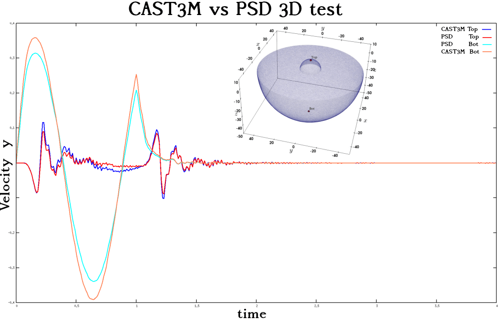
  <figcaption><em>Figure:  3D cross validation test for soildyanmics for PSD. Displacement fields at two distinct locations are compared between CAST3M and PSD</em></figcaption>
</figure>

### Cross-Validation of Elasto-plastic Module
<figure style="text-align: center;">

  

    
    
  

  

    
    
  

  

    
    
  

  <figcaption style="max-width: 800px; margin: 0 auto; font-style: italic;">
    Figure: Validation results comparison of PSD (left column) and reference code (right column) at different timesteps (<em>t0, t10, t19</em>). Reference results used for comparison were obtained by installing and running the FEniCS Solid Mechanics library [Garth N. Wells (2021)].
  </figcaption>
</figure>

<figure style="text-align: center;">
  
  <figcaption style="max-width: 600px; margin: 0 auto; font-style: italic;">
    Figure: Validation of the displacement movement of inner border obtained by PSD and another reference code. Reference results used for comparison were obtained by installing and running the FEniCS solid mechanics codes — 
    <a href="https://bitbucket.org/fenics-apps/fenics-solid-mechanics" target="_blank" rel="noopener noreferrer">https://bitbucket.org/fenics-apps/fenics-solid-mechanics</a>.
  </figcaption>
</figure>

<figure style="text-align: center;">
  
  

  <figcaption style="max-width: 700px; margin: 0 auto; font-style: italic;">
    Figure: Validation of the displacement field obtained by PSD and another reference code. The displacement magnitude is plotted on the central line which bisects the geometry into two. On the left, time steps — <em>t0, t4, t8, t12, t16</em> — are plotted and on the right — <em>t19</em>. Reference results used for comparison were obtained by installing and running the FEniCS Solid Mechanics library [Garth N. Wells (2021)].
  </figcaption>
</figure>
