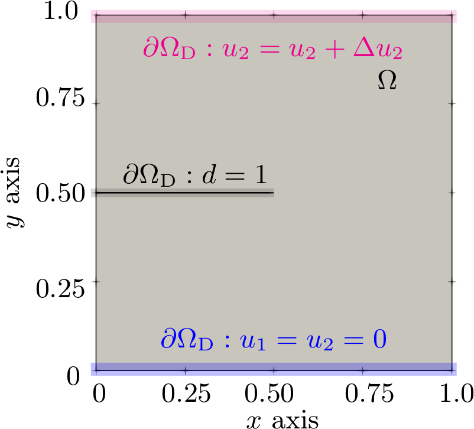
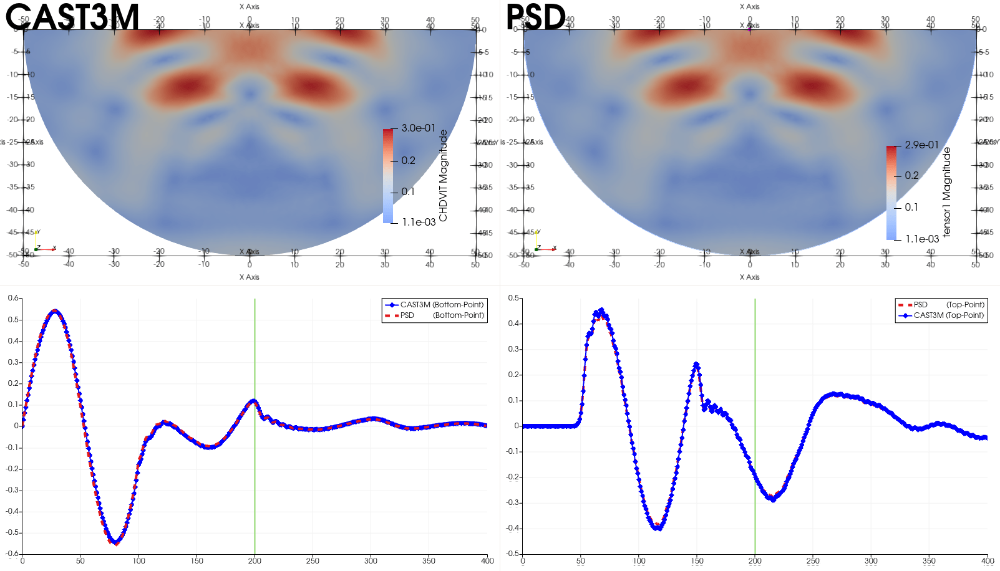

## Validation and Verification

Validation and verification of any numerical simulation solver is a key process that should not be avoided.

### Method of Manufactured Solutions for Linear Elasticity

The Method of Manufactured Solutions (MMS) is a robust approach for code verification in numerical simulations. In the context of linear elasticity, we begin by assuming an explicit form for the displacement field, known as the *manufactured solution* $\mathbf{u}^\mathrm{m}$, and then derive a consistent source term $\mathbf{f}^\mathrm{m}$ such that this field satisfies the governing equations. By solving the modified problem numerically and comparing with the known solution, we can assess the accuracy and convergence properties of the solver.

Let us consider a hypothetical two-dimensional elastic domain $\Omega \subset \mathbb{R}^2$, subjected to a manufactured body force vector $\mathbf{f}^\mathrm{m} = [f_1^\mathrm{m}, f_2^\mathrm{m}]^\top$. The prescribed displacement field $\mathbf{u}^\mathrm{m}=\{u_1^\mathrm{m},u_2^\mathrm{m}\}$ is assumed to be:

$$
u_1^\mathrm{m} = x^3 + x^2 y, \quad
u_2^\mathrm{m} = x y^2 + x^2 y. \tag{1}
$$

The divergence of the displacement field is:

$$
\frac{\partial u_1^\mathrm{m}}{\partial x} = 3x^2 + 2xy, \quad
\frac{\partial u_1^\mathrm{m}}{\partial y} = x^2, \quad
\frac{\partial u_2^\mathrm{m}}{\partial x} = y^2 + 2xy, \quad
\frac{\partial u_2^\mathrm{m}}{\partial y} = x^2 + 2xy
$$

$$
\nabla \cdot \mathbf{u}^\mathrm{m} = \frac{\partial u_1^\mathrm{m}}{\partial x} + \frac{\partial u_2^\mathrm{m}}{\partial y} = 4(x^2 + xy) \tag{2}
$$

Using the small strain definition, the components of the symmetric strain tensor $\boldsymbol{\varepsilon}^\mathrm{m}$ are:

$$
\varepsilon_{11}^\mathrm{m} = 3x^2 + 2xy, \quad
\varepsilon_{22}^\mathrm{m} = x^2 + 2xy, \quad
\varepsilon_{12}^\mathrm{m} = \varepsilon_{21}^\mathrm{m} = \frac{1}{2}(x^2 + y^2 + 2xy) \tag{3}
$$

Substituting into the isotropic linear elasticity constitutive law:

$$
\sigma_{ij}^\mathrm{m} = \lambda \delta_{ij} (\nabla \cdot \mathbf{u}^\mathrm{m}) + 2\mu \varepsilon_{ij}^\mathrm{m}
$$

we obtain the manufactured stress tensor:

$$
\sigma_{11}^\mathrm{m} = 4\lambda(x^2 + xy) + 2\mu(3x^2 + 2xy), \quad
\sigma_{22}^\mathrm{m} = 4\lambda(x^2 + xy) + 2\mu(x^2 + 2xy)
$$

$$
\sigma_{12}^\mathrm{m} = \sigma_{21}^\mathrm{m} = \mu(x^2 + y^2 + 2xy) \tag{4}
$$

Finally, the body force vector $\mathbf{f}^\mathrm{m}$ required to enforce the above displacement field is obtained by taking the negative divergence of the stress tensor:

$$
f_1^\mathrm{m} = -\frac{\partial \sigma_{11}^\mathrm{m}}{\partial x} - \frac{\partial \sigma_{12}^\mathrm{m}}{\partial y} = -x(8\lambda + 14\mu) - y(4\lambda + 6\mu)
$$

$$
f_2^\mathrm{m} = -\frac{\partial \sigma_{21}^\mathrm{m}}{\partial x} - \frac{\partial \sigma_{22}^\mathrm{m}}{\partial y} = -x(6\lambda + 4\mu) - y(2\mu) \tag{5}
$$

With this consistent manufactured solution and source term, one can now solve the elasticity system numerically and evaluate the solution $\mathbf{u}_h$ using PSD. Comparison against the analytical displacement field $\mathbf{u}^\mathrm{m}$, using suitable norms (e.g., $L^2$, $L^\infty$), provides a direct measure of discretization error and enables empirical determination of the PSD’s convergence rate. We construct different mesh refinements for which the convergence of the solution is assessed via $L_2$ and $L_\infty$ norms:

$$
\| \mathbf{u}^\mathrm{m} - \mathbf{u}_h \|_{L_2} = \left( \int_{\Omega_h} \| \mathbf{u}^\mathrm{m} - \mathbf{u}_h \|^2 \, dx \right)^{1/2}, \quad
\| \mathbf{u}^\mathrm{m} - \mathbf{u}_h \|_{L_\infty} = \max_{\Omega_h} | \mathbf{u}^\mathrm{m} - \mathbf{u}_h |
\tag{4}
$$

Observed results indicate that the solver achieves near second-order convergence in the $L_2$ and $L_\infty$ norms, consistent with theoretical expectations for piecewise linear elements $\mathbb{P}_1$ used in PDF, thus verifying the correctness of the linear elasticity module implementation.

<figure style="text-align: center;">
  
  <figcaption><em>Figure: $L_2$ and $L_\infty$ errors.</em></figcaption>
</figure>

The figure below presents the manufactured displacement field and PSD's displacement fields at two mesh refinement levels, we observe PSD's solution improving with mesh refinement.

<figure style="text-align: center;">
  
  
  
  <figcaption><em>Figure: manufactured displacement field $\mathbf{u}^\mathrm{m}$  (a) and PSD's displacement field $\mathbf{u}_h$ with a coarse mesh (b) and fine mesh (c).</em></figcaption>
</figure>

### Benchmark Validation of Fracture Mechanics Module

A widely used numerical benchmark in fracture mechanics (see, [1-4]) is the **two-dimensional single-edge notched tensile and shear fracture test**. This canonical setup serves as a validation case for the phase-field fracture mechanics module implemented in the PSD solver.

The problem domain consists of an initially cracked square plate $(x,y) \in \Omega = [0~\text{cm}, 1~\text{cm}]^2$, as illustrated in the figure below. A horizontal notch is introduced at the mid-height of the plate, specifically along $\partial\Omega_{\text{D}}(x:0 \le x \le 0.5, y: y=0.5)$. The bottom edge $\partial\Omega_{\text{D}}(y=0)$ is fixed in both displacement components, while the top edge $\partial\Omega_{\text{D}}(y=1)$ is incrementally loaded in the vertical direction until fracture occurs. The material is characterized by Lamé parameters $\lambda = 121.15~\text{kPa}$, $\mu = 80.77~\text{kPa}$, and fracture energy $G_{\text{c}} = 2.7~\text{kN/mm}$.

To impose a displacement discontinuity representing the initial crack, nearly overlapping Dirichlet nodes with a tolerance of $\delta y = 10^{-7}~\text{m}$ are placed above and below the crack line in the finite element mesh $\Omega^h$, i.e., on $\partial\Omega^h_{\text{D}}(x:0 \le x \le 0.5, y: 0.5 \pm \delta y)$. The vertical displacement on the top edge is applied incrementally with a step size of $\Delta\bar{u}_2 = 1 \cdot 10^{-5}~\text{mm}$ up to $u_2 = 5 \cdot 10^{-3}~\text{mm}$, followed by smaller steps of $\Delta\bar{u}_2 = 1 \cdot 10^{-6}~\text{mm}$ until full fracture. On the bottom edge, zero Dirichlet boundary conditions $\bar{u}_1 = \bar{u}_2 = 0$ are enforced. For all simulations, the degradation parameter is set to $\kappa = 1 \cdot 10^{-6}$, and the regularization length is chosen as $l_0 = 2h$, where $h$ is the characteristic element size.

<figure style="text-align: center;">
  
  <figcaption><em>Figure: domain and boundary conditions for tensile fracture benchmark.</em></figcaption>
</figure>

Unstructured triangular meshes are generated using Gmsh, a sufficientetly fine mesh is used for solving this problem with PSD. The reaction forces computed using PSD closely match reference results from [1] and [5], thus cross-validating the implementation.

<figure style="text-align: center;">
  
  <figcaption><em>Figure: cross-validation results for tensile fracture using PSD.</em></figcaption>
</figure>

A similar benchmark exists under shear loading, where the top edge is displaced in the horizontal ($x$) direction. This generates both tensile and compressive stress zones within the material, making fracture path prediction more challenging. The PSD results for this case are shown below and compared against reference solutions. The good agreement again validates the accuracy of the solver.

<figure style="text-align: center;">
  
  <figcaption><em>Figure: cross-validation results for shear fracture using PSD.</em></figcaption>
</figure>

#### References

[1] M. Ambati, T. Gerasimov, and L. De Lorenzis. *A review on phase-field models of brittle fracture and a new fast hybrid formulation*. Computational Mechanics, 55(2):383–405, 2014.

[2] Heeyeong Jeong et al. *Phase field modeling of crack propagation under combined shear and tensile loading with hybrid formulation*. Computational Materials Science, 155:483–492, 2018.

[3] Guowei Liu et al. *Abaqus implementation of monolithic and staggered schemes for quasi-static and dynamic fracture phase-field model*. Computational Materials Science, 121:35–47, 2016

[4] S.N Hirshikesh, and R.K. Annabattula. *A FEniCS implementation of the phase field method for quasi-static brittle fracture*. Frontiers of Structural and Civil Engineering, 13(2):380–396, 2018.

[5] C. Miehe, F. Welschinger, and M. Hofacker. *Thermodynamically consistent phase-field models of fracture: Variational principles and multi-field FE implementations.* International Journal for Numerical Methods in Engineering, 83(10):1273–1311, 2010.

### Experiential-Validation of Fracture Mechanics Module

<figure style="text-align: center;">
  
  
  
  <figcaption><em>Figure: left: geometry and experimental results of the fracture path [1]; middle: partitioned mesh used by PSD; right: PSD damage solution at final time step.</em></figcaption>
</figure>

#### References

[1] J. Oliver, A. Huespe, M.D.G. Pulido, and S. Blanco. *Computational modeling of cracking of concrete in strong discontinuity settings*. Computers and Concrete, 1(1):61, 2004.

[2] M. Ambati, T. Gerasimov, and L. De Lorenzis. *A review on phase-field models of brittle fracture and a new fast hybrid formulation*. Computational Mechanics, 55(2):383–405, 2014.

### Cross-Validation of Elastodynamics Module

<figure style="text-align: center;">
  
  
  
  <figcaption><em>Figure: cross validation elastodynamics module of PSD. Transient kinetic, elastic, and damping energies are compared to reference  solutions [1].</em></figcaption>
</figure>

#### References

[1] Silvano Erlicher, Luca Bonaventura, and Oreste S Bursi. *The analysis of the generalized-α method for non-linear dynamic problems*. Computational Mechanics 28(2):83–104, 2002.

### Cross-Validation of Soildynamics Module

<figure style="text-align: center;">
  
  <figcaption><em>Figure: 2D cross validation test for soildyanmics for PSD. Displacement fields at two distinct locations are compared between CAST3M and PSD.</em></figcaption>
</figure>

<figure style="text-align: center;">
  
  <figcaption><em>Figure:  3D cross validation test for soildyanmics for PSD. Displacement fields at two distinct locations are compared between CAST3M and PSD</em></figcaption>
</figure>

### Cross-Validation of Elasto-plastic Module

<figure style="text-align: center;">

    
    
  

    
    
  

    
    
  

<figcaption style="max-width: 800px; margin: 0 auto; font-style: italic;">
    Figure: Validation results comparison of PSD (left column) and reference code (right column) at different timesteps (<em>t0, t10, t19</em>). Reference results used for comparison were obtained by installing and running the FEniCS Solid Mechanics library [Garth N. Wells (2021)].
  </figcaption>
</figure>

<figure style="text-align: center;">
  
  <figcaption style="max-width: 600px; margin: 0 auto; font-style: italic;">
    Figure: Validation of the displacement movement of inner border obtained by PSD and another reference code. Reference results used for comparison were obtained by installing and running the FEniCS solid mechanics codes — 
    <a href="https://bitbucket.org/fenics-apps/fenics-solid-mechanics" target="_blank" rel="noopener noreferrer">https://bitbucket.org/fenics-apps/fenics-solid-mechanics</a>.
  </figcaption>
</figure>

<figure style="text-align: center;">
  
  

<figcaption style="max-width: 700px; margin: 0 auto; font-style: italic;">
    Figure: Validation of the displacement field obtained by PSD and another reference code. The displacement magnitude is plotted on the central line which bisects the geometry into two. On the left, time steps — <em>t0, t4, t8, t12, t16</em> — are plotted and on the right — <em>t19</em>. Reference results used for comparison were obtained by installing and running the FEniCS Solid Mechanics library [Garth N. Wells (2021)].
  </figcaption>
</figure>
