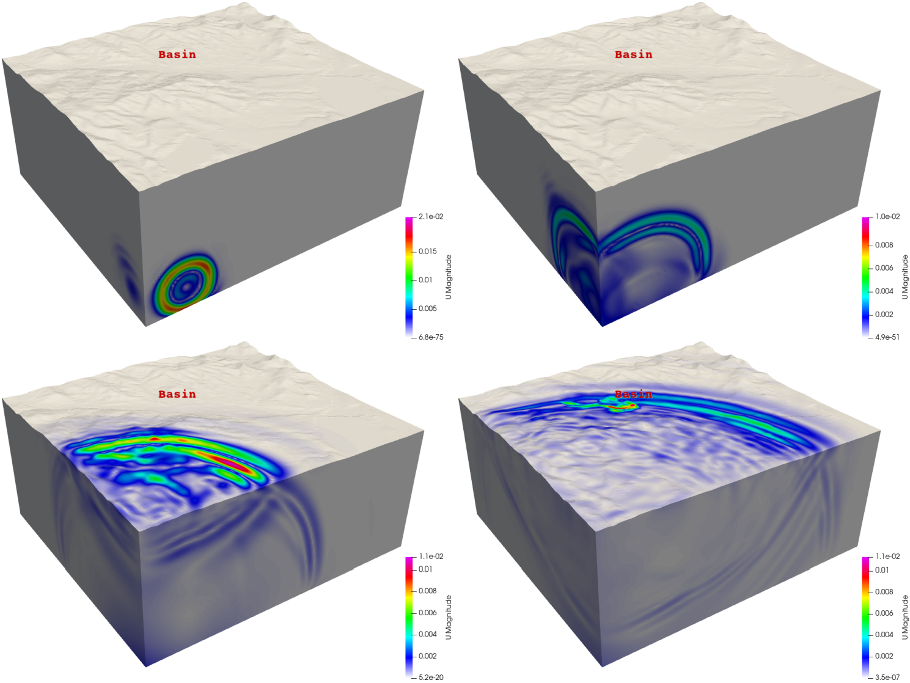
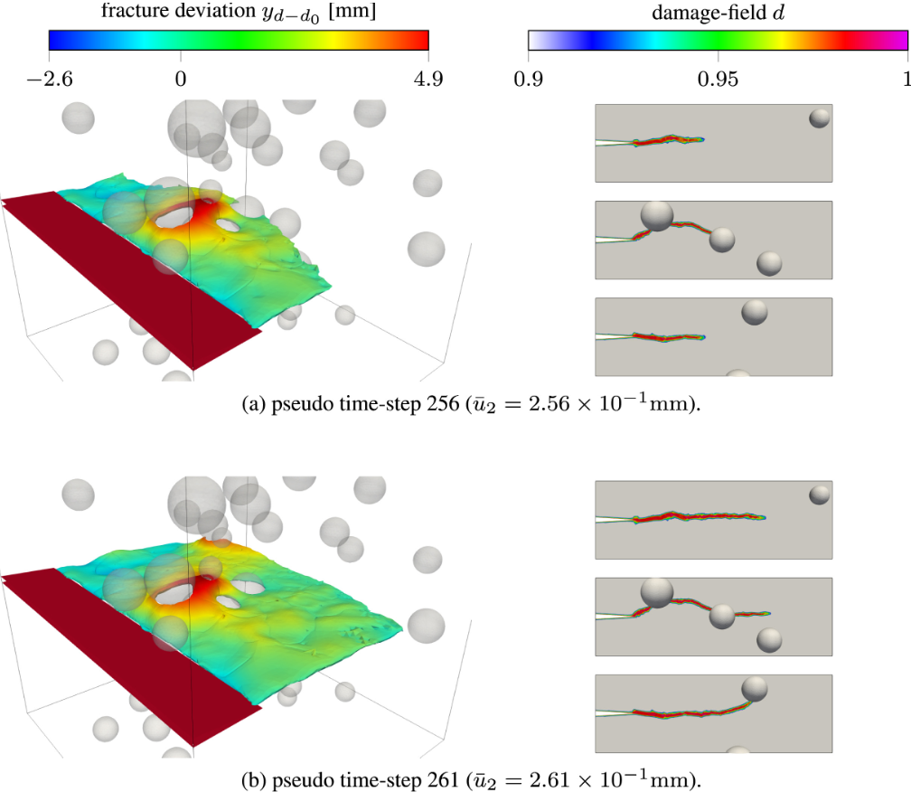

# Summary

`PSD` (Parallel finite element Solver for continuum Dynamics) is an open-source finite element method (FEM) solver designed for high-performance computing simulations in continuum dynamics with a special focus on earthquake mechanics and structural dynamics. It enables integrated fault-to-site seismic simulations by combining advanced material modeling, scalable parallelism, and purpose-built meshing-partitioning tools.

Built upon `FreeFEM`  [@MR3043640]  for FEM discretization and `PETSc` [@balay2019petsc] for scalable linear system solving, `PSD` integrates sophisticated material modeling through its dedicated  `Mfront` [@helfer2015],[@helfer2020] interface, supporting non-linear constitutive laws for realistic simulations.   features a custom `MPI I/O`-based mesher-partitioner, `top-ii-vol` [@badri2024top], designed for earthquake scenarios and implements hybrid phase-field fracture mechanics [@ambati2015review] for crack analysis. This spans the full simulation chain from earthquake source to structural assessment.

A key feature of `PSD` is its proven ability to handle fault-to-site earthquake simulations with billions of degrees of freedom, exhibiting excellent scalability on tens of thousands of MPI processes. This makes it a powerful tool for comprehensive seismic risk assessment.

# Statement of Need

Seismic risk assessments require computational tools capable of simulating wave propagation across multiple spatial scales, from fault (kilometers away) to local site response (meters), while ensuring sufficient accuracy for earthquake engineering analyses. Existing commercial solutions often lack the computational scalability required for integrated regional earthquake simulations, while open-source alternatives typically address only specific aspects of the seismic simulation workflow.

Current computational challenges in earthquake simulation include (1) the need for billions of degrees-of-freedom to capture realistic fault-to-site scenarios [@hori2018application], [@cui2013physics] (2) integration of complex non-linear material behaviors and damage assessment for solids and structures, and (3) efficient mesh generation and partitioning for irregular geological domains often constructed directly from digital elevation models. Tools like `OpenSees`[@mckenna2011opensees] excel in local site response analysis (soils and structures) based on FEM and `SPECFEM3D` [@Peter_Forward_and_adjoint_2011] or `SEM3D` [@touhami2022sem3d] address seismic wave propagation using the spectral element method. However, it is of interest  to have an open-source integrated platform addressing the complete fault-to-site simulation workflow with HPC scalability.

`PSD` tries to fill this gap by providing a unified computational framework that combines earthquake source modeling, wave propagation simulation, and structural mechanics assessment  within a single scalable FEM solver.  `PDS`'s integration of advanced meshing-partitioning capabilities (`top-ii-vol`), sophisticated material modeling (`Mfront` interface), and fracture mechanics positions it uniquely for comprehensive seismic risk assessment needs requiring both regional-scale wave propagation and local site response, including structural analysis.

# Features and Architecture

`PSD` provides a comprehensive suite of physics modules addressing diverse computational mechanics applications around earthquake simulations. It includes dedicated modules for linear elasticity, elastodynamics, fracture mechanics, soildynamics [^soildynamics], and elasto-plasticity, making it suitable for applications ranging from static structural analysis to dynamic earthquake simulation and material damage assessment. The `Mfront` interface significantly enhances this versatility by enabling users to implement custom non-linear material models that can be integrated into any of these physics modules, extending `PSD`'s applicability beyond the built-in constitutive laws.

`PSD` adopts a layered architecture that separates mathematical formulation from computational implementation while maintaining high performance through strategic integration with `FreeFEM` for FEM discretization, `PETSc` for scalable linear algebra, and `Mfront` for sophisticated material modeling. `PSD` follows a code generation approach where users specify problem configurations through command-line options, and the software automatically generates optimized code tailored to specific physics, dimensionality, and boundary conditions. This design enables computational efficiency while preserving flexibility for diverse solid mechanics applications across the available physics modules.

The parallel computing architecture in `PSD` employs domain decomposition strategies that enable distributed memory parallelization which are optimized for large-scale FEM simulation [@dolean2015introduction]. `PSD` has demonstrated scalability up to 24,000 cores and capability for handling problems with over 5 billion unknowns for earthquakes. The integration with the `top-ii-vol` meshing tool provides efficient on-the-fly mesh generation and partitioning specifically designed for earthquake simulation geometries, eliminating traditional bottlenecks associated with sequential meshing approaches.

Comprehensive verification and validation campaigns cover all `PSD` modules: results are cross-compared with reference codes, experimental results, and analytical benchmarks, c.f. [https://mohd-afeef-badri.github.io/psd/validation](https://mohd-afeef-badri.github.io/psd/validation), providing transparency and reproducibility.

[^soildynamics]: The *soildynamics* module builds upon the elastodynamics module by incorporating specialized tools essential for earthquake modeling, such as paraxial (absorbing) boundary conditions, double-couple source mechanisms, point-cloud meshing-partitioning algorithms, etc.

# Example Workflow

A representative application illustrates `PSD`'s soil-dynamics module for 3D seismic wave propagation in an elastic domain with paraxial absorbing boundaries [@modaressi1994paraxial] and double-couple point sources [@benz1987kinematic]. This example illustrates one of `PSD`'s specialized physics modules, among others. The aim here is to briefly illustrate `PSD`'s key capabilities, including automated distributed mesh generation (combined meshing-partitioning), advanced time integration, and sophisticated boundary condition handling.

**Mathematical Presentation:** `PSD` solves the elastodynamic wave equation using FEM discretization with Newmark-$\beta$ time integration[^1]. For a domain $\Omega \subset \mathbb{R}^3$ and with paraxial absorbing boundaries $\partial \Omega_{\text{P}} \subset \partial \Omega$, the FEM weak form reads:

$$
\begin{aligned} &\text{Find}~\mathbf{u}\in \mathcal{U}~\text{such~that}~\forall~t\in[0,t_{\text{max}}], \forall\mathbf{v}\in \mathcal{V}:\\&  \int_{\Omega} \left( \frac{\rho}{\beta \Delta t^2}    \mathbf{u} \cdot \mathbf{v} + 
    \boldsymbol{\sigma}(\mathbf{u}) : \boldsymbol{\varepsilon}(\mathbf{v}) \right) +    \int_{\partial\Omega_{\text{P}}}    \frac{\rho \gamma}{\beta \Delta t}    \mathbf{u} \cdot \boldsymbol{\mathbf{P}} \cdot \mathbf{v}  = \\  &
  \quad \quad\int_{\Omega} \frac{\rho}{\beta} \left( \frac{1}{\Delta t^2} \mathbf{u}_{\text{old}} \cdot \mathbf{v}  + \frac{1}{\Delta t} \dot{\mathbf{u}}_{\text{old}} \cdot \mathbf{v}  +  \left( \frac{1}{2} - \beta \right) \ddot{\mathbf{u}}_{\text{old}} \cdot \mathbf{v}\right) + \\  &  
 \quad \quad\int_{\partial\Omega_{\text{P}}}  \left(    \frac{\rho \gamma}{\beta \Delta t}    \mathbf{u}_{\text{old}} \cdot \boldsymbol{\mathbf{P}} \cdot \mathbf{v} +    \left( \frac{\rho\gamma}{\beta} - \rho \right) \dot{\mathbf{u}}_{\text{old}} \cdot \boldsymbol{\mathbf{P}}  \cdot \mathbf{v}  +    \left(  \frac{\rho \gamma \Delta t}{2\beta} -\rho \Delta t \right) \ddot{\mathbf{u}}_{\text{old}} \cdot \boldsymbol{\mathbf{P}}  \cdot \mathbf{v}\right).     \end{aligned}
$$

Here, $(\mathbf{u}, \mathbf{v}) : \Omega \to \mathbb{R}^3$ are the FEM trial and test functions, respectively, defined in FEM linear closed space. $(\mathcal{U},\mathcal{V})$ defined in $\left[H^1(\Omega)\right]^3$, $(\mathbf{u}_{\text{old}}, \dot{\mathbf{u}}_{\text{old}}, \ddot{\mathbf{u}}_{\text{old}}) : \Omega \to \mathbb{R}^3$ represent respectively the displacement, velocity, and acceleration fields computed at previous time step. $(\boldsymbol{\sigma}(\mathbf{u}), \boldsymbol{\varepsilon}(\mathbf{v})): \Omega \to \mathbb{R}^{3 \times 3}$ represent the linear elastic Cauchy stress tensor and the small strain tensor, $(\rho, \gamma, \beta, t, t_{\text{max}}, \Delta t) \in \mathbb{R}$ are the soil density,  Newmark-$\beta$ time discretization parameters ($\gamma,\beta$), and time variables ($t,t_{\max},\Delta t$). Finally ${\mathbf{P}} : \partial \Omega_{\text{P}} \to \mathbb{R}^{3 \times 3}$ is a direction-dependent impedance tensor enforcing paraxial absorbing boundary conditions on the boundary $\partial \Omega_{\text{P}}$. It is defined as:

  $$
  \boldsymbol{\mathbf{P}} = c_{\text{p}}\, \mathbf{n} \otimes \mathbf{n} + c_{\text{s}} \left( \mathbf{I} - \mathbf{n} \otimes \mathbf{n} \right),
  $$

  where, $\mathbf{n} : \partial \Omega_{\text{P}} \to \mathbb{R}^3$ is the outward unit normal vector, $\mathbf{I} \in \mathbb{R}^{3 \times 3}$ is the identity tensor, $(c_{\text{p}}, c_{\text{s}} \in \mathbb{R})$ are the P-wave and S-wave wave velocities in the soil.

Seismic excitation is modeled by a double-couple moment tensor $\mathbf{M}$, applied as equivalent displacement conditions at four neighboring nodes to reproduce the radiation pattern.

**Execution Workflow**: The `PSD` workflow begins with automated code generation through the `PSD_PreProcess` utility, which generates problem-specific FEM code based on user specifications.
```
PSD_PreProcess -problem soildynamics -dimension 3 -top2vol-meshing \
-timediscretization newmark_beta  -postprocess uav
```

Typical soil properties and time-integration parameters are included:
```
  real rho  = 1800.0 ,  // Density (kg/m³)
       cs   = 2300.0 ,  // S-wave velocity (m/s)
       cp   = 4000.0 ;  // P-wave velocity (m/s)

  real tmax = 20.0    ,    // Total simulation time
       t    = 0.001   ,    // Initial time
       dt   = 0.001   ;    // Time step
```

The simulation is executed using the parallel solver with the specified number of `MPI` processes:

```
PSD_Solve -np 6144 Main.edp #6144 MPI-domains are used
```

Results such as those presented in Figure \ref{fig:example1} can be obtained by launching `PSD` simulation. These results corresponds to seismic wave propagation for hypothetical earthquake. These simulations may then used for risk assessments of potential sites of interest for engineering.

# Demonstration

Figure \ref{fig:example1} presents a regional-scale earthquake simulation of the French Cadarache region (50 km × 50 km) performed with `PSD`, as detailed in [@badri2024top], involving over one billion degrees of freedom distributed across 6144 `MPI` domains using a 540-million-element mesh with 10 m resolution..

 {width=72%}

Figure \ref{fig:example2} demonstrates fracture mechanics capabilities through quasi-static brittle fracture simulation in a perforated medium [@badri2021preconditioning], involving more than 64 million degrees of freedom across 1008 MPI domains, illustrating detailed damage assessment capabilities.

{width=72%}

These demonstrations represent significant computational achievements, with problem sizes nearing those required for operational seismic hazard and risk assessment. The simulation of the Cadarache region in France demonstrates `PSD`'s applicability to real-world earthquake engineering problems, while the fracture mechanics example illustrates the software's capability for detailed damage assessment applications.

Additional applications demonstrate `PSD`'s versatility for advanced fracture mechanics research, including eikonal non-local gradient damage model implementations [@nogueira2023numerical],[@nogueira2024eikonal], which further extend the software's capabilities for comprehensive structural analysis.

# Acknowledgements

This work is supported by the French Alternative Energies and Atomic Energy Commission (CEA) through the GEN2&3 program. G. Rastiello was also supported by the SEISM Institute (France). The authors thank Dr. Breno Ribeiro Nogueira for advanced fracture module, Dr. Reine Fares for nonlinear soil modeling, and Rania Saadi for the parallel mesh adaptation kernel.

# References

[^1]: PSD implements the generalized-$\alpha$  time discretization method [@Chung], which encompasses several classical time integration schemes as special cases depending on the parameter selection: central difference, HHT (Hilber-Hughes-Taylor) [@hilber1977improved], and Newmark-$\beta$ methods.
